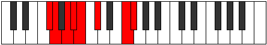

# Mode Bathian

## Links

- [Documentation](README.md)
- [Scales Index](Scales.md)
- [Modes Index](Modes.md)
- [Chords Index](Chords.md)

## Parent Scale

[Katacrian](ScaleKatacrian.md)

## Number

[2235](https://ianring.com/musictheory/scales/2235)

## Luminosity

6

## Transposition

1, 2, 1, 1, 2, 4, 1

## Chord Pattern

ii⁰

## Perfection

- 3 Perfect notes
- 4 Perfect notes

## Perfection Profile

true, false, false, true, true, false, false

## Permutations

| Tonic | Notes | Signature | Illustration | Audio |
|-------|-------|-----------|--------------|-------|
| [C](ModeCNaturalBathian.md) | C, **Db**, **Eb**, Fb, Gbb, **Abb**, **B**, C | C |  | [midi](https://github.com/edipermadi/music/blob/main/docs/ModeCNaturalBathian.mid?raw=true) |
| [C#](ModeCSharpBathian.md) | C#, **D**, **E**, F, Gb, **Ab**, **B#**, C# | C |  | [midi](https://github.com/edipermadi/music/blob/main/docs/ModeCSharpBathian.mid?raw=true) |
| [Db](ModeDFlatBathian.md) | Db, **Ebb**, **Fb**, Gbb, Abbb, **Bbbb**, **C**, Db | C |  | [midi](https://github.com/edipermadi/music/blob/main/docs/ModeDFlatBathian.mid?raw=true) |
| [D](ModeDNaturalBathian.md) | D, **Eb**, **F**, Gb, Abb, **Bbb**, **C#**, D | C |  | [midi](https://github.com/edipermadi/music/blob/main/docs/ModeDNaturalBathian.mid?raw=true) |
| [D#](ModeDSharpBathian.md) | D#, **E**, **F#**, G, Ab, **Bb**, **C##**, D# | C |  | [midi](https://github.com/edipermadi/music/blob/main/docs/ModeDSharpBathian.mid?raw=true) |
| [Eb](ModeEFlatBathian.md) | Eb, **Fb**, **Gb**, Abb, Bbbb, **Cbb**, **D**, Eb | C |  | [midi](https://github.com/edipermadi/music/blob/main/docs/ModeEFlatBathian.mid?raw=true) |
| [E](ModeENaturalBathian.md) | E, **F**, **G**, Ab, Bbb, **Cb**, **D#**, E | C |  | [midi](https://github.com/edipermadi/music/blob/main/docs/ModeENaturalBathian.mid?raw=true) |
| [F](ModeFNaturalBathian.md) | F, **Gb**, **Ab**, Bbb, Cbb, **Dbb**, **E**, F | C |  | [midi](https://github.com/edipermadi/music/blob/main/docs/ModeFNaturalBathian.mid?raw=true) |
| [F#](ModeFSharpBathian.md) | F#, **G**, **A**, Bb, Cb, **Db**, **E#**, F# | C |  | [midi](https://github.com/edipermadi/music/blob/main/docs/ModeFSharpBathian.mid?raw=true) |
| [Gb](ModeGFlatBathian.md) | Gb, **Abb**, **Bbb**, Cbb, Dbbb, **Ebbb**, **F**, Gb | C |  | [midi](https://github.com/edipermadi/music/blob/main/docs/ModeGFlatBathian.mid?raw=true) |
| [G](ModeGNaturalBathian.md) | G, **Ab**, **Bb**, Cb, Dbb, **Ebb**, **F#**, G | C |  | [midi](https://github.com/edipermadi/music/blob/main/docs/ModeGNaturalBathian.mid?raw=true) |
| [G#](ModeGSharpBathian.md) | G#, **A**, **B**, C, Db, **Eb**, **F##**, G# | C |  | [midi](https://github.com/edipermadi/music/blob/main/docs/ModeGSharpBathian.mid?raw=true) |
| [Ab](ModeAFlatBathian.md) | Ab, **Bbb**, **Cb**, Dbb, Ebbb, **Fbb**, **G**, Ab | C |  | [midi](https://github.com/edipermadi/music/blob/main/docs/ModeAFlatBathian.mid?raw=true) |
| [A](ModeANaturalBathian.md) | A, **Bb**, **C**, Db, Ebb, **Fb**, **G#**, A | C |  | [midi](https://github.com/edipermadi/music/blob/main/docs/ModeANaturalBathian.mid?raw=true) |
| [A#](ModeASharpBathian.md) | A#, **B**, **C#**, D, Eb, **F**, **G##**, A# | C |  | [midi](https://github.com/edipermadi/music/blob/main/docs/ModeASharpBathian.mid?raw=true) |
| [Bb](ModeBFlatBathian.md) | Bb, **Cb**, **Db**, Ebb, Fbb, **Gbb**, **A**, Bb | C |  | [midi](https://github.com/edipermadi/music/blob/main/docs/ModeBFlatBathian.mid?raw=true) |
| [B](ModeBNaturalBathian.md) | B, **C**, **D**, Eb, Fb, **Gb**, **A#**, B | C |  | [midi](https://github.com/edipermadi/music/blob/main/docs/ModeBNaturalBathian.mid?raw=true) |
