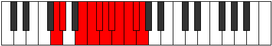
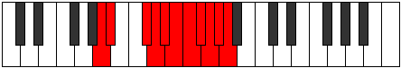

# Mode Bathyllian

## Links

- [Documentation](index.md)
- [Scales Index](Scales.md)
- [Modes Index](Modes.md)
- [Chords Index](Chords.md)

## Parent Scale

[Katoryllian](ScaleKatoryllian.md)

## Number

[4083](https://ianring.com/musictheory/scales/4083)

## Perfection

- 8 Perfect notes
- 2 Perfect notes

## Perfection Profile

[true true true true true false false true true true]

## Permutations

| Tonic | Notes | Signature | Illustration | Audio |
|-------|-------|-----------|--------------|-------|
| [C](ModeCNaturalBathyllian.md) | C, C#, E, F, F#, **G**, **G#**, A, A#, B, C | C |  | [midi](ModeCNaturalBathyllian.mid) [ogg](ModeCNaturalBathyllian.ogg) |
| [C#](ModeCSharpBathyllian.md) | C#, D, F, F#, G, **G#**, **A**, A#, B, C, C# | C |  | [midi](ModeCSharpBathyllian.mid) [ogg](ModeCSharpBathyllian.ogg) |
| [Db](ModeDFlatBathyllian.md) | Db, D, F, Gb, G, **Ab**, **A**, Bb, B, C, Db | C |  | [midi](ModeDFlatBathyllian.mid) [ogg](ModeDFlatBathyllian.ogg) |
| [D](ModeDNaturalBathyllian.md) | D, D#, F#, G, G#, **A**, **A#**, B, C, C#, D | C |  | [midi](ModeDNaturalBathyllian.mid) [ogg](ModeDNaturalBathyllian.ogg) |
| [D#](ModeDSharpBathyllian.md) | D#, E, G, G#, A, **A#**, **B**, C, C#, D, D# | C |  | [midi](ModeDSharpBathyllian.mid) [ogg](ModeDSharpBathyllian.ogg) |
| [Eb](ModeEFlatBathyllian.md) | Eb, E, G, Ab, A, **Bb**, **B**, C, Db, D, Eb | C |  | [midi](ModeEFlatBathyllian.mid) [ogg](ModeEFlatBathyllian.ogg) |
| [E](ModeENaturalBathyllian.md) | E, F, G#, A, A#, **B**, **C**, C#, D, D#, E | C |  | [midi](ModeENaturalBathyllian.mid) [ogg](ModeENaturalBathyllian.ogg) |
| [F](ModeFNaturalBathyllian.md) | F, F#, A, A#, B, **C**, **C#**, D, D#, E, F | C |  | [midi](ModeFNaturalBathyllian.mid) [ogg](ModeFNaturalBathyllian.ogg) |
| [F#](ModeFSharpBathyllian.md) | F#, G, A#, B, C, **C#**, **D**, D#, E, F, F# | C |  | [midi](ModeFSharpBathyllian.mid) [ogg](ModeFSharpBathyllian.ogg) |
| [Gb](ModeGFlatBathyllian.md) | Gb, G, Bb, B, C, **Db**, **D**, Eb, E, F, Gb | C |  | [midi](ModeGFlatBathyllian.mid) [ogg](ModeGFlatBathyllian.ogg) |
| [G](ModeGNaturalBathyllian.md) | G, G#, B, C, C#, **D**, **D#**, E, F, F#, G | C |  | [midi](ModeGNaturalBathyllian.mid) [ogg](ModeGNaturalBathyllian.ogg) |
| [G#](ModeGSharpBathyllian.md) | G#, A, C, C#, D, **D#**, **E**, F, F#, G, G# | C |  | [midi](ModeGSharpBathyllian.mid) [ogg](ModeGSharpBathyllian.ogg) |
| [Ab](ModeAFlatBathyllian.md) | Ab, A, C, Db, D, **Eb**, **E**, F, Gb, G, Ab | C |  | [midi](ModeAFlatBathyllian.mid) [ogg](ModeAFlatBathyllian.ogg) |
| [A](ModeANaturalBathyllian.md) | A, A#, C#, D, D#, **E**, **F**, F#, G, G#, A | C |  | [midi](ModeANaturalBathyllian.mid) [ogg](ModeANaturalBathyllian.ogg) |
| [A#](ModeASharpBathyllian.md) | A#, B, D, D#, E, **F**, **F#**, G, G#, A, A# | C |  | [midi](ModeASharpBathyllian.mid) [ogg](ModeASharpBathyllian.ogg) |
| [Bb](ModeBFlatBathyllian.md) | Bb, B, D, Eb, E, **F**, **Gb**, G, Ab, A, Bb | C |  | [midi](ModeBFlatBathyllian.mid) [ogg](ModeBFlatBathyllian.ogg) |
| [B](ModeBNaturalBathyllian.md) | B, C, D#, E, F, **F#**, **G**, G#, A, A#, B | C |  | [midi](ModeBNaturalBathyllian.mid) [ogg](ModeBNaturalBathyllian.ogg) |
