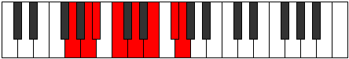
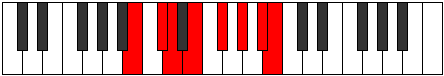

# Mode Bocrian

## Links

- [Documentation](index.md)
- [Scales Index](Scales.md)
- [Modes Index](Modes.md)
- [Chords Index](Chords.md)

## Parent Scale

[Larian](ScaleLarian.md)

## Number

[2733](https://ianring.com/musictheory/scales/2733)

## Perfection

- 4 Perfect notes
- 3 Perfect notes

## Perfection Profile

[true true false true true false false]

## Permutations

| Tonic | Notes | Signature | Illustration | Audio |
|-------|-------|-----------|--------------|-------|
| [C](ModeCNaturalBocrian.md) | C, D, **Eb**, F, G, **A**, **B**, C | C |  | [midi](ModeCNaturalBocrian.mid) [ogg](ModeCNaturalBocrian.ogg) |
| [C#](ModeCSharpBocrian.md) | C#, D#, **E**, F#, G#, **A#**, **B#**, C# | C |  | [midi](ModeCSharpBocrian.mid) [ogg](ModeCSharpBocrian.ogg) |
| [Db](ModeDFlatBocrian.md) | Db, Eb, **Fb**, Gb, Ab, **Bb**, **C**, Db | C |  | [midi](ModeDFlatBocrian.mid) [ogg](ModeDFlatBocrian.ogg) |
| [D](ModeDNaturalBocrian.md) | D, E, **F**, G, A, **B**, **C#**, D | C |  | [midi](ModeDNaturalBocrian.mid) [ogg](ModeDNaturalBocrian.ogg) |
| [D#](ModeDSharpBocrian.md) | D#, E#, **F#**, G#, A#, **B#**, **C##**, D# | C |  | [midi](ModeDSharpBocrian.mid) [ogg](ModeDSharpBocrian.ogg) |
| [Eb](ModeEFlatBocrian.md) | Eb, F, **Gb**, Ab, Bb, **C**, **D**, Eb | C |  | [midi](ModeEFlatBocrian.mid) [ogg](ModeEFlatBocrian.ogg) |
| [E](ModeENaturalBocrian.md) | E, F#, **G**, A, B, **C#**, **D#**, E | C |  | [midi](ModeENaturalBocrian.mid) [ogg](ModeENaturalBocrian.ogg) |
| [F](ModeFNaturalBocrian.md) | F, G, **Ab**, Bb, C, **D**, **E**, F | C |  | [midi](ModeFNaturalBocrian.mid) [ogg](ModeFNaturalBocrian.ogg) |
| [F#](ModeFSharpBocrian.md) | F#, G#, **A**, B, C#, **D#**, **E#**, F# | C |  | [midi](ModeFSharpBocrian.mid) [ogg](ModeFSharpBocrian.ogg) |
| [Gb](ModeGFlatBocrian.md) | Gb, Ab, **Bbb**, Cb, Db, **Eb**, **F**, Gb | C |  | [midi](ModeGFlatBocrian.mid) [ogg](ModeGFlatBocrian.ogg) |
| [G](ModeGNaturalBocrian.md) | G, A, **Bb**, C, D, **E**, **F#**, G | C |  | [midi](ModeGNaturalBocrian.mid) [ogg](ModeGNaturalBocrian.ogg) |
| [G#](ModeGSharpBocrian.md) | G#, A#, **B**, C#, D#, **E#**, **F##**, G# | C |  | [midi](ModeGSharpBocrian.mid) [ogg](ModeGSharpBocrian.ogg) |
| [Ab](ModeAFlatBocrian.md) | Ab, Bb, **Cb**, Db, Eb, **F**, **G**, Ab | C |  | [midi](ModeAFlatBocrian.mid) [ogg](ModeAFlatBocrian.ogg) |
| [A](ModeANaturalBocrian.md) | A, B, **C**, D, E, **F#**, **G#**, A | C |  | [midi](ModeANaturalBocrian.mid) [ogg](ModeANaturalBocrian.ogg) |
| [A#](ModeASharpBocrian.md) | A#, B#, **C#**, D#, E#, **F##**, **G##**, A# | C |  | [midi](ModeASharpBocrian.mid) [ogg](ModeASharpBocrian.ogg) |
| [Bb](ModeBFlatBocrian.md) | Bb, C, **Db**, Eb, F, **G**, **A**, Bb | C |  | [midi](ModeBFlatBocrian.mid) [ogg](ModeBFlatBocrian.ogg) |
| [B](ModeBNaturalBocrian.md) | B, C#, **D**, E, F#, **G#**, **A#**, B | C |  | [midi](ModeBNaturalBocrian.mid) [ogg](ModeBNaturalBocrian.ogg) |
