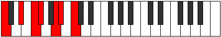

# Mode Bocrimic

## Links

- [Documentation](index.md)
- [Scales Index](Scales.md)
- [Modes Index](Modes.md)
- [Chords Index](Chords.md)

## Parent Scale

[Bocrimic](ScaleBocrimic.md)

## Number

[1641](https://ianring.com/musictheory/scales/1641)

## Perfection

- 3 Perfect notes
- 3 Perfect notes

## Perfection Profile

[false true true false false true]

## Permutations

| Tonic | Notes | Signature | Illustration | Audio |
|-------|-------|-----------|--------------|-------|
| [C](ModeCNaturalBocrimic.md) | **C**, D#, E#, **F#**, **G##**, A#, **C** | C |  | [midi](ModeCNaturalBocrimic.mid) [ogg](ModeCNaturalBocrimic.ogg) |
| [C#](ModeCSharpBocrimic.md) | **C#**, D##, E##, **F##**, **G###**, A##, **C#** | C |  | [midi](ModeCSharpBocrimic.mid) [ogg](ModeCSharpBocrimic.ogg) |
| [Db](ModeDFlatBocrimic.md) | **Db**, E, F#, **G**, **A#**, B, **Db** | C |  | [midi](ModeDFlatBocrimic.mid) [ogg](ModeDFlatBocrimic.ogg) |
| [D](ModeDNaturalBocrimic.md) | **D**, E#, F##, **G#**, **A##**, B#, **D** | C |  | [midi](ModeDNaturalBocrimic.mid) [ogg](ModeDNaturalBocrimic.ogg) |
| [D#](ModeDSharpBocrimic.md) | **D#**, E##, F###, **G##**, **A###**, B##, **D#** | C |  | [midi](ModeDSharpBocrimic.mid) [ogg](ModeDSharpBocrimic.ogg) |
| [Eb](ModeEFlatBocrimic.md) | **Eb**, F#, G#, **A**, **B#**, C#, **Eb** | C |  | [midi](ModeEFlatBocrimic.mid) [ogg](ModeEFlatBocrimic.ogg) |
| [E](ModeENaturalBocrimic.md) | **E**, F##, G##, **A#**, **B##**, C##, **E** | C |  | [midi](ModeENaturalBocrimic.mid) [ogg](ModeENaturalBocrimic.ogg) |
| [F](ModeFNaturalBocrimic.md) | **F**, G#, A#, **B**, **C##**, D#, **F** | C |  | [midi](ModeFNaturalBocrimic.mid) [ogg](ModeFNaturalBocrimic.ogg) |
| [F#](ModeFSharpBocrimic.md) | **F#**, G##, A##, **B#**, **C###**, D##, **F#** | C |  | [midi](ModeFSharpBocrimic.mid) [ogg](ModeFSharpBocrimic.ogg) |
| [Gb](ModeGFlatBocrimic.md) | **Gb**, A, B, **C**, **D#**, E, **Gb** | C |  | [midi](ModeGFlatBocrimic.mid) [ogg](ModeGFlatBocrimic.ogg) |
| [G](ModeGNaturalBocrimic.md) | **G**, A#, B#, **C#**, **D##**, E#, **G** | C |  | [midi](ModeGNaturalBocrimic.mid) [ogg](ModeGNaturalBocrimic.ogg) |
| [G#](ModeGSharpBocrimic.md) | **G#**, A##, B##, **C##**, **D###**, E##, **G#** | C |  | [midi](ModeGSharpBocrimic.mid) [ogg](ModeGSharpBocrimic.ogg) |
| [Ab](ModeAFlatBocrimic.md) | **Ab**, B, C#, **D**, **E#**, F#, **Ab** | C |  | [midi](ModeAFlatBocrimic.mid) [ogg](ModeAFlatBocrimic.ogg) |
| [A](ModeANaturalBocrimic.md) | **A**, B#, C##, **D#**, **E##**, F##, **A** | C |  | [midi](ModeANaturalBocrimic.mid) [ogg](ModeANaturalBocrimic.ogg) |
| [A#](ModeASharpBocrimic.md) | **A#**, B##, C###, **D##**, **E###**, F###, **A#** | C |  | [midi](ModeASharpBocrimic.mid) [ogg](ModeASharpBocrimic.ogg) |
| [Bb](ModeBFlatBocrimic.md) | **Bb**, C#, D#, **E**, **F##**, G#, **Bb** | C |  | [midi](ModeBFlatBocrimic.mid) [ogg](ModeBFlatBocrimic.ogg) |
| [B](ModeBNaturalBocrimic.md) | **B**, C##, D##, **E#**, **F###**, G##, **B** | C |  | [midi](ModeBNaturalBocrimic.mid) [ogg](ModeBNaturalBocrimic.ogg) |
