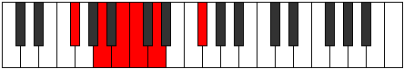
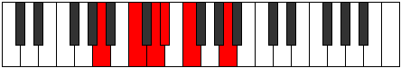

# Mode Bocritonic

## Links

- [Documentation](index.md)
- [Scales Index](Scales.md)
- [Modes Index](Modes.md)
- [Chords Index](Chords.md)

## Parent Scale

[Ionaditonic](ScaleIonaditonic.md)

## Number

[361](https://ianring.com/musictheory/scales/361)

## Perfection

- 2 Perfect notes
- 3 Perfect notes

## Perfection Profile

[false false true false true]

## Permutations

| Tonic | Notes | Signature | Illustration | Audio |
|-------|-------|-----------|--------------|-------|
| [C](ModeCNaturalBocritonic.md) | **C**, **D#**, F, **F#**, G#, **C** | C |  | [midi](https://github.com/edipermadi/music/blob/main/docs/ModeCNaturalBocritonic.mid?raw=true) |
| [C#](ModeCSharpBocritonic.md) | **C#**, **E**, F#, **G**, A, **C#** | C |  | [midi](https://github.com/edipermadi/music/blob/main/docs/ModeCSharpBocritonic.mid?raw=true) |
| [Db](ModeDFlatBocritonic.md) | **Db**, **E**, Gb, **G**, A, **Db** | C |  | [midi](https://github.com/edipermadi/music/blob/main/docs/ModeDFlatBocritonic.mid?raw=true) |
| [D](ModeDNaturalBocritonic.md) | **D**, **F**, G, **G#**, A#, **D** | C |  | [midi](https://github.com/edipermadi/music/blob/main/docs/ModeDNaturalBocritonic.mid?raw=true) |
| [D#](ModeDSharpBocritonic.md) | **D#**, **F#**, G#, **A**, B, **D#** | C |  | [midi](https://github.com/edipermadi/music/blob/main/docs/ModeDSharpBocritonic.mid?raw=true) |
| [Eb](ModeEFlatBocritonic.md) | **Eb**, **Gb**, Ab, **A**, B, **Eb** | C |  | [midi](https://github.com/edipermadi/music/blob/main/docs/ModeEFlatBocritonic.mid?raw=true) |
| [E](ModeENaturalBocritonic.md) | **E**, **G**, A, **A#**, C, **E** | C |  | [midi](https://github.com/edipermadi/music/blob/main/docs/ModeENaturalBocritonic.mid?raw=true) |
| [F](ModeFNaturalBocritonic.md) | **F**, **G#**, A#, **B**, C#, **F** | C |  | [midi](https://github.com/edipermadi/music/blob/main/docs/ModeFNaturalBocritonic.mid?raw=true) |
| [F#](ModeFSharpBocritonic.md) | **F#**, **A**, B, **C**, D, **F#** | C |  | [midi](https://github.com/edipermadi/music/blob/main/docs/ModeFSharpBocritonic.mid?raw=true) |
| [Gb](ModeGFlatBocritonic.md) | **Gb**, **A**, B, **C**, D, **Gb** | C |  | [midi](https://github.com/edipermadi/music/blob/main/docs/ModeGFlatBocritonic.mid?raw=true) |
| [G](ModeGNaturalBocritonic.md) | **G**, **A#**, C, **C#**, D#, **G** | C |  | [midi](https://github.com/edipermadi/music/blob/main/docs/ModeGNaturalBocritonic.mid?raw=true) |
| [G#](ModeGSharpBocritonic.md) | **G#**, **B**, C#, **D**, E, **G#** | C |  | [midi](https://github.com/edipermadi/music/blob/main/docs/ModeGSharpBocritonic.mid?raw=true) |
| [Ab](ModeAFlatBocritonic.md) | **Ab**, **B**, Db, **D**, E, **Ab** | C |  | [midi](https://github.com/edipermadi/music/blob/main/docs/ModeAFlatBocritonic.mid?raw=true) |
| [A](ModeANaturalBocritonic.md) | **A**, **C**, D, **D#**, F, **A** | C |  | [midi](https://github.com/edipermadi/music/blob/main/docs/ModeANaturalBocritonic.mid?raw=true) |
| [A#](ModeASharpBocritonic.md) | **A#**, **C#**, D#, **E**, F#, **A#** | C |  | [midi](https://github.com/edipermadi/music/blob/main/docs/ModeASharpBocritonic.mid?raw=true) |
| [Bb](ModeBFlatBocritonic.md) | **Bb**, **Db**, Eb, **E**, Gb, **Bb** | C |  | [midi](https://github.com/edipermadi/music/blob/main/docs/ModeBFlatBocritonic.mid?raw=true) |
| [B](ModeBNaturalBocritonic.md) | **B**, **D**, E, **F**, G, **B** | C |  | [midi](https://github.com/edipermadi/music/blob/main/docs/ModeBNaturalBocritonic.mid?raw=true) |
