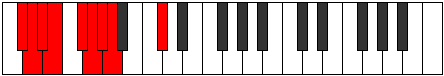
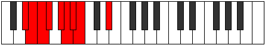
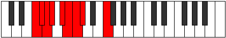
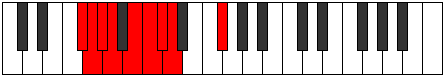
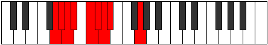
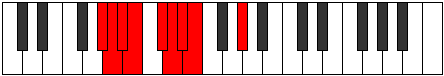
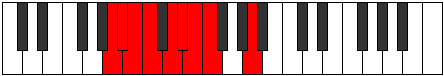
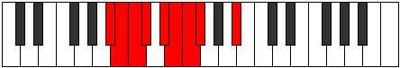
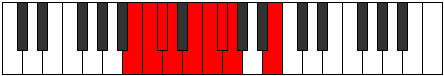

# Mode Bocryllic

## Links

- [Documentation](index.md)
- [Scales Index](Scales.md)
- [Modes Index](Modes.md)
- [Chords Index](Chords.md)

## Parent Scale

[Pynyllic](ScalePynyllic.md)

## Number

[495](https://ianring.com/musictheory/scales/495)

## Perfection

- 6 Perfect notes
- 2 Perfect notes

## Perfection Profile

[true true false false true true true true]

## Permutations

| Tonic | Notes | Signature | Illustration | Audio |
|-------|-------|-----------|--------------|-------|
| [C](ModeCNaturalBocryllic.md) | C, C#, **D**, **D#**, F, F#, G, G#, C | C |  | [midi](https://github.com/edipermadi/music/blob/main/docs/ModeCNaturalBocryllic.mid?raw=true) |
| [C#](ModeCSharpBocryllic.md) | C#, D, **D#**, **E**, F#, G, G#, A, C# | C |  | [midi](https://github.com/edipermadi/music/blob/main/docs/ModeCSharpBocryllic.mid?raw=true) |
| [Db](ModeDFlatBocryllic.md) | Db, D, **Eb**, **E**, Gb, G, Ab, A, Db | C |  | [midi](https://github.com/edipermadi/music/blob/main/docs/ModeDFlatBocryllic.mid?raw=true) |
| [D](ModeDNaturalBocryllic.md) | D, D#, **E**, **F**, G, G#, A, A#, D | C |  | [midi](https://github.com/edipermadi/music/blob/main/docs/ModeDNaturalBocryllic.mid?raw=true) |
| [D#](ModeDSharpBocryllic.md) | D#, E, **F**, **F#**, G#, A, A#, B, D# | C |  | [midi](https://github.com/edipermadi/music/blob/main/docs/ModeDSharpBocryllic.mid?raw=true) |
| [Eb](ModeEFlatBocryllic.md) | Eb, E, **F**, **Gb**, Ab, A, Bb, B, Eb | C |  | [midi](https://github.com/edipermadi/music/blob/main/docs/ModeEFlatBocryllic.mid?raw=true) |
| [E](ModeENaturalBocryllic.md) | E, F, **F#**, **G**, A, A#, B, C, E | C |  | [midi](https://github.com/edipermadi/music/blob/main/docs/ModeENaturalBocryllic.mid?raw=true) |
| [F](ModeFNaturalBocryllic.md) | F, F#, **G**, **G#**, A#, B, C, C#, F | C |  | [midi](https://github.com/edipermadi/music/blob/main/docs/ModeFNaturalBocryllic.mid?raw=true) |
| [F#](ModeFSharpBocryllic.md) | F#, G, **G#**, **A**, B, C, C#, D, F# | C |  | [midi](https://github.com/edipermadi/music/blob/main/docs/ModeFSharpBocryllic.mid?raw=true) |
| [Gb](ModeGFlatBocryllic.md) | Gb, G, **Ab**, **A**, B, C, Db, D, Gb | C |  | [midi](https://github.com/edipermadi/music/blob/main/docs/ModeGFlatBocryllic.mid?raw=true) |
| [G](ModeGNaturalBocryllic.md) | G, G#, **A**, **A#**, C, C#, D, D#, G | C |  | [midi](https://github.com/edipermadi/music/blob/main/docs/ModeGNaturalBocryllic.mid?raw=true) |
| [G#](ModeGSharpBocryllic.md) | G#, A, **A#**, **B**, C#, D, D#, E, G# | C |  | [midi](https://github.com/edipermadi/music/blob/main/docs/ModeGSharpBocryllic.mid?raw=true) |
| [Ab](ModeAFlatBocryllic.md) | Ab, A, **Bb**, **B**, Db, D, Eb, E, Ab | C |  | [midi](https://github.com/edipermadi/music/blob/main/docs/ModeAFlatBocryllic.mid?raw=true) |
| [A](ModeANaturalBocryllic.md) | A, A#, **B**, **C**, D, D#, E, F, A | C |  | [midi](https://github.com/edipermadi/music/blob/main/docs/ModeANaturalBocryllic.mid?raw=true) |
| [A#](ModeASharpBocryllic.md) | A#, B, **C**, **C#**, D#, E, F, F#, A# | C |  | [midi](https://github.com/edipermadi/music/blob/main/docs/ModeASharpBocryllic.mid?raw=true) |
| [Bb](ModeBFlatBocryllic.md) | Bb, B, **C**, **Db**, Eb, E, F, Gb, Bb | C |  | [midi](https://github.com/edipermadi/music/blob/main/docs/ModeBFlatBocryllic.mid?raw=true) |
| [B](ModeBNaturalBocryllic.md) | B, C, **C#**, **D**, E, F, F#, G, B | C |  | [midi](https://github.com/edipermadi/music/blob/main/docs/ModeBNaturalBocryllic.mid?raw=true) |
