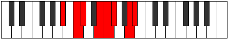

# Mode Bogian

## Links

- [Documentation](index.md)
- [Scales Index](Scales.md)
- [Modes Index](Modes.md)
- [Chords Index](Chords.md)

## Parent Scale

[Loptian](ScaleLoptian.md)

## Number

[2509](https://ianring.com/musictheory/scales/2509)

## Interval Pattern

2, 1, 3, 1, 1, 3, 1

## Chord Pattern

i, III⁺, V, VI, vii

## Perfection

- 4 Perfect notes
- 3 Perfect notes

## Perfection Profile

[true false false false true true true]

## Permutations

| Tonic | Notes | Signature | Illustration | Audio |
|-------|-------|-----------|--------------|-------|
| [C](ModeCNaturalBogian.md) | C, **D**, **Eb**, **F#**, G, Ab, B, C | C |  | [midi](https://github.com/edipermadi/music/blob/main/docs/ModeCNaturalBogian.mid?raw=true) |
| [C#](ModeCSharpBogian.md) | C#, **D#**, **E**, **F##**, G#, A, B#, C# | C |  | [midi](https://github.com/edipermadi/music/blob/main/docs/ModeCSharpBogian.mid?raw=true) |
| [Db](ModeDFlatBogian.md) | Db, **Eb**, **Fb**, **G**, Ab, Bbb, C, Db | C |  | [midi](https://github.com/edipermadi/music/blob/main/docs/ModeDFlatBogian.mid?raw=true) |
| [D](ModeDNaturalBogian.md) | D, **E**, **F**, **G#**, A, Bb, C#, D | C |  | [midi](https://github.com/edipermadi/music/blob/main/docs/ModeDNaturalBogian.mid?raw=true) |
| [D#](ModeDSharpBogian.md) | D#, **E#**, **F#**, **G##**, A#, B, C##, D# | C |  | [midi](https://github.com/edipermadi/music/blob/main/docs/ModeDSharpBogian.mid?raw=true) |
| [Eb](ModeEFlatBogian.md) | Eb, **F**, **Gb**, **A**, Bb, Cb, D, Eb | C |  | [midi](https://github.com/edipermadi/music/blob/main/docs/ModeEFlatBogian.mid?raw=true) |
| [E](ModeENaturalBogian.md) | E, **F#**, **G**, **A#**, B, C, D#, E | C |  | [midi](https://github.com/edipermadi/music/blob/main/docs/ModeENaturalBogian.mid?raw=true) |
| [F](ModeFNaturalBogian.md) | F, **G**, **Ab**, **B**, C, Db, E, F | C |  | [midi](https://github.com/edipermadi/music/blob/main/docs/ModeFNaturalBogian.mid?raw=true) |
| [F#](ModeFSharpBogian.md) | F#, **G#**, **A**, **B#**, C#, D, E#, F# | C |  | [midi](https://github.com/edipermadi/music/blob/main/docs/ModeFSharpBogian.mid?raw=true) |
| [Gb](ModeGFlatBogian.md) | Gb, **Ab**, **Bbb**, **C**, Db, Ebb, F, Gb | C |  | [midi](https://github.com/edipermadi/music/blob/main/docs/ModeGFlatBogian.mid?raw=true) |
| [G](ModeGNaturalBogian.md) | G, **A**, **Bb**, **C#**, D, Eb, F#, G | C |  | [midi](https://github.com/edipermadi/music/blob/main/docs/ModeGNaturalBogian.mid?raw=true) |
| [G#](ModeGSharpBogian.md) | G#, **A#**, **B**, **C##**, D#, E, F##, G# | C |  | [midi](https://github.com/edipermadi/music/blob/main/docs/ModeGSharpBogian.mid?raw=true) |
| [Ab](ModeAFlatBogian.md) | Ab, **Bb**, **Cb**, **D**, Eb, Fb, G, Ab | C |  | [midi](https://github.com/edipermadi/music/blob/main/docs/ModeAFlatBogian.mid?raw=true) |
| [A](ModeANaturalBogian.md) | A, **B**, **C**, **D#**, E, F, G#, A | C |  | [midi](https://github.com/edipermadi/music/blob/main/docs/ModeANaturalBogian.mid?raw=true) |
| [A#](ModeASharpBogian.md) | A#, **B#**, **C#**, **D##**, E#, F#, G##, A# | C |  | [midi](https://github.com/edipermadi/music/blob/main/docs/ModeASharpBogian.mid?raw=true) |
| [Bb](ModeBFlatBogian.md) | Bb, **C**, **Db**, **E**, F, Gb, A, Bb | C |  | [midi](https://github.com/edipermadi/music/blob/main/docs/ModeBFlatBogian.mid?raw=true) |
| [B](ModeBNaturalBogian.md) | B, **C#**, **D**, **E#**, F#, G, A#, B | C |  | [midi](https://github.com/edipermadi/music/blob/main/docs/ModeBNaturalBogian.mid?raw=true) |
