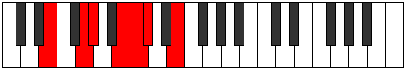

# Mode Bogimic

## Links

- [Documentation](README.md)
- [Scales Index](Scales.md)
- [Modes Index](Modes.md)
- [Chords Index](Chords.md)

## Parent Scale

[Ionodimic](ScaleIonodimic.md)

## Number

[921](https://ianring.com/musictheory/scales/921)

## Transposition

3, 1, 3, 1, 1, 3

## Chord Pattern

I⁺, IIb5, IIb5, III⁺, V⁺, V⁺

## Perfection

- 3 Perfect notes
- 3 Perfect notes

## Perfection Profile

[true false false false true true]

## Permutations

| Tonic | Notes | Signature | Illustration | Audio |
|-------|-------|-----------|--------------|-------|
| [C](ModeCNaturalBogimic.md) | C, **D#**, **E**, **F##**, G#, A, C | C |  | [midi](https://github.com/edipermadi/music/blob/main/docs/ModeCNaturalBogimic.mid?raw=true) |
| [C#](ModeCSharpBogimic.md) | C#, **D##**, **E#**, **F###**, G##, A#, C# | C |  | [midi](https://github.com/edipermadi/music/blob/main/docs/ModeCSharpBogimic.mid?raw=true) |
| [Db](ModeDFlatBogimic.md) | Db, **E**, **F**, **G#**, A, Bb, Db | C |  | [midi](https://github.com/edipermadi/music/blob/main/docs/ModeDFlatBogimic.mid?raw=true) |
| [D](ModeDNaturalBogimic.md) | D, **E#**, **F#**, **G##**, A#, B, D | C |  | [midi](https://github.com/edipermadi/music/blob/main/docs/ModeDNaturalBogimic.mid?raw=true) |
| [D#](ModeDSharpBogimic.md) | D#, **E##**, **F##**, **G###**, A##, B#, D# | C |  | [midi](https://github.com/edipermadi/music/blob/main/docs/ModeDSharpBogimic.mid?raw=true) |
| [Eb](ModeEFlatBogimic.md) | Eb, **F#**, **G**, **A#**, B, C, Eb | C |  | [midi](https://github.com/edipermadi/music/blob/main/docs/ModeEFlatBogimic.mid?raw=true) |
| [E](ModeENaturalBogimic.md) | E, **F##**, **G#**, **A##**, B#, C#, E | C |  | [midi](https://github.com/edipermadi/music/blob/main/docs/ModeENaturalBogimic.mid?raw=true) |
| [F](ModeFNaturalBogimic.md) | F, **G#**, **A**, **B#**, C#, D, F | C |  | [midi](https://github.com/edipermadi/music/blob/main/docs/ModeFNaturalBogimic.mid?raw=true) |
| [F#](ModeFSharpBogimic.md) | F#, **G##**, **A#**, **B##**, C##, D#, F# | C |  | [midi](https://github.com/edipermadi/music/blob/main/docs/ModeFSharpBogimic.mid?raw=true) |
| [Gb](ModeGFlatBogimic.md) | Gb, **A**, **Bb**, **C#**, D, Eb, Gb | C |  | [midi](https://github.com/edipermadi/music/blob/main/docs/ModeGFlatBogimic.mid?raw=true) |
| [G](ModeGNaturalBogimic.md) | G, **A#**, **B**, **C##**, D#, E, G | C |  | [midi](https://github.com/edipermadi/music/blob/main/docs/ModeGNaturalBogimic.mid?raw=true) |
| [G#](ModeGSharpBogimic.md) | G#, **A##**, **B#**, **C###**, D##, E#, G# | C |  | [midi](https://github.com/edipermadi/music/blob/main/docs/ModeGSharpBogimic.mid?raw=true) |
| [Ab](ModeAFlatBogimic.md) | Ab, **B**, **C**, **D#**, E, F, Ab | C |  | [midi](https://github.com/edipermadi/music/blob/main/docs/ModeAFlatBogimic.mid?raw=true) |
| [A](ModeANaturalBogimic.md) | A, **B#**, **C#**, **D##**, E#, F#, A | C |  | [midi](https://github.com/edipermadi/music/blob/main/docs/ModeANaturalBogimic.mid?raw=true) |
| [A#](ModeASharpBogimic.md) | A#, **B##**, **C##**, **D###**, E##, F##, A# | C |  | [midi](https://github.com/edipermadi/music/blob/main/docs/ModeASharpBogimic.mid?raw=true) |
| [Bb](ModeBFlatBogimic.md) | Bb, **C#**, **D**, **E#**, F#, G, Bb | C |  | [midi](https://github.com/edipermadi/music/blob/main/docs/ModeBFlatBogimic.mid?raw=true) |
| [B](ModeBNaturalBogimic.md) | B, **C##**, **D#**, **E##**, F##, G#, B | C |  | [midi](https://github.com/edipermadi/music/blob/main/docs/ModeBNaturalBogimic.mid?raw=true) |
