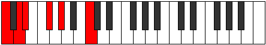

# Mode Bogitonic

## Links

- [Documentation](index.md)
- [Scales Index](Scales.md)
- [Modes Index](Modes.md)
- [Chords Index](Chords.md)

## Parent Scale

[Ionoditonic](ScaleIonoditonic.md)

## Number

[333](https://ianring.com/musictheory/scales/333)

## Perfection

- 1 Perfect notes
- 4 Perfect notes

## Perfection Profile

[false false false false true]

## Permutations

| Tonic | Notes | Signature | Illustration | Audio |
|-------|-------|-----------|--------------|-------|
| [C](ModeCNaturalBogitonic.md) | **C**, **D**, **D#**, **F#**, G#, **C** | C |  | [midi](ModeCNaturalBogitonic.mid) [ogg](ModeCNaturalBogitonic.ogg) |
| [C#](ModeCSharpBogitonic.md) | **C#**, **D#**, **E**, **G**, A, **C#** | C |  | [midi](ModeCSharpBogitonic.mid) [ogg](ModeCSharpBogitonic.ogg) |
| [Db](ModeDFlatBogitonic.md) | **Db**, **Eb**, **E**, **G**, A, **Db** | C |  | [midi](ModeDFlatBogitonic.mid) [ogg](ModeDFlatBogitonic.ogg) |
| [D](ModeDNaturalBogitonic.md) | **D**, **E**, **F**, **G#**, A#, **D** | C |  | [midi](ModeDNaturalBogitonic.mid) [ogg](ModeDNaturalBogitonic.ogg) |
| [D#](ModeDSharpBogitonic.md) | **D#**, **F**, **F#**, **A**, B, **D#** | C |  | [midi](ModeDSharpBogitonic.mid) [ogg](ModeDSharpBogitonic.ogg) |
| [Eb](ModeEFlatBogitonic.md) | **Eb**, **F**, **Gb**, **A**, B, **Eb** | C |  | [midi](ModeEFlatBogitonic.mid) [ogg](ModeEFlatBogitonic.ogg) |
| [E](ModeENaturalBogitonic.md) | **E**, **F#**, **G**, **A#**, C, **E** | C |  | [midi](ModeENaturalBogitonic.mid) [ogg](ModeENaturalBogitonic.ogg) |
| [F](ModeFNaturalBogitonic.md) | **F**, **G**, **G#**, **B**, C#, **F** | C |  | [midi](ModeFNaturalBogitonic.mid) [ogg](ModeFNaturalBogitonic.ogg) |
| [F#](ModeFSharpBogitonic.md) | **F#**, **G#**, **A**, **C**, D, **F#** | C |  | [midi](ModeFSharpBogitonic.mid) [ogg](ModeFSharpBogitonic.ogg) |
| [Gb](ModeGFlatBogitonic.md) | **Gb**, **Ab**, **A**, **C**, D, **Gb** | C |  | [midi](ModeGFlatBogitonic.mid) [ogg](ModeGFlatBogitonic.ogg) |
| [G](ModeGNaturalBogitonic.md) | **G**, **A**, **A#**, **C#**, D#, **G** | C |  | [midi](ModeGNaturalBogitonic.mid) [ogg](ModeGNaturalBogitonic.ogg) |
| [G#](ModeGSharpBogitonic.md) | **G#**, **A#**, **B**, **D**, E, **G#** | C |  | [midi](ModeGSharpBogitonic.mid) [ogg](ModeGSharpBogitonic.ogg) |
| [Ab](ModeAFlatBogitonic.md) | **Ab**, **Bb**, **B**, **D**, E, **Ab** | C |  | [midi](ModeAFlatBogitonic.mid) [ogg](ModeAFlatBogitonic.ogg) |
| [A](ModeANaturalBogitonic.md) | **A**, **B**, **C**, **D#**, F, **A** | C |  | [midi](ModeANaturalBogitonic.mid) [ogg](ModeANaturalBogitonic.ogg) |
| [A#](ModeASharpBogitonic.md) | **A#**, **C**, **C#**, **E**, F#, **A#** | C |  | [midi](ModeASharpBogitonic.mid) [ogg](ModeASharpBogitonic.ogg) |
| [Bb](ModeBFlatBogitonic.md) | **Bb**, **C**, **Db**, **E**, Gb, **Bb** | C |  | [midi](ModeBFlatBogitonic.mid) [ogg](ModeBFlatBogitonic.ogg) |
| [B](ModeBNaturalBogitonic.md) | **B**, **C#**, **D**, **F**, G, **B** | C |  | [midi](ModeBNaturalBogitonic.mid) [ogg](ModeBNaturalBogitonic.ogg) |
