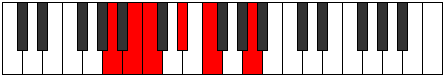

# Mode Bogitonic

## Links

- [Documentation](README.md)
- [Scales Index](Scales.md)
- [Modes Index](Modes.md)
- [Chords Index](Chords.md)

## Parent Scale

[Ionoditonic](ScaleIonoditonic.md)

## Number

[333](https://ianring.com/musictheory/scales/333)

## Luminosity

-1

## Transposition

2, 1, 3, 2, 4

## Chord Pattern

## Perfection

- 1 Perfect notes
- 4 Perfect notes

## Perfection Profile

false, false, false, false, true

## Permutations

| Tonic | Notes | Signature | Illustration | Audio |
|-------|-------|-----------|--------------|-------|
| [C](ModeCNaturalBogitonic.md) | **C**, **D**, **D#**, **F#**, G#, **C** | C |  | [midi](https://github.com/edipermadi/music/blob/main/docs/ModeCNaturalBogitonic.mid?raw=true) |
| [C#](ModeCSharpBogitonic.md) | **C#**, **D#**, **E**, **G**, A, **C#** | C |  | [midi](https://github.com/edipermadi/music/blob/main/docs/ModeCSharpBogitonic.mid?raw=true) |
| [Db](ModeDFlatBogitonic.md) | **Db**, **Eb**, **E**, **G**, A, **Db** | C |  | [midi](https://github.com/edipermadi/music/blob/main/docs/ModeDFlatBogitonic.mid?raw=true) |
| [D](ModeDNaturalBogitonic.md) | **D**, **E**, **F**, **G#**, A#, **D** | C |  | [midi](https://github.com/edipermadi/music/blob/main/docs/ModeDNaturalBogitonic.mid?raw=true) |
| [D#](ModeDSharpBogitonic.md) | **D#**, **F**, **F#**, **A**, B, **D#** | C |  | [midi](https://github.com/edipermadi/music/blob/main/docs/ModeDSharpBogitonic.mid?raw=true) |
| [Eb](ModeEFlatBogitonic.md) | **Eb**, **F**, **Gb**, **A**, B, **Eb** | C |  | [midi](https://github.com/edipermadi/music/blob/main/docs/ModeEFlatBogitonic.mid?raw=true) |
| [E](ModeENaturalBogitonic.md) | **E**, **F#**, **G**, **A#**, C, **E** | C |  | [midi](https://github.com/edipermadi/music/blob/main/docs/ModeENaturalBogitonic.mid?raw=true) |
| [F](ModeFNaturalBogitonic.md) | **F**, **G**, **G#**, **B**, C#, **F** | C |  | [midi](https://github.com/edipermadi/music/blob/main/docs/ModeFNaturalBogitonic.mid?raw=true) |
| [F#](ModeFSharpBogitonic.md) | **F#**, **G#**, **A**, **C**, D, **F#** | C |  | [midi](https://github.com/edipermadi/music/blob/main/docs/ModeFSharpBogitonic.mid?raw=true) |
| [Gb](ModeGFlatBogitonic.md) | **Gb**, **Ab**, **A**, **C**, D, **Gb** | C |  | [midi](https://github.com/edipermadi/music/blob/main/docs/ModeGFlatBogitonic.mid?raw=true) |
| [G](ModeGNaturalBogitonic.md) | **G**, **A**, **A#**, **C#**, D#, **G** | C |  | [midi](https://github.com/edipermadi/music/blob/main/docs/ModeGNaturalBogitonic.mid?raw=true) |
| [G#](ModeGSharpBogitonic.md) | **G#**, **A#**, **B**, **D**, E, **G#** | C |  | [midi](https://github.com/edipermadi/music/blob/main/docs/ModeGSharpBogitonic.mid?raw=true) |
| [Ab](ModeAFlatBogitonic.md) | **Ab**, **Bb**, **B**, **D**, E, **Ab** | C |  | [midi](https://github.com/edipermadi/music/blob/main/docs/ModeAFlatBogitonic.mid?raw=true) |
| [A](ModeANaturalBogitonic.md) | **A**, **B**, **C**, **D#**, F, **A** | C |  | [midi](https://github.com/edipermadi/music/blob/main/docs/ModeANaturalBogitonic.mid?raw=true) |
| [A#](ModeASharpBogitonic.md) | **A#**, **C**, **C#**, **E**, F#, **A#** | C |  | [midi](https://github.com/edipermadi/music/blob/main/docs/ModeASharpBogitonic.mid?raw=true) |
| [Bb](ModeBFlatBogitonic.md) | **Bb**, **C**, **Db**, **E**, Gb, **Bb** | C |  | [midi](https://github.com/edipermadi/music/blob/main/docs/ModeBFlatBogitonic.mid?raw=true) |
| [B](ModeBNaturalBogitonic.md) | **B**, **C#**, **D**, **F**, G, **B** | C |  | [midi](https://github.com/edipermadi/music/blob/main/docs/ModeBNaturalBogitonic.mid?raw=true) |
