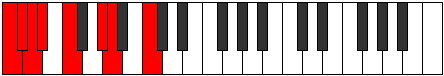
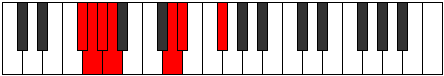
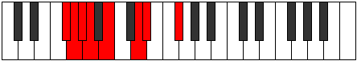

# Mode Bolian

## Links

- [Documentation](index.md)
- [Scales Index](Scales.md)
- [Modes Index](Modes.md)
- [Chords Index](Chords.md)

## Parent Scale

[Zarian](ScaleZarian.md)

## Number

[815](https://ianring.com/musictheory/scales/815)

## Perfection

- 4 Perfect notes
- 3 Perfect notes

## Perfection Profile

[false true true false true true false]

## Permutations

| Tonic | Notes | Signature | Illustration | Audio |
|-------|-------|-----------|--------------|-------|
| [C](ModeCNaturalBolian.md) | **C**, Db, Ebb, **Fbb**, Gbb, Ab, **Bbb**, **C** | C |  | [midi](ModeCNaturalBolian.mid) [ogg](ModeCNaturalBolian.ogg) |
| [C#](ModeCSharpBolian.md) | **C#**, D, Eb, **Fb**, Gb, A, **Bb**, **C#** | C |  | [midi](ModeCSharpBolian.mid) [ogg](ModeCSharpBolian.ogg) |
| [Db](ModeDFlatBolian.md) | **Db**, Ebb, Fbb, **Gbbb**, Abbb, Bbb, **Cbb**, **Db** | C |  | [midi](ModeDFlatBolian.mid) [ogg](ModeDFlatBolian.ogg) |
| [D](ModeDNaturalBolian.md) | **D**, Eb, Fb, **Gbb**, Abb, Bb, **Cb**, **D** | C |  | [midi](ModeDNaturalBolian.mid) [ogg](ModeDNaturalBolian.ogg) |
| [D#](ModeDSharpBolian.md) | **D#**, E, F, **Gb**, Ab, B, **C**, **D#** | C |  | [midi](ModeDSharpBolian.mid) [ogg](ModeDSharpBolian.ogg) |
| [Eb](ModeEFlatBolian.md) | **Eb**, Fb, Gbb, **Abbb**, Bbbb, Cb, **Dbb**, **Eb** | C |  | [midi](ModeEFlatBolian.mid) [ogg](ModeEFlatBolian.ogg) |
| [E](ModeENaturalBolian.md) | **E**, F, Gb, **Abb**, Bbb, C, **Db**, **E** | C |  | [midi](ModeENaturalBolian.mid) [ogg](ModeENaturalBolian.ogg) |
| [F](ModeFNaturalBolian.md) | **F**, Gb, Abb, **Bbbb**, Cbb, Db, **Ebb**, **F** | C |  | [midi](ModeFNaturalBolian.mid) [ogg](ModeFNaturalBolian.ogg) |
| [F#](ModeFSharpBolian.md) | **F#**, G, Ab, **Bbb**, Cb, D, **Eb**, **F#** | C |  | [midi](ModeFSharpBolian.mid) [ogg](ModeFSharpBolian.ogg) |
| [Gb](ModeGFlatBolian.md) | **Gb**, Abb, Bbbb, **Cbbb**, Dbbb, Ebb, **Fbb**, **Gb** | C |  | [midi](ModeGFlatBolian.mid) [ogg](ModeGFlatBolian.ogg) |
| [G](ModeGNaturalBolian.md) | **G**, Ab, Bbb, **Cbb**, Dbb, Eb, **Fb**, **G** | C |  | [midi](ModeGNaturalBolian.mid) [ogg](ModeGNaturalBolian.ogg) |
| [G#](ModeGSharpBolian.md) | **G#**, A, Bb, **Cb**, Db, E, **F**, **G#** | C |  | [midi](ModeGSharpBolian.mid) [ogg](ModeGSharpBolian.ogg) |
| [Ab](ModeAFlatBolian.md) | **Ab**, Bbb, Cbb, **Dbbb**, Ebbb, Fb, **Gbb**, **Ab** | C |  | [midi](ModeAFlatBolian.mid) [ogg](ModeAFlatBolian.ogg) |
| [A](ModeANaturalBolian.md) | **A**, Bb, Cb, **Dbb**, Ebb, F, **Gb**, **A** | C |  | [midi](ModeANaturalBolian.mid) [ogg](ModeANaturalBolian.ogg) |
| [A#](ModeASharpBolian.md) | **A#**, B, C, **Db**, Eb, F#, **G**, **A#** | C |  | [midi](ModeASharpBolian.mid) [ogg](ModeASharpBolian.ogg) |
| [Bb](ModeBFlatBolian.md) | **Bb**, Cb, Dbb, **Ebbb**, Fbb, Gb, **Abb**, **Bb** | C |  | [midi](ModeBFlatBolian.mid) [ogg](ModeBFlatBolian.ogg) |
| [B](ModeBNaturalBolian.md) | **B**, C, Db, **Ebb**, Fb, G, **Ab**, **B** | C |  | [midi](ModeBNaturalBolian.mid) [ogg](ModeBNaturalBolian.ogg) |
