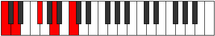
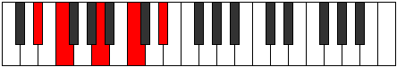
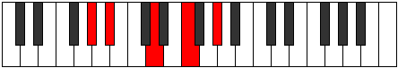
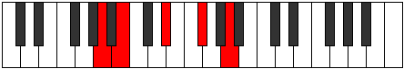

# Mode Bolic

## Links

- [Documentation](index.md)
- [Scales Index](Scales.md)
- [Modes Index](Modes.md)
- [Chords Index](Chords.md)

## Parent Scale

[Daric](ScaleDaric.md)

## Number

[581](https://ianring.com/musictheory/scales/581)

## Interval Pattern

2, 4, 3, 3

## Chord Pattern

II, iii⁰

## Perfection

- 1 Perfect notes
- 3 Perfect notes

## Perfection Profile

[false true false false]

## Permutations

| Tonic | Notes | Signature | Illustration | Audio |
|-------|-------|-----------|--------------|-------|
| [C](ModeCNaturalBolic.md) | **C**, D, **F#**, **A**, **C** | C |  | [midi](https://github.com/edipermadi/music/blob/main/docs/ModeCNaturalBolic.mid?raw=true) |
| [C#](ModeCSharpBolic.md) | **C#**, D#, **G**, **A#**, **C#** | C |  | [midi](https://github.com/edipermadi/music/blob/main/docs/ModeCSharpBolic.mid?raw=true) |
| [Db](ModeDFlatBolic.md) | **Db**, Eb, **G**, **Bb**, **Db** | C |  | [midi](https://github.com/edipermadi/music/blob/main/docs/ModeDFlatBolic.mid?raw=true) |
| [D](ModeDNaturalBolic.md) | **D**, E, **G#**, **B**, **D** | C |  | [midi](https://github.com/edipermadi/music/blob/main/docs/ModeDNaturalBolic.mid?raw=true) |
| [D#](ModeDSharpBolic.md) | **D#**, F, **A**, **C**, **D#** | C |  | [midi](https://github.com/edipermadi/music/blob/main/docs/ModeDSharpBolic.mid?raw=true) |
| [Eb](ModeEFlatBolic.md) | **Eb**, F, **A**, **C**, **Eb** | C |  | [midi](https://github.com/edipermadi/music/blob/main/docs/ModeEFlatBolic.mid?raw=true) |
| [E](ModeENaturalBolic.md) | **E**, F#, **A#**, **C#**, **E** | C |  | [midi](https://github.com/edipermadi/music/blob/main/docs/ModeENaturalBolic.mid?raw=true) |
| [F](ModeFNaturalBolic.md) | **F**, G, **B**, **D**, **F** | C |  | [midi](https://github.com/edipermadi/music/blob/main/docs/ModeFNaturalBolic.mid?raw=true) |
| [F#](ModeFSharpBolic.md) | **F#**, G#, **C**, **D#**, **F#** | C |  | [midi](https://github.com/edipermadi/music/blob/main/docs/ModeFSharpBolic.mid?raw=true) |
| [Gb](ModeGFlatBolic.md) | **Gb**, Ab, **C**, **Eb**, **Gb** | C |  | [midi](https://github.com/edipermadi/music/blob/main/docs/ModeGFlatBolic.mid?raw=true) |
| [G](ModeGNaturalBolic.md) | **G**, A, **C#**, **E**, **G** | C |  | [midi](https://github.com/edipermadi/music/blob/main/docs/ModeGNaturalBolic.mid?raw=true) |
| [G#](ModeGSharpBolic.md) | **G#**, A#, **D**, **F**, **G#** | C |  | [midi](https://github.com/edipermadi/music/blob/main/docs/ModeGSharpBolic.mid?raw=true) |
| [Ab](ModeAFlatBolic.md) | **Ab**, Bb, **D**, **F**, **Ab** | C |  | [midi](https://github.com/edipermadi/music/blob/main/docs/ModeAFlatBolic.mid?raw=true) |
| [A](ModeANaturalBolic.md) | **A**, B, **D#**, **F#**, **A** | C |  | [midi](https://github.com/edipermadi/music/blob/main/docs/ModeANaturalBolic.mid?raw=true) |
| [A#](ModeASharpBolic.md) | **A#**, C, **E**, **G**, **A#** | C |  | [midi](https://github.com/edipermadi/music/blob/main/docs/ModeASharpBolic.mid?raw=true) |
| [Bb](ModeBFlatBolic.md) | **Bb**, C, **E**, **G**, **Bb** | C |  | [midi](https://github.com/edipermadi/music/blob/main/docs/ModeBFlatBolic.mid?raw=true) |
| [B](ModeBNaturalBolic.md) | **B**, C#, **F**, **G#**, **B** | C |  | [midi](https://github.com/edipermadi/music/blob/main/docs/ModeBNaturalBolic.mid?raw=true) |
