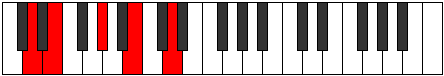

# Mode Bolic

## Links

- [Documentation](index.md)
- [Scales Index](Scales.md)
- [Modes Index](Modes.md)
- [Chords Index](Chords.md)

## Parent Scale

[Daric](ScaleDaric.md)

## Number

[581](https://ianring.com/musictheory/scales/581)

## Perfection

- 1 Perfect notes
- 3 Perfect notes

## Perfection Profile

[false true false false]

## Permutations

| Tonic | Notes | Signature | Illustration | Audio |
|-------|-------|-----------|--------------|-------|
| [C](ModeCNaturalBolic.md) | **C**, D, **F#**, **A**, **C** | C |  | [midi](ModeCNaturalBolic.mid) [ogg](ModeCNaturalBolic.ogg) |
| [C#](ModeCSharpBolic.md) | **C#**, D#, **G**, **A#**, **C#** | C |  | [midi](ModeCSharpBolic.mid) [ogg](ModeCSharpBolic.ogg) |
| [Db](ModeDFlatBolic.md) | **Db**, Eb, **G**, **Bb**, **Db** | C |  | [midi](ModeDFlatBolic.mid) [ogg](ModeDFlatBolic.ogg) |
| [D](ModeDNaturalBolic.md) | **D**, E, **G#**, **B**, **D** | C |  | [midi](ModeDNaturalBolic.mid) [ogg](ModeDNaturalBolic.ogg) |
| [D#](ModeDSharpBolic.md) | **D#**, F, **A**, **C**, **D#** | C |  | [midi](ModeDSharpBolic.mid) [ogg](ModeDSharpBolic.ogg) |
| [Eb](ModeEFlatBolic.md) | **Eb**, F, **A**, **C**, **Eb** | C |  | [midi](ModeEFlatBolic.mid) [ogg](ModeEFlatBolic.ogg) |
| [E](ModeENaturalBolic.md) | **E**, F#, **A#**, **C#**, **E** | C |  | [midi](ModeENaturalBolic.mid) [ogg](ModeENaturalBolic.ogg) |
| [F](ModeFNaturalBolic.md) | **F**, G, **B**, **D**, **F** | C |  | [midi](ModeFNaturalBolic.mid) [ogg](ModeFNaturalBolic.ogg) |
| [F#](ModeFSharpBolic.md) | **F#**, G#, **C**, **D#**, **F#** | C |  | [midi](ModeFSharpBolic.mid) [ogg](ModeFSharpBolic.ogg) |
| [Gb](ModeGFlatBolic.md) | **Gb**, Ab, **C**, **Eb**, **Gb** | C |  | [midi](ModeGFlatBolic.mid) [ogg](ModeGFlatBolic.ogg) |
| [G](ModeGNaturalBolic.md) | **G**, A, **C#**, **E**, **G** | C |  | [midi](ModeGNaturalBolic.mid) [ogg](ModeGNaturalBolic.ogg) |
| [G#](ModeGSharpBolic.md) | **G#**, A#, **D**, **F**, **G#** | C |  | [midi](ModeGSharpBolic.mid) [ogg](ModeGSharpBolic.ogg) |
| [Ab](ModeAFlatBolic.md) | **Ab**, Bb, **D**, **F**, **Ab** | C |  | [midi](ModeAFlatBolic.mid) [ogg](ModeAFlatBolic.ogg) |
| [A](ModeANaturalBolic.md) | **A**, B, **D#**, **F#**, **A** | C |  | [midi](ModeANaturalBolic.mid) [ogg](ModeANaturalBolic.ogg) |
| [A#](ModeASharpBolic.md) | **A#**, C, **E**, **G**, **A#** | C |  | [midi](ModeASharpBolic.mid) [ogg](ModeASharpBolic.ogg) |
| [Bb](ModeBFlatBolic.md) | **Bb**, C, **E**, **G**, **Bb** | C |  | [midi](ModeBFlatBolic.mid) [ogg](ModeBFlatBolic.ogg) |
| [B](ModeBNaturalBolic.md) | **B**, C#, **F**, **G#**, **B** | C |  | [midi](ModeBNaturalBolic.mid) [ogg](ModeBNaturalBolic.ogg) |
