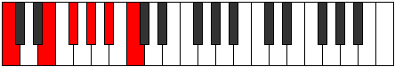

# Mode Bolitonic

## Links

- [Documentation](README.md)
- [Scales Index](Scales.md)
- [Modes Index](Modes.md)
- [Chords Index](Chords.md)

## Parent Scale

[Bolitonic](ScaleBolitonic.md)

## Number

[1361](https://ianring.com/musictheory/scales/1361)

## Interval Pattern

4, 2, 2, 2, 2

## Chord Pattern

II⁺

## Perfection

- 0 Perfect notes
- 5 Perfect notes

## Perfection Profile

[false false false false false]

## Permutations

| Tonic | Notes | Signature | Illustration | Audio |
|-------|-------|-----------|--------------|-------|
| [C](ModeCNaturalBolitonic.md) | **C**, **E**, **F#**, **G#**, **A#**, **C** | C |  | [midi](https://github.com/edipermadi/music/blob/main/docs/ModeCNaturalBolitonic.mid?raw=true) |
| [C#](ModeCSharpBolitonic.md) | **C#**, **F**, **G**, **A**, **B**, **C#** | C |  | [midi](https://github.com/edipermadi/music/blob/main/docs/ModeCSharpBolitonic.mid?raw=true) |
| [Db](ModeDFlatBolitonic.md) | **Db**, **F**, **G**, **A**, **B**, **Db** | C |  | [midi](https://github.com/edipermadi/music/blob/main/docs/ModeDFlatBolitonic.mid?raw=true) |
| [D](ModeDNaturalBolitonic.md) | **D**, **F#**, **G#**, **A#**, **C**, **D** | C |  | [midi](https://github.com/edipermadi/music/blob/main/docs/ModeDNaturalBolitonic.mid?raw=true) |
| [D#](ModeDSharpBolitonic.md) | **D#**, **G**, **A**, **B**, **C#**, **D#** | C |  | [midi](https://github.com/edipermadi/music/blob/main/docs/ModeDSharpBolitonic.mid?raw=true) |
| [Eb](ModeEFlatBolitonic.md) | **Eb**, **G**, **A**, **B**, **Db**, **Eb** | C |  | [midi](https://github.com/edipermadi/music/blob/main/docs/ModeEFlatBolitonic.mid?raw=true) |
| [E](ModeENaturalBolitonic.md) | **E**, **G#**, **A#**, **C**, **D**, **E** | C |  | [midi](https://github.com/edipermadi/music/blob/main/docs/ModeENaturalBolitonic.mid?raw=true) |
| [F](ModeFNaturalBolitonic.md) | **F**, **A**, **B**, **C#**, **D#**, **F** | C |  | [midi](https://github.com/edipermadi/music/blob/main/docs/ModeFNaturalBolitonic.mid?raw=true) |
| [F#](ModeFSharpBolitonic.md) | **F#**, **A#**, **C**, **D**, **E**, **F#** | C |  | [midi](https://github.com/edipermadi/music/blob/main/docs/ModeFSharpBolitonic.mid?raw=true) |
| [Gb](ModeGFlatBolitonic.md) | **Gb**, **Bb**, **C**, **D**, **E**, **Gb** | C |  | [midi](https://github.com/edipermadi/music/blob/main/docs/ModeGFlatBolitonic.mid?raw=true) |
| [G](ModeGNaturalBolitonic.md) | **G**, **B**, **C#**, **D#**, **F**, **G** | C |  | [midi](https://github.com/edipermadi/music/blob/main/docs/ModeGNaturalBolitonic.mid?raw=true) |
| [G#](ModeGSharpBolitonic.md) | **G#**, **C**, **D**, **E**, **F#**, **G#** | C |  | [midi](https://github.com/edipermadi/music/blob/main/docs/ModeGSharpBolitonic.mid?raw=true) |
| [Ab](ModeAFlatBolitonic.md) | **Ab**, **C**, **D**, **E**, **Gb**, **Ab** | C |  | [midi](https://github.com/edipermadi/music/blob/main/docs/ModeAFlatBolitonic.mid?raw=true) |
| [A](ModeANaturalBolitonic.md) | **A**, **C#**, **D#**, **F**, **G**, **A** | C |  | [midi](https://github.com/edipermadi/music/blob/main/docs/ModeANaturalBolitonic.mid?raw=true) |
| [A#](ModeASharpBolitonic.md) | **A#**, **D**, **E**, **F#**, **G#**, **A#** | C |  | [midi](https://github.com/edipermadi/music/blob/main/docs/ModeASharpBolitonic.mid?raw=true) |
| [Bb](ModeBFlatBolitonic.md) | **Bb**, **D**, **E**, **Gb**, **Ab**, **Bb** | C |  | [midi](https://github.com/edipermadi/music/blob/main/docs/ModeBFlatBolitonic.mid?raw=true) |
| [B](ModeBNaturalBolitonic.md) | **B**, **D#**, **F**, **G**, **A**, **B** | C |  | [midi](https://github.com/edipermadi/music/blob/main/docs/ModeBNaturalBolitonic.mid?raw=true) |
