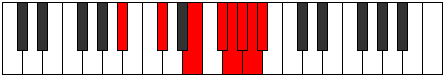

# Mode Bonian

## Links

- [Documentation](index.md)
- [Scales Index](Scales.md)
- [Modes Index](Modes.md)
- [Chords Index](Chords.md)

## Parent Scale

[Bonian](ScaleBonian.md)

## Number

[3913](https://ianring.com/musictheory/scales/3913)

## Perfection

- 3 Perfect notes
- 4 Perfect notes

## Perfection Profile

[false true false true false false true]

## Permutations

| Tonic | Notes | Signature | Illustration | Audio |
|-------|-------|-----------|--------------|-------|
| [C](ModeCNaturalBonian.md) | **C**, D#, **E##**, F###, **G##**, **A#**, B, **C** | C |  | [midi](ModeCNaturalBonian.mid) [ogg](ModeCNaturalBonian.ogg) |
| [C#](ModeCSharpBonian.md) | **C#**, D##, **E###**, Cbbb, **Cbb**, **Dbbb**, Dbb, **C#** | C |  | [midi](ModeCSharpBonian.mid) [ogg](ModeCSharpBonian.ogg) |
| [Db](ModeDFlatBonian.md) | **Db**, E, **F##**, G##, **A#**, **B**, C, **Db** | C |  | [midi](ModeDFlatBonian.mid) [ogg](ModeDFlatBonian.ogg) |
| [D](ModeDNaturalBonian.md) | **D**, E#, **F###**, G###, **A##**, **B#**, C#, **D** | C |  | [midi](ModeDNaturalBonian.mid) [ogg](ModeDNaturalBonian.ogg) |
| [D#](ModeDSharpBonian.md) | **D#**, E##, **Cbbb**, Dbbb, **Dbb**, **Ebbb**, Fbbb, **D#** | C |  | [midi](ModeDSharpBonian.mid) [ogg](ModeDSharpBonian.ogg) |
| [Eb](ModeEFlatBonian.md) | **Eb**, F#, **G##**, A##, **B#**, **C#**, D, **Eb** | C |  | [midi](ModeEFlatBonian.mid) [ogg](ModeEFlatBonian.ogg) |
| [E](ModeENaturalBonian.md) | **E**, F##, **G###**, A###, **B##**, **C##**, D#, **E** | C |  | [midi](ModeENaturalBonian.mid) [ogg](ModeENaturalBonian.ogg) |
| [F](ModeFNaturalBonian.md) | **F**, G#, **A##**, B##, **C##**, **D#**, E, **F** | C |  | [midi](ModeFNaturalBonian.mid) [ogg](ModeFNaturalBonian.ogg) |
| [F#](ModeFSharpBonian.md) | **F#**, G##, **A###**, B###, **C###**, **D##**, E#, **F#** | C |  | [midi](ModeFSharpBonian.mid) [ogg](ModeFSharpBonian.ogg) |
| [Gb](ModeGFlatBonian.md) | **Gb**, A, **B#**, C##, **D#**, **E**, F, **Gb** | C |  | [midi](ModeGFlatBonian.mid) [ogg](ModeGFlatBonian.ogg) |
| [G](ModeGNaturalBonian.md) | **G**, A#, **B##**, C###, **D##**, **E#**, F#, **G** | C |  | [midi](ModeGNaturalBonian.mid) [ogg](ModeGNaturalBonian.ogg) |
| [G#](ModeGSharpBonian.md) | **G#**, A##, **B###**, D##, **E#**, **F#**, G, **G#** | C |  | [midi](ModeGSharpBonian.mid) [ogg](ModeGSharpBonian.ogg) |
| [Ab](ModeAFlatBonian.md) | **Ab**, B, **C##**, D##, **E#**, **F#**, G, **Ab** | C |  | [midi](ModeAFlatBonian.mid) [ogg](ModeAFlatBonian.ogg) |
| [A](ModeANaturalBonian.md) | **A**, B#, **C###**, D###, **E##**, **F##**, G#, **A** | C |  | [midi](ModeANaturalBonian.mid) [ogg](ModeANaturalBonian.ogg) |
| [A#](ModeASharpBonian.md) | **A#**, B##, **D##**, E##, **F##**, **G#**, A, **A#** | C |  | [midi](ModeASharpBonian.mid) [ogg](ModeASharpBonian.ogg) |
| [Bb](ModeBFlatBonian.md) | **Bb**, C#, **D##**, E##, **F##**, **G#**, A, **Bb** | C |  | [midi](ModeBFlatBonian.mid) [ogg](ModeBFlatBonian.ogg) |
| [B](ModeBNaturalBonian.md) | **B**, C##, **D###**, E###, **F###**, **G##**, A#, **B** | C |  | [midi](ModeBNaturalBonian.mid) [ogg](ModeBNaturalBonian.ogg) |
