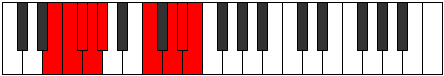

# Mode Bonyllic

## Links

- [Documentation](index.md)
- [Scales Index](Scales.md)
- [Modes Index](Modes.md)
- [Chords Index](Chords.md)

## Parent Scale

[Stycryllic](ScaleStycryllic.md)

## Number

[3359](https://ianring.com/musictheory/scales/3359)

## Perfection

- 4 Perfect notes
- 4 Perfect notes

## Perfection Profile

[false true false true true true false false]

## Permutations

| Tonic | Notes | Signature | Illustration | Audio |
|-------|-------|-----------|--------------|-------|
| [C](ModeCNaturalBonyllic.md) | **C**, C#, **D**, D#, E, G#, **A#**, **B**, **C** | C |  | [midi](ModeCNaturalBonyllic.mid) [ogg](ModeCNaturalBonyllic.ogg) |
| [C#](ModeCSharpBonyllic.md) | **C#**, D, **D#**, E, F, A, **B**, **C**, **C#** | C |  | [midi](ModeCSharpBonyllic.mid) [ogg](ModeCSharpBonyllic.ogg) |
| [Db](ModeDFlatBonyllic.md) | **Db**, D, **Eb**, E, F, A, **B**, **C**, **Db** | C |  | [midi](ModeDFlatBonyllic.mid) [ogg](ModeDFlatBonyllic.ogg) |
| [D](ModeDNaturalBonyllic.md) | **D**, D#, **E**, F, F#, A#, **C**, **C#**, **D** | C |  | [midi](ModeDNaturalBonyllic.mid) [ogg](ModeDNaturalBonyllic.ogg) |
| [D#](ModeDSharpBonyllic.md) | **D#**, E, **F**, F#, G, B, **C#**, **D**, **D#** | C |  | [midi](ModeDSharpBonyllic.mid) [ogg](ModeDSharpBonyllic.ogg) |
| [Eb](ModeEFlatBonyllic.md) | **Eb**, E, **F**, Gb, G, B, **Db**, **D**, **Eb** | C |  | [midi](ModeEFlatBonyllic.mid) [ogg](ModeEFlatBonyllic.ogg) |
| [E](ModeENaturalBonyllic.md) | **E**, F, **F#**, G, G#, C, **D**, **D#**, **E** | C |  | [midi](ModeENaturalBonyllic.mid) [ogg](ModeENaturalBonyllic.ogg) |
| [F](ModeFNaturalBonyllic.md) | **F**, F#, **G**, G#, A, C#, **D#**, **E**, **F** | C |  | [midi](ModeFNaturalBonyllic.mid) [ogg](ModeFNaturalBonyllic.ogg) |
| [F#](ModeFSharpBonyllic.md) | **F#**, G, **G#**, A, A#, D, **E**, **F**, **F#** | C |  | [midi](ModeFSharpBonyllic.mid) [ogg](ModeFSharpBonyllic.ogg) |
| [Gb](ModeGFlatBonyllic.md) | **Gb**, G, **Ab**, A, Bb, D, **E**, **F**, **Gb** | C |  | [midi](ModeGFlatBonyllic.mid) [ogg](ModeGFlatBonyllic.ogg) |
| [G](ModeGNaturalBonyllic.md) | **G**, G#, **A**, A#, B, D#, **F**, **F#**, **G** | C |  | [midi](ModeGNaturalBonyllic.mid) [ogg](ModeGNaturalBonyllic.ogg) |
| [G#](ModeGSharpBonyllic.md) | **G#**, A, **A#**, B, C, E, **F#**, **G**, **G#** | C |  | [midi](ModeGSharpBonyllic.mid) [ogg](ModeGSharpBonyllic.ogg) |
| [Ab](ModeAFlatBonyllic.md) | **Ab**, A, **Bb**, B, C, E, **Gb**, **G**, **Ab** | C |  | [midi](ModeAFlatBonyllic.mid) [ogg](ModeAFlatBonyllic.ogg) |
| [A](ModeANaturalBonyllic.md) | **A**, A#, **B**, C, C#, F, **G**, **G#**, **A** | C |  | [midi](ModeANaturalBonyllic.mid) [ogg](ModeANaturalBonyllic.ogg) |
| [A#](ModeASharpBonyllic.md) | **A#**, B, **C**, C#, D, F#, **G#**, **A**, **A#** | C |  | [midi](ModeASharpBonyllic.mid) [ogg](ModeASharpBonyllic.ogg) |
| [Bb](ModeBFlatBonyllic.md) | **Bb**, B, **C**, Db, D, Gb, **Ab**, **A**, **Bb** | C |  | [midi](ModeBFlatBonyllic.mid) [ogg](ModeBFlatBonyllic.ogg) |
| [B](ModeBNaturalBonyllic.md) | **B**, C, **C#**, D, D#, G, **A**, **A#**, **B** | C |  | [midi](ModeBNaturalBonyllic.mid) [ogg](ModeBNaturalBonyllic.ogg) |
