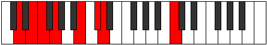
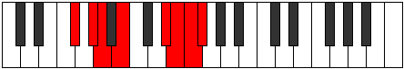
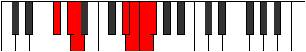
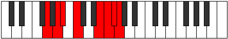
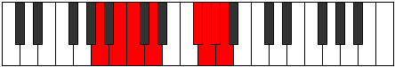
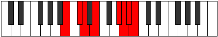

# Mode Boptian

## Links

- [Documentation](index.md)
- [Scales Index](Scales.md)
- [Modes Index](Modes.md)
- [Chords Index](Chords.md)

## Parent Scale

[Saptian](ScaleSaptian.md)

## Number

[3629](https://ianring.com/musictheory/scales/3629)

## Perfection

- 4 Perfect notes
- 3 Perfect notes

## Perfection Profile

[false true true true false true false]

## Permutations

| Tonic | Notes | Signature | Illustration | Audio |
|-------|-------|-----------|--------------|-------|
| [C](ModeCNaturalBoptian.md) | **C**, D, Eb, F, **G##**, A#, **B**, **C** | C |  | [midi](ModeCNaturalBoptian.mid) [ogg](ModeCNaturalBoptian.ogg) |
| [C#](ModeCSharpBoptian.md) | **C#**, D#, E, F#, **G###**, A##, **B#**, **C#** | C |  | [midi](ModeCSharpBoptian.mid) [ogg](ModeCSharpBoptian.ogg) |
| [Db](ModeDFlatBoptian.md) | **Db**, Eb, Fb, Gb, **A#**, B, **C**, **Db** | C |  | [midi](ModeDFlatBoptian.mid) [ogg](ModeDFlatBoptian.ogg) |
| [D](ModeDNaturalBoptian.md) | **D**, E, F, G, **A##**, B#, **C#**, **D** | C |  | [midi](ModeDNaturalBoptian.mid) [ogg](ModeDNaturalBoptian.ogg) |
| [D#](ModeDSharpBoptian.md) | **D#**, E#, F#, G#, **A###**, B##, **C##**, **D#** | C |  | [midi](ModeDSharpBoptian.mid) [ogg](ModeDSharpBoptian.ogg) |
| [Eb](ModeEFlatBoptian.md) | **Eb**, F, Gb, Ab, **B#**, C#, **D**, **Eb** | C |  | [midi](ModeEFlatBoptian.mid) [ogg](ModeEFlatBoptian.ogg) |
| [E](ModeENaturalBoptian.md) | **E**, F#, G, A, **B##**, C##, **D#**, **E** | C |  | [midi](ModeENaturalBoptian.mid) [ogg](ModeENaturalBoptian.ogg) |
| [F](ModeFNaturalBoptian.md) | **F**, G, Ab, Bb, **C##**, D#, **E**, **F** | C |  | [midi](ModeFNaturalBoptian.mid) [ogg](ModeFNaturalBoptian.ogg) |
| [F#](ModeFSharpBoptian.md) | **F#**, G#, A, B, **C###**, D##, **E#**, **F#** | C |  | [midi](ModeFSharpBoptian.mid) [ogg](ModeFSharpBoptian.ogg) |
| [Gb](ModeGFlatBoptian.md) | **Gb**, Ab, Bbb, Cb, **D#**, E, **F**, **Gb** | C |  | [midi](ModeGFlatBoptian.mid) [ogg](ModeGFlatBoptian.ogg) |
| [G](ModeGNaturalBoptian.md) | **G**, A, Bb, C, **D##**, E#, **F#**, **G** | C |  | [midi](ModeGNaturalBoptian.mid) [ogg](ModeGNaturalBoptian.ogg) |
| [G#](ModeGSharpBoptian.md) | **G#**, A#, B, C#, **D###**, E##, **F##**, **G#** | C |  | [midi](ModeGSharpBoptian.mid) [ogg](ModeGSharpBoptian.ogg) |
| [Ab](ModeAFlatBoptian.md) | **Ab**, Bb, Cb, Db, **E#**, F#, **G**, **Ab** | C |  | [midi](ModeAFlatBoptian.mid) [ogg](ModeAFlatBoptian.ogg) |
| [A](ModeANaturalBoptian.md) | **A**, B, C, D, **E##**, F##, **G#**, **A** | C |  | [midi](ModeANaturalBoptian.mid) [ogg](ModeANaturalBoptian.ogg) |
| [A#](ModeASharpBoptian.md) | **A#**, B#, C#, D#, **E###**, F###, **G##**, **A#** | C |  | [midi](ModeASharpBoptian.mid) [ogg](ModeASharpBoptian.ogg) |
| [Bb](ModeBFlatBoptian.md) | **Bb**, C, Db, Eb, **F##**, G#, **A**, **Bb** | C |  | [midi](ModeBFlatBoptian.mid) [ogg](ModeBFlatBoptian.ogg) |
| [B](ModeBNaturalBoptian.md) | **B**, C#, D, E, **F###**, G##, **A#**, **B** | C |  | [midi](ModeBNaturalBoptian.mid) [ogg](ModeBNaturalBoptian.ogg) |
