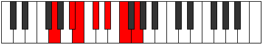
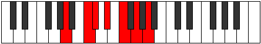
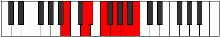

# Mode Boptimic

## Links

- [Documentation](index.md)
- [Scales Index](Scales.md)
- [Modes Index](Modes.md)
- [Chords Index](Chords.md)

## Parent Scale

[Boptimic](ScaleBoptimic.md)

## Number

[1369](https://ianring.com/musictheory/scales/1369)

## Perfection

- 2 Perfect notes
- 4 Perfect notes

## Perfection Profile

[false true false false true false]

## Permutations

| Tonic | Notes | Signature | Illustration | Audio |
|-------|-------|-----------|--------------|-------|
| [C](ModeCNaturalBoptimic.md) | **C**, D#, **E**, **F#**, G#, **A#**, **C** | C |  | [midi](ModeCNaturalBoptimic.mid) [ogg](ModeCNaturalBoptimic.ogg) |
| [C#](ModeCSharpBoptimic.md) | **C#**, D##, **E#**, **F##**, G##, **A##**, **C#** | C |  | [midi](ModeCSharpBoptimic.mid) [ogg](ModeCSharpBoptimic.ogg) |
| [Db](ModeDFlatBoptimic.md) | **Db**, E, **F**, **G**, A, **B**, **Db** | C |  | [midi](ModeDFlatBoptimic.mid) [ogg](ModeDFlatBoptimic.ogg) |
| [D](ModeDNaturalBoptimic.md) | **D**, E#, **F#**, **G#**, A#, **B#**, **D** | C |  | [midi](ModeDNaturalBoptimic.mid) [ogg](ModeDNaturalBoptimic.ogg) |
| [D#](ModeDSharpBoptimic.md) | **D#**, E##, **F##**, **G##**, A##, **B##**, **D#** | C |  | [midi](ModeDSharpBoptimic.mid) [ogg](ModeDSharpBoptimic.ogg) |
| [Eb](ModeEFlatBoptimic.md) | **Eb**, F#, **G**, **A**, B, **C#**, **Eb** | C |  | [midi](ModeEFlatBoptimic.mid) [ogg](ModeEFlatBoptimic.ogg) |
| [E](ModeENaturalBoptimic.md) | **E**, F##, **G#**, **A#**, B#, **C##**, **E** | C |  | [midi](ModeENaturalBoptimic.mid) [ogg](ModeENaturalBoptimic.ogg) |
| [F](ModeFNaturalBoptimic.md) | **F**, G#, **A**, **B**, C#, **D#**, **F** | C |  | [midi](ModeFNaturalBoptimic.mid) [ogg](ModeFNaturalBoptimic.ogg) |
| [F#](ModeFSharpBoptimic.md) | **F#**, G##, **A#**, **B#**, C##, **D##**, **F#** | C |  | [midi](ModeFSharpBoptimic.mid) [ogg](ModeFSharpBoptimic.ogg) |
| [Gb](ModeGFlatBoptimic.md) | **Gb**, A, **Bb**, **C**, D, **E**, **Gb** | C |  | [midi](ModeGFlatBoptimic.mid) [ogg](ModeGFlatBoptimic.ogg) |
| [G](ModeGNaturalBoptimic.md) | **G**, A#, **B**, **C#**, D#, **E#**, **G** | C |  | [midi](ModeGNaturalBoptimic.mid) [ogg](ModeGNaturalBoptimic.ogg) |
| [G#](ModeGSharpBoptimic.md) | **G#**, A##, **B#**, **C##**, D##, **E##**, **G#** | C |  | [midi](ModeGSharpBoptimic.mid) [ogg](ModeGSharpBoptimic.ogg) |
| [Ab](ModeAFlatBoptimic.md) | **Ab**, B, **C**, **D**, E, **F#**, **Ab** | C |  | [midi](ModeAFlatBoptimic.mid) [ogg](ModeAFlatBoptimic.ogg) |
| [A](ModeANaturalBoptimic.md) | **A**, B#, **C#**, **D#**, E#, **F##**, **A** | C |  | [midi](ModeANaturalBoptimic.mid) [ogg](ModeANaturalBoptimic.ogg) |
| [A#](ModeASharpBoptimic.md) | **A#**, B##, **C##**, **D##**, E##, **F###**, **A#** | C |  | [midi](ModeASharpBoptimic.mid) [ogg](ModeASharpBoptimic.ogg) |
| [Bb](ModeBFlatBoptimic.md) | **Bb**, C#, **D**, **E**, F#, **G#**, **Bb** | C |  | [midi](ModeBFlatBoptimic.mid) [ogg](ModeBFlatBoptimic.ogg) |
| [B](ModeBNaturalBoptimic.md) | **B**, C##, **D#**, **E#**, F##, **G##**, **B** | C |  | [midi](ModeBNaturalBoptimic.mid) [ogg](ModeBNaturalBoptimic.ogg) |
