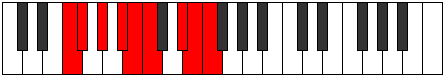

# Mode Boptyllic

## Links

- [Documentation](index.md)
- [Scales Index](Scales.md)
- [Modes Index](Modes.md)
- [Chords Index](Chords.md)

## Parent Scale

[Bacryllic](ScaleBacryllic.md)

## Number

[3307](https://ianring.com/musictheory/scales/3307)

## Perfection

- 6 Perfect notes
- 2 Perfect notes

## Perfection Profile

[true false true true true false true true]

## Permutations

| Tonic | Notes | Signature | Illustration | Audio |
|-------|-------|-----------|--------------|-------|
| [C](ModeCNaturalBoptyllic.md) | C, **C#**, D#, F, F#, **G**, A#, B, C | C |  | [midi](ModeCNaturalBoptyllic.mid) [ogg](ModeCNaturalBoptyllic.ogg) |
| [C#](ModeCSharpBoptyllic.md) | C#, **D**, E, F#, G, **G#**, B, C, C# | C |  | [midi](ModeCSharpBoptyllic.mid) [ogg](ModeCSharpBoptyllic.ogg) |
| [Db](ModeDFlatBoptyllic.md) | Db, **D**, E, Gb, G, **Ab**, B, C, Db | C |  | [midi](ModeDFlatBoptyllic.mid) [ogg](ModeDFlatBoptyllic.ogg) |
| [D](ModeDNaturalBoptyllic.md) | D, **D#**, F, G, G#, **A**, C, C#, D | C |  | [midi](ModeDNaturalBoptyllic.mid) [ogg](ModeDNaturalBoptyllic.ogg) |
| [D#](ModeDSharpBoptyllic.md) | D#, **E**, F#, G#, A, **A#**, C#, D, D# | C |  | [midi](ModeDSharpBoptyllic.mid) [ogg](ModeDSharpBoptyllic.ogg) |
| [Eb](ModeEFlatBoptyllic.md) | Eb, **E**, Gb, Ab, A, **Bb**, Db, D, Eb | C |  | [midi](ModeEFlatBoptyllic.mid) [ogg](ModeEFlatBoptyllic.ogg) |
| [E](ModeENaturalBoptyllic.md) | E, **F**, G, A, A#, **B**, D, D#, E | C |  | [midi](ModeENaturalBoptyllic.mid) [ogg](ModeENaturalBoptyllic.ogg) |
| [F](ModeFNaturalBoptyllic.md) | F, **F#**, G#, A#, B, **C**, D#, E, F | C |  | [midi](ModeFNaturalBoptyllic.mid) [ogg](ModeFNaturalBoptyllic.ogg) |
| [F#](ModeFSharpBoptyllic.md) | F#, **G**, A, B, C, **C#**, E, F, F# | C |  | [midi](ModeFSharpBoptyllic.mid) [ogg](ModeFSharpBoptyllic.ogg) |
| [Gb](ModeGFlatBoptyllic.md) | Gb, **G**, A, B, C, **Db**, E, F, Gb | C |  | [midi](ModeGFlatBoptyllic.mid) [ogg](ModeGFlatBoptyllic.ogg) |
| [G](ModeGNaturalBoptyllic.md) | G, **G#**, A#, C, C#, **D**, F, F#, G | C |  | [midi](ModeGNaturalBoptyllic.mid) [ogg](ModeGNaturalBoptyllic.ogg) |
| [G#](ModeGSharpBoptyllic.md) | G#, **A**, B, C#, D, **D#**, F#, G, G# | C |  | [midi](ModeGSharpBoptyllic.mid) [ogg](ModeGSharpBoptyllic.ogg) |
| [Ab](ModeAFlatBoptyllic.md) | Ab, **A**, B, Db, D, **Eb**, Gb, G, Ab | C |  | [midi](ModeAFlatBoptyllic.mid) [ogg](ModeAFlatBoptyllic.ogg) |
| [A](ModeANaturalBoptyllic.md) | A, **A#**, C, D, D#, **E**, G, G#, A | C |  | [midi](ModeANaturalBoptyllic.mid) [ogg](ModeANaturalBoptyllic.ogg) |
| [A#](ModeASharpBoptyllic.md) | A#, **B**, C#, D#, E, **F**, G#, A, A# | C |  | [midi](ModeASharpBoptyllic.mid) [ogg](ModeASharpBoptyllic.ogg) |
| [Bb](ModeBFlatBoptyllic.md) | Bb, **B**, Db, Eb, E, **F**, Ab, A, Bb | C |  | [midi](ModeBFlatBoptyllic.mid) [ogg](ModeBFlatBoptyllic.ogg) |
| [B](ModeBNaturalBoptyllic.md) | B, **C**, D, E, F, **F#**, A, A#, B | C |  | [midi](ModeBNaturalBoptyllic.mid) [ogg](ModeBNaturalBoptyllic.ogg) |
