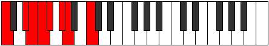
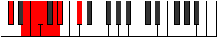
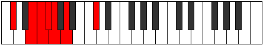
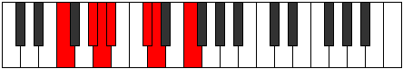

# Mode Borian

## Links

- [Documentation](README.md)
- [Scales Index](Scales.md)
- [Modes Index](Modes.md)
- [Chords Index](Chords.md)

## Parent Scale

[Gacrian](ScaleGacrian.md)

## Number

[889](https://ianring.com/musictheory/scales/889)

## Interval Pattern

3, 1, 1, 1, 2, 1, 3

## Chord Pattern

Ib5, iv, VI⁺

## Perfection

- 3 Perfect notes
- 4 Perfect notes

## Perfection Profile

[false false false true false true true]

## Permutations

| Tonic | Notes | Signature | Illustration | Audio |
|-------|-------|-----------|--------------|-------|
| [C](ModeCNaturalBorian.md) | **C**, **D#**, **E**, F, **Gb**, Ab, Bbb, **C** | C |  | [midi](https://github.com/edipermadi/music/blob/main/docs/ModeCNaturalBorian.mid?raw=true) |
| [C#](ModeCSharpBorian.md) | **C#**, **D##**, **E#**, F#, **G**, A, Bb, **C#** | C |  | [midi](https://github.com/edipermadi/music/blob/main/docs/ModeCSharpBorian.mid?raw=true) |
| [Db](ModeDFlatBorian.md) | **Db**, **E**, **F**, Gb, **Abb**, Bbb, Cbb, **Db** | C |  | [midi](https://github.com/edipermadi/music/blob/main/docs/ModeDFlatBorian.mid?raw=true) |
| [D](ModeDNaturalBorian.md) | **D**, **E#**, **F#**, G, **Ab**, Bb, Cb, **D** | C |  | [midi](https://github.com/edipermadi/music/blob/main/docs/ModeDNaturalBorian.mid?raw=true) |
| [D#](ModeDSharpBorian.md) | **D#**, **E##**, **F##**, G#, **A**, B, C, **D#** | C |  | [midi](https://github.com/edipermadi/music/blob/main/docs/ModeDSharpBorian.mid?raw=true) |
| [Eb](ModeEFlatBorian.md) | **Eb**, **F#**, **G**, Ab, **Bbb**, Cb, Dbb, **Eb** | C |  | [midi](https://github.com/edipermadi/music/blob/main/docs/ModeEFlatBorian.mid?raw=true) |
| [E](ModeENaturalBorian.md) | **E**, **F##**, **G#**, A, **Bb**, C, Db, **E** | C |  | [midi](https://github.com/edipermadi/music/blob/main/docs/ModeENaturalBorian.mid?raw=true) |
| [F](ModeFNaturalBorian.md) | **F**, **G#**, **A**, Bb, **Cb**, Db, Ebb, **F** | C |  | [midi](https://github.com/edipermadi/music/blob/main/docs/ModeFNaturalBorian.mid?raw=true) |
| [F#](ModeFSharpBorian.md) | **F#**, **G##**, **A#**, B, **C**, D, Eb, **F#** | C |  | [midi](https://github.com/edipermadi/music/blob/main/docs/ModeFSharpBorian.mid?raw=true) |
| [Gb](ModeGFlatBorian.md) | **Gb**, **A**, **Bb**, Cb, **Dbb**, Ebb, Fbb, **Gb** | C |  | [midi](https://github.com/edipermadi/music/blob/main/docs/ModeGFlatBorian.mid?raw=true) |
| [G](ModeGNaturalBorian.md) | **G**, **A#**, **B**, C, **Db**, Eb, Fb, **G** | C |  | [midi](https://github.com/edipermadi/music/blob/main/docs/ModeGNaturalBorian.mid?raw=true) |
| [G#](ModeGSharpBorian.md) | **G#**, **A##**, **B#**, C#, **D**, E, F, **G#** | C |  | [midi](https://github.com/edipermadi/music/blob/main/docs/ModeGSharpBorian.mid?raw=true) |
| [Ab](ModeAFlatBorian.md) | **Ab**, **B**, **C**, Db, **Ebb**, Fb, Gbb, **Ab** | C |  | [midi](https://github.com/edipermadi/music/blob/main/docs/ModeAFlatBorian.mid?raw=true) |
| [A](ModeANaturalBorian.md) | **A**, **B#**, **C#**, D, **Eb**, F, Gb, **A** | C |  | [midi](https://github.com/edipermadi/music/blob/main/docs/ModeANaturalBorian.mid?raw=true) |
| [A#](ModeASharpBorian.md) | **A#**, **B##**, **C##**, D#, **E**, F#, G, **A#** | C |  | [midi](https://github.com/edipermadi/music/blob/main/docs/ModeASharpBorian.mid?raw=true) |
| [Bb](ModeBFlatBorian.md) | **Bb**, **C#**, **D**, Eb, **Fb**, Gb, Abb, **Bb** | C |  | [midi](https://github.com/edipermadi/music/blob/main/docs/ModeBFlatBorian.mid?raw=true) |
| [B](ModeBNaturalBorian.md) | **B**, **C##**, **D#**, E, **F**, G, Ab, **B** | C |  | [midi](https://github.com/edipermadi/music/blob/main/docs/ModeBNaturalBorian.mid?raw=true) |
