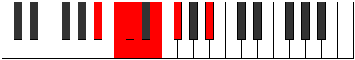

# Mode Borimic

## Links

- [Documentation](index.md)
- [Scales Index](Scales.md)
- [Modes Index](Modes.md)
- [Chords Index](Chords.md)

## Parent Scale

[Gacrimic](ScaleGacrimic.md)

## Number

[349](https://ianring.com/musictheory/scales/349)

## Perfection

- 1 Perfect notes
- 5 Perfect notes

## Perfection Profile

[false false false false false true]

## Permutations

| Tonic | Notes | Signature | Illustration | Audio |
|-------|-------|-----------|--------------|-------|
| [C](ModeCNaturalBorimic.md) | **C**, **D**, **Eb**, **Fb**, **Gb**, Ab, **C** | C |  | [midi](ModeCNaturalBorimic.mid) [ogg](ModeCNaturalBorimic.ogg) |
| [C#](ModeCSharpBorimic.md) | **C#**, **D#**, **E**, **F**, **G**, A, **C#** | C |  | [midi](ModeCSharpBorimic.mid) [ogg](ModeCSharpBorimic.ogg) |
| [Db](ModeDFlatBorimic.md) | **Db**, **Eb**, **Fb**, **Gbb**, **Abb**, Bbb, **Db** | C |  | [midi](ModeDFlatBorimic.mid) [ogg](ModeDFlatBorimic.ogg) |
| [D](ModeDNaturalBorimic.md) | **D**, **E**, **F**, **Gb**, **Ab**, Bb, **D** | C |  | [midi](ModeDNaturalBorimic.mid) [ogg](ModeDNaturalBorimic.ogg) |
| [D#](ModeDSharpBorimic.md) | **D#**, **E#**, **F#**, **G**, **A**, B, **D#** | C |  | [midi](ModeDSharpBorimic.mid) [ogg](ModeDSharpBorimic.ogg) |
| [Eb](ModeEFlatBorimic.md) | **Eb**, **F**, **Gb**, **Abb**, **Bbb**, Cb, **Eb** | C |  | [midi](ModeEFlatBorimic.mid) [ogg](ModeEFlatBorimic.ogg) |
| [E](ModeENaturalBorimic.md) | **E**, **F#**, **G**, **Ab**, **Bb**, C, **E** | C |  | [midi](ModeENaturalBorimic.mid) [ogg](ModeENaturalBorimic.ogg) |
| [F](ModeFNaturalBorimic.md) | **F**, **G**, **Ab**, **Bbb**, **Cb**, Db, **F** | C |  | [midi](ModeFNaturalBorimic.mid) [ogg](ModeFNaturalBorimic.ogg) |
| [F#](ModeFSharpBorimic.md) | **F#**, **G#**, **A**, **Bb**, **C**, D, **F#** | C |  | [midi](ModeFSharpBorimic.mid) [ogg](ModeFSharpBorimic.ogg) |
| [Gb](ModeGFlatBorimic.md) | **Gb**, **Ab**, **Bbb**, **Cbb**, **Dbb**, Ebb, **Gb** | C |  | [midi](ModeGFlatBorimic.mid) [ogg](ModeGFlatBorimic.ogg) |
| [G](ModeGNaturalBorimic.md) | **G**, **A**, **Bb**, **Cb**, **Db**, Eb, **G** | C |  | [midi](ModeGNaturalBorimic.mid) [ogg](ModeGNaturalBorimic.ogg) |
| [G#](ModeGSharpBorimic.md) | **G#**, **A#**, **B**, **C**, **D**, E, **G#** | C |  | [midi](ModeGSharpBorimic.mid) [ogg](ModeGSharpBorimic.ogg) |
| [Ab](ModeAFlatBorimic.md) | **Ab**, **Bb**, **Cb**, **Dbb**, **Ebb**, Fb, **Ab** | C |  | [midi](ModeAFlatBorimic.mid) [ogg](ModeAFlatBorimic.ogg) |
| [A](ModeANaturalBorimic.md) | **A**, **B**, **C**, **Db**, **Eb**, F, **A** | C |  | [midi](ModeANaturalBorimic.mid) [ogg](ModeANaturalBorimic.ogg) |
| [A#](ModeASharpBorimic.md) | **A#**, **B#**, **C#**, **D**, **E**, F#, **A#** | C |  | [midi](ModeASharpBorimic.mid) [ogg](ModeASharpBorimic.ogg) |
| [Bb](ModeBFlatBorimic.md) | **Bb**, **C**, **Db**, **Ebb**, **Fb**, Gb, **Bb** | C |  | [midi](ModeBFlatBorimic.mid) [ogg](ModeBFlatBorimic.ogg) |
| [B](ModeBNaturalBorimic.md) | **B**, **C#**, **D**, **Eb**, **F**, G, **B** | C |  | [midi](ModeBNaturalBorimic.mid) [ogg](ModeBNaturalBorimic.ogg) |
