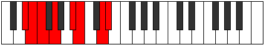
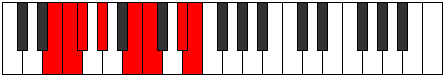
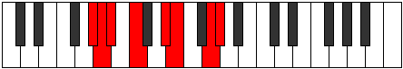

# Mode Bothian

## Links

- [Documentation](index.md)
- [Scales Index](Scales.md)
- [Modes Index](Modes.md)
- [Chords Index](Chords.md)

## Parent Scale

[Zarian](ScaleZarian.md)

## Number

[2455](https://ianring.com/musictheory/scales/2455)

## Perfection

- 4 Perfect notes
- 3 Perfect notes

## Perfection Profile

[true true false true true false false]

## Permutations

| Tonic | Notes | Signature | Illustration | Audio |
|-------|-------|-----------|--------------|-------|
| [C](ModeCNaturalBothian.md) | C, Db, **Ebb**, Fb, G, **Ab**, **B**, C | C |  | [midi](ModeCNaturalBothian.mid) [ogg](ModeCNaturalBothian.ogg) |
| [C#](ModeCSharpBothian.md) | C#, D, **Eb**, F, G#, **A**, **B#**, C# | C |  | [midi](ModeCSharpBothian.mid) [ogg](ModeCSharpBothian.ogg) |
| [Db](ModeDFlatBothian.md) | Db, Ebb, **Fbb**, Gbb, Ab, **Bbb**, **C**, Db | C |  | [midi](ModeDFlatBothian.mid) [ogg](ModeDFlatBothian.ogg) |
| [D](ModeDNaturalBothian.md) | D, Eb, **Fb**, Gb, A, **Bb**, **C#**, D | C |  | [midi](ModeDNaturalBothian.mid) [ogg](ModeDNaturalBothian.ogg) |
| [D#](ModeDSharpBothian.md) | D#, E, **F**, G, A#, **B**, **C##**, D# | C |  | [midi](ModeDSharpBothian.mid) [ogg](ModeDSharpBothian.ogg) |
| [Eb](ModeEFlatBothian.md) | Eb, Fb, **Gbb**, Abb, Bb, **Cb**, **D**, Eb | C |  | [midi](ModeEFlatBothian.mid) [ogg](ModeEFlatBothian.ogg) |
| [E](ModeENaturalBothian.md) | E, F, **Gb**, Ab, B, **C**, **D#**, E | C |  | [midi](ModeENaturalBothian.mid) [ogg](ModeENaturalBothian.ogg) |
| [F](ModeFNaturalBothian.md) | F, Gb, **Abb**, Bbb, C, **Db**, **E**, F | C |  | [midi](ModeFNaturalBothian.mid) [ogg](ModeFNaturalBothian.ogg) |
| [F#](ModeFSharpBothian.md) | F#, G, **Ab**, Bb, C#, **D**, **E#**, F# | C |  | [midi](ModeFSharpBothian.mid) [ogg](ModeFSharpBothian.ogg) |
| [Gb](ModeGFlatBothian.md) | Gb, Abb, **Bbbb**, Cbb, Db, **Ebb**, **F**, Gb | C |  | [midi](ModeGFlatBothian.mid) [ogg](ModeGFlatBothian.ogg) |
| [G](ModeGNaturalBothian.md) | G, Ab, **Bbb**, Cb, D, **Eb**, **F#**, G | C |  | [midi](ModeGNaturalBothian.mid) [ogg](ModeGNaturalBothian.ogg) |
| [G#](ModeGSharpBothian.md) | G#, A, **Bb**, C, D#, **E**, **F##**, G# | C |  | [midi](ModeGSharpBothian.mid) [ogg](ModeGSharpBothian.ogg) |
| [Ab](ModeAFlatBothian.md) | Ab, Bbb, **Cbb**, Dbb, Eb, **Fb**, **G**, Ab | C |  | [midi](ModeAFlatBothian.mid) [ogg](ModeAFlatBothian.ogg) |
| [A](ModeANaturalBothian.md) | A, Bb, **Cb**, Db, E, **F**, **G#**, A | C |  | [midi](ModeANaturalBothian.mid) [ogg](ModeANaturalBothian.ogg) |
| [A#](ModeASharpBothian.md) | A#, B, **C**, D, E#, **F#**, **G##**, A# | C |  | [midi](ModeASharpBothian.mid) [ogg](ModeASharpBothian.ogg) |
| [Bb](ModeBFlatBothian.md) | Bb, Cb, **Dbb**, Ebb, F, **Gb**, **A**, Bb | C |  | [midi](ModeBFlatBothian.mid) [ogg](ModeBFlatBothian.ogg) |
| [B](ModeBNaturalBothian.md) | B, C, **Db**, Eb, F#, **G**, **A#**, B | C |  | [midi](ModeBNaturalBothian.mid) [ogg](ModeBNaturalBothian.ogg) |
