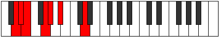
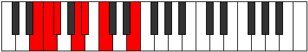
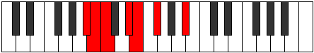

# Mode Bothimic

## Links

- [Documentation](README.md)
- [Scales Index](Scales.md)
- [Modes Index](Modes.md)
- [Chords Index](Chords.md)

## Parent Scale

[Bolimic](ScaleBolimic.md)

## Number

[359](https://ianring.com/musictheory/scales/359)

## Interval Pattern

1, 1, 3, 1, 2, 4

## Chord Pattern

II

## Perfection

- 3 Perfect notes
- 3 Perfect notes

## Perfection Profile

[false true false true true false]

## Permutations

| Tonic | Notes | Signature | Illustration | Audio |
|-------|-------|-----------|--------------|-------|
| [C](ModeCNaturalBothimic.md) | **C**, Db, **Ebb**, F, Gb, **Ab**, **C** | C |  | [midi](https://github.com/edipermadi/music/blob/main/docs/ModeCNaturalBothimic.mid?raw=true) |
| [C#](ModeCSharpBothimic.md) | **C#**, D, **Eb**, F#, G, **A**, **C#** | C |  | [midi](https://github.com/edipermadi/music/blob/main/docs/ModeCSharpBothimic.mid?raw=true) |
| [Db](ModeDFlatBothimic.md) | **Db**, Ebb, **Fbb**, Gb, Abb, **Bbb**, **Db** | C |  | [midi](https://github.com/edipermadi/music/blob/main/docs/ModeDFlatBothimic.mid?raw=true) |
| [D](ModeDNaturalBothimic.md) | **D**, Eb, **Fb**, G, Ab, **Bb**, **D** | C |  | [midi](https://github.com/edipermadi/music/blob/main/docs/ModeDNaturalBothimic.mid?raw=true) |
| [D#](ModeDSharpBothimic.md) | **D#**, E, **F**, G#, A, **B**, **D#** | C |  | [midi](https://github.com/edipermadi/music/blob/main/docs/ModeDSharpBothimic.mid?raw=true) |
| [Eb](ModeEFlatBothimic.md) | **Eb**, Fb, **Gbb**, Ab, Bbb, **Cb**, **Eb** | C |  | [midi](https://github.com/edipermadi/music/blob/main/docs/ModeEFlatBothimic.mid?raw=true) |
| [E](ModeENaturalBothimic.md) | **E**, F, **Gb**, A, Bb, **C**, **E** | C |  | [midi](https://github.com/edipermadi/music/blob/main/docs/ModeENaturalBothimic.mid?raw=true) |
| [F](ModeFNaturalBothimic.md) | **F**, Gb, **Abb**, Bb, Cb, **Db**, **F** | C |  | [midi](https://github.com/edipermadi/music/blob/main/docs/ModeFNaturalBothimic.mid?raw=true) |
| [F#](ModeFSharpBothimic.md) | **F#**, G, **Ab**, B, C, **D**, **F#** | C |  | [midi](https://github.com/edipermadi/music/blob/main/docs/ModeFSharpBothimic.mid?raw=true) |
| [Gb](ModeGFlatBothimic.md) | **Gb**, Abb, **Bbbb**, Cb, Dbb, **Ebb**, **Gb** | C |  | [midi](https://github.com/edipermadi/music/blob/main/docs/ModeGFlatBothimic.mid?raw=true) |
| [G](ModeGNaturalBothimic.md) | **G**, Ab, **Bbb**, C, Db, **Eb**, **G** | C |  | [midi](https://github.com/edipermadi/music/blob/main/docs/ModeGNaturalBothimic.mid?raw=true) |
| [G#](ModeGSharpBothimic.md) | **G#**, A, **Bb**, C#, D, **E**, **G#** | C |  | [midi](https://github.com/edipermadi/music/blob/main/docs/ModeGSharpBothimic.mid?raw=true) |
| [Ab](ModeAFlatBothimic.md) | **Ab**, Bbb, **Cbb**, Db, Ebb, **Fb**, **Ab** | C |  | [midi](https://github.com/edipermadi/music/blob/main/docs/ModeAFlatBothimic.mid?raw=true) |
| [A](ModeANaturalBothimic.md) | **A**, Bb, **Cb**, D, Eb, **F**, **A** | C |  | [midi](https://github.com/edipermadi/music/blob/main/docs/ModeANaturalBothimic.mid?raw=true) |
| [A#](ModeASharpBothimic.md) | **A#**, B, **C**, D#, E, **F#**, **A#** | C |  | [midi](https://github.com/edipermadi/music/blob/main/docs/ModeASharpBothimic.mid?raw=true) |
| [Bb](ModeBFlatBothimic.md) | **Bb**, Cb, **Dbb**, Eb, Fb, **Gb**, **Bb** | C |  | [midi](https://github.com/edipermadi/music/blob/main/docs/ModeBFlatBothimic.mid?raw=true) |
| [B](ModeBNaturalBothimic.md) | **B**, C, **Db**, E, F, **G**, **B** | C |  | [midi](https://github.com/edipermadi/music/blob/main/docs/ModeBNaturalBothimic.mid?raw=true) |
