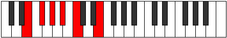
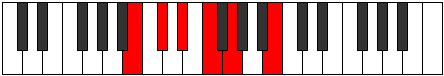

# Mode Bothitonic

## Links

- [Documentation](index.md)
- [Scales Index](Scales.md)
- [Modes Index](Modes.md)
- [Chords Index](Chords.md)

## Parent Scale

[Bolitonic](ScaleBolitonic.md)

## Number

[341](https://ianring.com/musictheory/scales/341)

## Interval Pattern

2, 2, 2, 2, 4

## Chord Pattern

I⁺

## Perfection

- 0 Perfect notes
- 5 Perfect notes

## Perfection Profile

[false false false false false]

## Permutations

| Tonic | Notes | Signature | Illustration | Audio |
|-------|-------|-----------|--------------|-------|
| [C](ModeCNaturalBothitonic.md) | **C**, **D**, **E**, **F#**, **G#**, **C** | C |  | [midi](https://github.com/edipermadi/music/blob/main/docs/ModeCNaturalBothitonic.mid?raw=true) |
| [C#](ModeCSharpBothitonic.md) | **C#**, **D#**, **F**, **G**, **A**, **C#** | C |  | [midi](https://github.com/edipermadi/music/blob/main/docs/ModeCSharpBothitonic.mid?raw=true) |
| [Db](ModeDFlatBothitonic.md) | **Db**, **Eb**, **F**, **G**, **A**, **Db** | C |  | [midi](https://github.com/edipermadi/music/blob/main/docs/ModeDFlatBothitonic.mid?raw=true) |
| [D](ModeDNaturalBothitonic.md) | **D**, **E**, **F#**, **G#**, **A#**, **D** | C |  | [midi](https://github.com/edipermadi/music/blob/main/docs/ModeDNaturalBothitonic.mid?raw=true) |
| [D#](ModeDSharpBothitonic.md) | **D#**, **F**, **G**, **A**, **B**, **D#** | C |  | [midi](https://github.com/edipermadi/music/blob/main/docs/ModeDSharpBothitonic.mid?raw=true) |
| [Eb](ModeEFlatBothitonic.md) | **Eb**, **F**, **G**, **A**, **B**, **Eb** | C |  | [midi](https://github.com/edipermadi/music/blob/main/docs/ModeEFlatBothitonic.mid?raw=true) |
| [E](ModeENaturalBothitonic.md) | **E**, **F#**, **G#**, **A#**, **C**, **E** | C |  | [midi](https://github.com/edipermadi/music/blob/main/docs/ModeENaturalBothitonic.mid?raw=true) |
| [F](ModeFNaturalBothitonic.md) | **F**, **G**, **A**, **B**, **C#**, **F** | C |  | [midi](https://github.com/edipermadi/music/blob/main/docs/ModeFNaturalBothitonic.mid?raw=true) |
| [F#](ModeFSharpBothitonic.md) | **F#**, **G#**, **A#**, **C**, **D**, **F#** | C |  | [midi](https://github.com/edipermadi/music/blob/main/docs/ModeFSharpBothitonic.mid?raw=true) |
| [Gb](ModeGFlatBothitonic.md) | **Gb**, **Ab**, **Bb**, **C**, **D**, **Gb** | C |  | [midi](https://github.com/edipermadi/music/blob/main/docs/ModeGFlatBothitonic.mid?raw=true) |
| [G](ModeGNaturalBothitonic.md) | **G**, **A**, **B**, **C#**, **D#**, **G** | C |  | [midi](https://github.com/edipermadi/music/blob/main/docs/ModeGNaturalBothitonic.mid?raw=true) |
| [G#](ModeGSharpBothitonic.md) | **G#**, **A#**, **C**, **D**, **E**, **G#** | C |  | [midi](https://github.com/edipermadi/music/blob/main/docs/ModeGSharpBothitonic.mid?raw=true) |
| [Ab](ModeAFlatBothitonic.md) | **Ab**, **Bb**, **C**, **D**, **E**, **Ab** | C |  | [midi](https://github.com/edipermadi/music/blob/main/docs/ModeAFlatBothitonic.mid?raw=true) |
| [A](ModeANaturalBothitonic.md) | **A**, **B**, **C#**, **D#**, **F**, **A** | C |  | [midi](https://github.com/edipermadi/music/blob/main/docs/ModeANaturalBothitonic.mid?raw=true) |
| [A#](ModeASharpBothitonic.md) | **A#**, **C**, **D**, **E**, **F#**, **A#** | C |  | [midi](https://github.com/edipermadi/music/blob/main/docs/ModeASharpBothitonic.mid?raw=true) |
| [Bb](ModeBFlatBothitonic.md) | **Bb**, **C**, **D**, **E**, **Gb**, **Bb** | C |  | [midi](https://github.com/edipermadi/music/blob/main/docs/ModeBFlatBothitonic.mid?raw=true) |
| [B](ModeBNaturalBothitonic.md) | **B**, **C#**, **D#**, **F**, **G**, **B** | C |  | [midi](https://github.com/edipermadi/music/blob/main/docs/ModeBNaturalBothitonic.mid?raw=true) |
