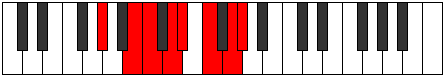

# Mode Bycrian

## Links

- [Documentation](index.md)
- [Scales Index](Scales.md)
- [Modes Index](Modes.md)
- [Chords Index](Chords.md)

## Parent Scale

[Bycrian](ScaleBycrian.md)

## Number

[2777](https://ianring.com/musictheory/scales/2777)

## Perfection

- 4 Perfect notes
- 3 Perfect notes

## Perfection Profile

[true false true false false true true]

## Permutations

| Tonic | Notes | Signature | Illustration | Audio |
|-------|-------|-----------|--------------|-------|
| [C](ModeCNaturalBycrian.md) | C, **D#**, E, **F#**, **G**, A, B, C | C |  | [midi](ModeCNaturalBycrian.mid) [ogg](ModeCNaturalBycrian.ogg) |
| [C#](ModeCSharpBycrian.md) | C#, **D##**, E#, **F##**, **G#**, A#, B#, C# | C |  | [midi](ModeCSharpBycrian.mid) [ogg](ModeCSharpBycrian.ogg) |
| [Db](ModeDFlatBycrian.md) | Db, **E**, F, **G**, **Ab**, Bb, C, Db | C |  | [midi](ModeDFlatBycrian.mid) [ogg](ModeDFlatBycrian.ogg) |
| [D](ModeDNaturalBycrian.md) | D, **E#**, F#, **G#**, **A**, B, C#, D | C |  | [midi](ModeDNaturalBycrian.mid) [ogg](ModeDNaturalBycrian.ogg) |
| [D#](ModeDSharpBycrian.md) | D#, **E##**, F##, **G##**, **A#**, B#, C##, D# | C |  | [midi](ModeDSharpBycrian.mid) [ogg](ModeDSharpBycrian.ogg) |
| [Eb](ModeEFlatBycrian.md) | Eb, **F#**, G, **A**, **Bb**, C, D, Eb | C |  | [midi](ModeEFlatBycrian.mid) [ogg](ModeEFlatBycrian.ogg) |
| [E](ModeENaturalBycrian.md) | E, **F##**, G#, **A#**, **B**, C#, D#, E | C |  | [midi](ModeENaturalBycrian.mid) [ogg](ModeENaturalBycrian.ogg) |
| [F](ModeFNaturalBycrian.md) | F, **G#**, A, **B**, **C**, D, E, F | C |  | [midi](ModeFNaturalBycrian.mid) [ogg](ModeFNaturalBycrian.ogg) |
| [F#](ModeFSharpBycrian.md) | F#, **G##**, A#, **B#**, **C#**, D#, E#, F# | C |  | [midi](ModeFSharpBycrian.mid) [ogg](ModeFSharpBycrian.ogg) |
| [Gb](ModeGFlatBycrian.md) | Gb, **A**, Bb, **C**, **Db**, Eb, F, Gb | C |  | [midi](ModeGFlatBycrian.mid) [ogg](ModeGFlatBycrian.ogg) |
| [G](ModeGNaturalBycrian.md) | G, **A#**, B, **C#**, **D**, E, F#, G | C |  | [midi](ModeGNaturalBycrian.mid) [ogg](ModeGNaturalBycrian.ogg) |
| [G#](ModeGSharpBycrian.md) | G#, **A##**, B#, **C##**, **D#**, E#, F##, G# | C |  | [midi](ModeGSharpBycrian.mid) [ogg](ModeGSharpBycrian.ogg) |
| [Ab](ModeAFlatBycrian.md) | Ab, **B**, C, **D**, **Eb**, F, G, Ab | C |  | [midi](ModeAFlatBycrian.mid) [ogg](ModeAFlatBycrian.ogg) |
| [A](ModeANaturalBycrian.md) | A, **B#**, C#, **D#**, **E**, F#, G#, A | C |  | [midi](ModeANaturalBycrian.mid) [ogg](ModeANaturalBycrian.ogg) |
| [A#](ModeASharpBycrian.md) | A#, **B##**, C##, **D##**, **E#**, F##, G##, A# | C |  | [midi](ModeASharpBycrian.mid) [ogg](ModeASharpBycrian.ogg) |
| [Bb](ModeBFlatBycrian.md) | Bb, **C#**, D, **E**, **F**, G, A, Bb | C |  | [midi](ModeBFlatBycrian.mid) [ogg](ModeBFlatBycrian.ogg) |
| [B](ModeBNaturalBycrian.md) | B, **C##**, D#, **E#**, **F#**, G#, A#, B | C |  | [midi](ModeBNaturalBycrian.mid) [ogg](ModeBNaturalBycrian.ogg) |
