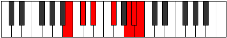

# Mode Bycrimic

## Links

- [Documentation](README.md)
- [Scales Index](Scales.md)
- [Modes Index](Modes.md)
- [Chords Index](Chords.md)

## Parent Scale

[Zagimic](ScaleZagimic.md)

## Number

[3221](https://ianring.com/musictheory/scales/3221)

## Luminosity

-1

## Transposition

2, 2, 3, 3, 1, 1

## Chord Pattern

IV, v⁰b3

## Perfection

- 3 Perfect notes
- 3 Perfect notes

## Perfection Profile

true, false, true, true, false, false

## Permutations

| Tonic | Notes | Signature | Illustration | Audio |
|-------|-------|-----------|--------------|-------|
| [C](ModeCNaturalBycrimic.md) | C, **D**, E, F##, **G###**, **A##**, C | C |  | [midi](https://github.com/edipermadi/music/blob/main/docs/ModeCNaturalBycrimic.mid?raw=true) |
| [C#](ModeCSharpBycrimic.md) | C#, **D#**, E#, F###, **Cb**, **Dbb**, C# | C |  | [midi](https://github.com/edipermadi/music/blob/main/docs/ModeCSharpBycrimic.mid?raw=true) |
| [Db](ModeDFlatBycrimic.md) | Db, **Eb**, F, G#, **A##**, **B#**, Db | C |  | [midi](https://github.com/edipermadi/music/blob/main/docs/ModeDFlatBycrimic.mid?raw=true) |
| [D](ModeDNaturalBycrimic.md) | D, **E**, F#, G##, **A###**, **B##**, D | C |  | [midi](https://github.com/edipermadi/music/blob/main/docs/ModeDNaturalBycrimic.mid?raw=true) |
| [D#](ModeDSharpBycrimic.md) | D#, **E#**, F##, G###, **Db**, **Ebb**, D# | C |  | [midi](https://github.com/edipermadi/music/blob/main/docs/ModeDSharpBycrimic.mid?raw=true) |
| [Eb](ModeEFlatBycrimic.md) | Eb, **F**, G, A#, **B##**, **C##**, Eb | C |  | [midi](https://github.com/edipermadi/music/blob/main/docs/ModeEFlatBycrimic.mid?raw=true) |
| [E](ModeENaturalBycrimic.md) | E, **F#**, G#, A##, **B###**, **C###**, E | C |  | [midi](https://github.com/edipermadi/music/blob/main/docs/ModeENaturalBycrimic.mid?raw=true) |
| [F](ModeFNaturalBycrimic.md) | F, **G**, A, B#, **C###**, **D##**, F | C |  | [midi](https://github.com/edipermadi/music/blob/main/docs/ModeFNaturalBycrimic.mid?raw=true) |
| [F#](ModeFSharpBycrimic.md) | F#, **G#**, A#, B##, **D##**, **E#**, F# | C |  | [midi](https://github.com/edipermadi/music/blob/main/docs/ModeFSharpBycrimic.mid?raw=true) |
| [Gb](ModeGFlatBycrimic.md) | Gb, **Ab**, Bb, C#, **D##**, **E#**, Gb | C |  | [midi](https://github.com/edipermadi/music/blob/main/docs/ModeGFlatBycrimic.mid?raw=true) |
| [G](ModeGNaturalBycrimic.md) | G, **A**, B, C##, **D###**, **E##**, G | C |  | [midi](https://github.com/edipermadi/music/blob/main/docs/ModeGNaturalBycrimic.mid?raw=true) |
| [G#](ModeGSharpBycrimic.md) | G#, **A#**, B#, C###, **E##**, **F##**, G# | C |  | [midi](https://github.com/edipermadi/music/blob/main/docs/ModeGSharpBycrimic.mid?raw=true) |
| [Ab](ModeAFlatBycrimic.md) | Ab, **Bb**, C, D#, **E##**, **F##**, Ab | C |  | [midi](https://github.com/edipermadi/music/blob/main/docs/ModeAFlatBycrimic.mid?raw=true) |
| [A](ModeANaturalBycrimic.md) | A, **B**, C#, D##, **E###**, **F###**, A | C |  | [midi](https://github.com/edipermadi/music/blob/main/docs/ModeANaturalBycrimic.mid?raw=true) |
| [A#](ModeASharpBycrimic.md) | A#, **B#**, C##, D###, **F###**, **G##**, A# | C |  | [midi](https://github.com/edipermadi/music/blob/main/docs/ModeASharpBycrimic.mid?raw=true) |
| [Bb](ModeBFlatBycrimic.md) | Bb, **C**, D, E#, **F###**, **G##**, Bb | C |  | [midi](https://github.com/edipermadi/music/blob/main/docs/ModeBFlatBycrimic.mid?raw=true) |
| [B](ModeBNaturalBycrimic.md) | B, **C#**, D#, E##, **Cbbb**, **Cbb**, B | C |  | [midi](https://github.com/edipermadi/music/blob/main/docs/ModeBNaturalBycrimic.mid?raw=true) |
