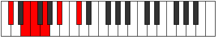

# Mode Bycritonic

## Links

- [Documentation](index.md)
- [Scales Index](Scales.md)
- [Modes Index](Modes.md)
- [Chords Index](Chords.md)

## Parent Scale

[Thyritonic](ScaleThyritonic.md)

## Number

[601](https://ianring.com/musictheory/scales/601)

## Interval Pattern

3, 1, 2, 3, 3

## Chord Pattern

## Perfection

- 1 Perfect notes
- 4 Perfect notes

## Perfection Profile

[false false false false true]

## Permutations

| Tonic | Notes | Signature | Illustration | Audio |
|-------|-------|-----------|--------------|-------|
| [C](ModeCNaturalBycritonic.md) | **C**, **D#**, **E**, **F#**, A, **C** | C |  | [midi](https://github.com/edipermadi/music/blob/main/docs/ModeCNaturalBycritonic.mid?raw=true) |
| [C#](ModeCSharpBycritonic.md) | **C#**, **E**, **F**, **G**, A#, **C#** | C |  | [midi](https://github.com/edipermadi/music/blob/main/docs/ModeCSharpBycritonic.mid?raw=true) |
| [Db](ModeDFlatBycritonic.md) | **Db**, **E**, **F**, **G**, Bb, **Db** | C |  | [midi](https://github.com/edipermadi/music/blob/main/docs/ModeDFlatBycritonic.mid?raw=true) |
| [D](ModeDNaturalBycritonic.md) | **D**, **F**, **F#**, **G#**, B, **D** | C |  | [midi](https://github.com/edipermadi/music/blob/main/docs/ModeDNaturalBycritonic.mid?raw=true) |
| [D#](ModeDSharpBycritonic.md) | **D#**, **F#**, **G**, **A**, C, **D#** | C |  | [midi](https://github.com/edipermadi/music/blob/main/docs/ModeDSharpBycritonic.mid?raw=true) |
| [Eb](ModeEFlatBycritonic.md) | **Eb**, **Gb**, **G**, **A**, C, **Eb** | C |  | [midi](https://github.com/edipermadi/music/blob/main/docs/ModeEFlatBycritonic.mid?raw=true) |
| [E](ModeENaturalBycritonic.md) | **E**, **G**, **G#**, **A#**, C#, **E** | C |  | [midi](https://github.com/edipermadi/music/blob/main/docs/ModeENaturalBycritonic.mid?raw=true) |
| [F](ModeFNaturalBycritonic.md) | **F**, **G#**, **A**, **B**, D, **F** | C |  | [midi](https://github.com/edipermadi/music/blob/main/docs/ModeFNaturalBycritonic.mid?raw=true) |
| [F#](ModeFSharpBycritonic.md) | **F#**, **A**, **A#**, **C**, D#, **F#** | C |  | [midi](https://github.com/edipermadi/music/blob/main/docs/ModeFSharpBycritonic.mid?raw=true) |
| [Gb](ModeGFlatBycritonic.md) | **Gb**, **A**, **Bb**, **C**, Eb, **Gb** | C |  | [midi](https://github.com/edipermadi/music/blob/main/docs/ModeGFlatBycritonic.mid?raw=true) |
| [G](ModeGNaturalBycritonic.md) | **G**, **A#**, **B**, **C#**, E, **G** | C |  | [midi](https://github.com/edipermadi/music/blob/main/docs/ModeGNaturalBycritonic.mid?raw=true) |
| [G#](ModeGSharpBycritonic.md) | **G#**, **B**, **C**, **D**, F, **G#** | C |  | [midi](https://github.com/edipermadi/music/blob/main/docs/ModeGSharpBycritonic.mid?raw=true) |
| [Ab](ModeAFlatBycritonic.md) | **Ab**, **B**, **C**, **D**, F, **Ab** | C |  | [midi](https://github.com/edipermadi/music/blob/main/docs/ModeAFlatBycritonic.mid?raw=true) |
| [A](ModeANaturalBycritonic.md) | **A**, **C**, **C#**, **D#**, F#, **A** | C |  | [midi](https://github.com/edipermadi/music/blob/main/docs/ModeANaturalBycritonic.mid?raw=true) |
| [A#](ModeASharpBycritonic.md) | **A#**, **C#**, **D**, **E**, G, **A#** | C |  | [midi](https://github.com/edipermadi/music/blob/main/docs/ModeASharpBycritonic.mid?raw=true) |
| [Bb](ModeBFlatBycritonic.md) | **Bb**, **Db**, **D**, **E**, G, **Bb** | C |  | [midi](https://github.com/edipermadi/music/blob/main/docs/ModeBFlatBycritonic.mid?raw=true) |
| [B](ModeBNaturalBycritonic.md) | **B**, **D**, **D#**, **F**, G#, **B** | C |  | [midi](https://github.com/edipermadi/music/blob/main/docs/ModeBNaturalBycritonic.mid?raw=true) |
