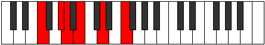
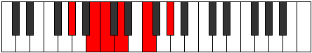

# Mode Bycritonic

## Links

- [Documentation](index.md)
- [Scales Index](Scales.md)
- [Modes Index](Modes.md)
- [Chords Index](Chords.md)

## Parent Scale

[Thyritonic](ScaleThyritonic.md)

## Number

[601](https://ianring.com/musictheory/scales/601)

## Perfection

- 1 Perfect notes
- 4 Perfect notes

## Perfection Profile

[false false false false true]

## Permutations

| Tonic | Notes | Signature | Illustration | Audio |
|-------|-------|-----------|--------------|-------|
| [C](ModeCNaturalBycritonic.md) | **C**, **D#**, **E**, **F#**, A, **C** | C |  | [midi](ModeCNaturalBycritonic.mid) [ogg](ModeCNaturalBycritonic.ogg) |
| [C#](ModeCSharpBycritonic.md) | **C#**, **E**, **F**, **G**, A#, **C#** | C |  | [midi](ModeCSharpBycritonic.mid) [ogg](ModeCSharpBycritonic.ogg) |
| [Db](ModeDFlatBycritonic.md) | **Db**, **E**, **F**, **G**, Bb, **Db** | C |  | [midi](ModeDFlatBycritonic.mid) [ogg](ModeDFlatBycritonic.ogg) |
| [D](ModeDNaturalBycritonic.md) | **D**, **F**, **F#**, **G#**, B, **D** | C |  | [midi](ModeDNaturalBycritonic.mid) [ogg](ModeDNaturalBycritonic.ogg) |
| [D#](ModeDSharpBycritonic.md) | **D#**, **F#**, **G**, **A**, C, **D#** | C |  | [midi](ModeDSharpBycritonic.mid) [ogg](ModeDSharpBycritonic.ogg) |
| [Eb](ModeEFlatBycritonic.md) | **Eb**, **Gb**, **G**, **A**, C, **Eb** | C |  | [midi](ModeEFlatBycritonic.mid) [ogg](ModeEFlatBycritonic.ogg) |
| [E](ModeENaturalBycritonic.md) | **E**, **G**, **G#**, **A#**, C#, **E** | C |  | [midi](ModeENaturalBycritonic.mid) [ogg](ModeENaturalBycritonic.ogg) |
| [F](ModeFNaturalBycritonic.md) | **F**, **G#**, **A**, **B**, D, **F** | C |  | [midi](ModeFNaturalBycritonic.mid) [ogg](ModeFNaturalBycritonic.ogg) |
| [F#](ModeFSharpBycritonic.md) | **F#**, **A**, **A#**, **C**, D#, **F#** | C |  | [midi](ModeFSharpBycritonic.mid) [ogg](ModeFSharpBycritonic.ogg) |
| [Gb](ModeGFlatBycritonic.md) | **Gb**, **A**, **Bb**, **C**, Eb, **Gb** | C |  | [midi](ModeGFlatBycritonic.mid) [ogg](ModeGFlatBycritonic.ogg) |
| [G](ModeGNaturalBycritonic.md) | **G**, **A#**, **B**, **C#**, E, **G** | C |  | [midi](ModeGNaturalBycritonic.mid) [ogg](ModeGNaturalBycritonic.ogg) |
| [G#](ModeGSharpBycritonic.md) | **G#**, **B**, **C**, **D**, F, **G#** | C |  | [midi](ModeGSharpBycritonic.mid) [ogg](ModeGSharpBycritonic.ogg) |
| [Ab](ModeAFlatBycritonic.md) | **Ab**, **B**, **C**, **D**, F, **Ab** | C |  | [midi](ModeAFlatBycritonic.mid) [ogg](ModeAFlatBycritonic.ogg) |
| [A](ModeANaturalBycritonic.md) | **A**, **C**, **C#**, **D#**, F#, **A** | C |  | [midi](ModeANaturalBycritonic.mid) [ogg](ModeANaturalBycritonic.ogg) |
| [A#](ModeASharpBycritonic.md) | **A#**, **C#**, **D**, **E**, G, **A#** | C |  | [midi](ModeASharpBycritonic.mid) [ogg](ModeASharpBycritonic.ogg) |
| [Bb](ModeBFlatBycritonic.md) | **Bb**, **Db**, **D**, **E**, G, **Bb** | C |  | [midi](ModeBFlatBycritonic.mid) [ogg](ModeBFlatBycritonic.ogg) |
| [B](ModeBNaturalBycritonic.md) | **B**, **D**, **D#**, **F**, G#, **B** | C |  | [midi](ModeBNaturalBycritonic.mid) [ogg](ModeBNaturalBycritonic.ogg) |
