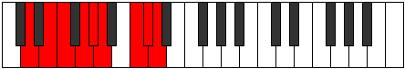

# Mode Bycryllic

## Links

- [Documentation](index.md)
- [Scales Index](Scales.md)
- [Modes Index](Modes.md)
- [Chords Index](Chords.md)

## Parent Scale

[Dydyllic](ScaleDydyllic.md)

## Number

[3309](https://ianring.com/musictheory/scales/3309)

## Perfection

- 6 Perfect notes
- 2 Perfect notes

## Perfection Profile

[true false true true false true true true]

## Permutations

| Tonic | Notes | Signature | Illustration | Audio |
|-------|-------|-----------|--------------|-------|
| [C](ModeCNaturalBycryllic.md) | C, **D**, D#, F, **F#**, G, A#, B, C | C |  | [midi](ModeCNaturalBycryllic.mid) [ogg](ModeCNaturalBycryllic.ogg) |
| [C#](ModeCSharpBycryllic.md) | C#, **D#**, E, F#, **G**, G#, B, C, C# | C |  | [midi](ModeCSharpBycryllic.mid) [ogg](ModeCSharpBycryllic.ogg) |
| [Db](ModeDFlatBycryllic.md) | Db, **Eb**, E, Gb, **G**, Ab, B, C, Db | C |  | [midi](ModeDFlatBycryllic.mid) [ogg](ModeDFlatBycryllic.ogg) |
| [D](ModeDNaturalBycryllic.md) | D, **E**, F, G, **G#**, A, C, C#, D | C |  | [midi](ModeDNaturalBycryllic.mid) [ogg](ModeDNaturalBycryllic.ogg) |
| [D#](ModeDSharpBycryllic.md) | D#, **F**, F#, G#, **A**, A#, C#, D, D# | C |  | [midi](ModeDSharpBycryllic.mid) [ogg](ModeDSharpBycryllic.ogg) |
| [Eb](ModeEFlatBycryllic.md) | Eb, **F**, Gb, Ab, **A**, Bb, Db, D, Eb | C |  | [midi](ModeEFlatBycryllic.mid) [ogg](ModeEFlatBycryllic.ogg) |
| [E](ModeENaturalBycryllic.md) | E, **F#**, G, A, **A#**, B, D, D#, E | C |  | [midi](ModeENaturalBycryllic.mid) [ogg](ModeENaturalBycryllic.ogg) |
| [F](ModeFNaturalBycryllic.md) | F, **G**, G#, A#, **B**, C, D#, E, F | C |  | [midi](ModeFNaturalBycryllic.mid) [ogg](ModeFNaturalBycryllic.ogg) |
| [F#](ModeFSharpBycryllic.md) | F#, **G#**, A, B, **C**, C#, E, F, F# | C |  | [midi](ModeFSharpBycryllic.mid) [ogg](ModeFSharpBycryllic.ogg) |
| [Gb](ModeGFlatBycryllic.md) | Gb, **Ab**, A, B, **C**, Db, E, F, Gb | C |  | [midi](ModeGFlatBycryllic.mid) [ogg](ModeGFlatBycryllic.ogg) |
| [G](ModeGNaturalBycryllic.md) | G, **A**, A#, C, **C#**, D, F, F#, G | C |  | [midi](ModeGNaturalBycryllic.mid) [ogg](ModeGNaturalBycryllic.ogg) |
| [G#](ModeGSharpBycryllic.md) | G#, **A#**, B, C#, **D**, D#, F#, G, G# | C |  | [midi](ModeGSharpBycryllic.mid) [ogg](ModeGSharpBycryllic.ogg) |
| [Ab](ModeAFlatBycryllic.md) | Ab, **Bb**, B, Db, **D**, Eb, Gb, G, Ab | C |  | [midi](ModeAFlatBycryllic.mid) [ogg](ModeAFlatBycryllic.ogg) |
| [A](ModeANaturalBycryllic.md) | A, **B**, C, D, **D#**, E, G, G#, A | C |  | [midi](ModeANaturalBycryllic.mid) [ogg](ModeANaturalBycryllic.ogg) |
| [A#](ModeASharpBycryllic.md) | A#, **C**, C#, D#, **E**, F, G#, A, A# | C |  | [midi](ModeASharpBycryllic.mid) [ogg](ModeASharpBycryllic.ogg) |
| [Bb](ModeBFlatBycryllic.md) | Bb, **C**, Db, Eb, **E**, F, Ab, A, Bb | C |  | [midi](ModeBFlatBycryllic.mid) [ogg](ModeBFlatBycryllic.ogg) |
| [B](ModeBNaturalBycryllic.md) | B, **C#**, D, E, **F**, F#, A, A#, B | C |  | [midi](ModeBNaturalBycryllic.mid) [ogg](ModeBNaturalBycryllic.ogg) |
