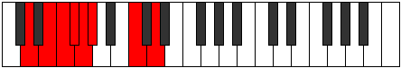
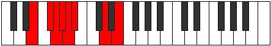

# Mode Bydian

## Links

- [Documentation](README.md)
- [Scales Index](Scales.md)
- [Modes Index](Modes.md)
- [Chords Index](Chords.md)

## Parent Scale

[Pythian](ScalePythian.md)

## Number

[1149](https://ianring.com/musictheory/scales/1149)

## Transposition

2, 1, 1, 1, 1, 4, 2

## Chord Pattern

VIIb5

## Perfection

- 3 Perfect notes
- 4 Perfect notes

## Perfection Profile

false, false, true, false, true, false, true

## Permutations

| Tonic | Notes | Signature | Illustration | Audio |
|-------|-------|-----------|--------------|-------|
| [C](ModeCNaturalBydian.md) | **C**, **D**, Eb, **Fb**, Gbb, **Abbb**, Bb, **C** | C |  | [midi](https://github.com/edipermadi/music/blob/main/docs/ModeCNaturalBydian.mid?raw=true) |
| [C#](ModeCSharpBydian.md) | **C#**, **D#**, E, **F**, Gb, **Abb**, B, **C#** | C |  | [midi](https://github.com/edipermadi/music/blob/main/docs/ModeCSharpBydian.mid?raw=true) |
| [Db](ModeDFlatBydian.md) | **Db**, **Eb**, Fb, **Gbb**, Abbb, **E###**, Cb, **Db** | C |  | [midi](https://github.com/edipermadi/music/blob/main/docs/ModeDFlatBydian.mid?raw=true) |
| [D](ModeDNaturalBydian.md) | **D**, **E**, F, **Gb**, Abb, **Bbbb**, C, **D** | C |  | [midi](https://github.com/edipermadi/music/blob/main/docs/ModeDNaturalBydian.mid?raw=true) |
| [D#](ModeDSharpBydian.md) | **D#**, **E#**, F#, **G**, Ab, **Bbb**, C#, **D#** | C |  | [midi](https://github.com/edipermadi/music/blob/main/docs/ModeDSharpBydian.mid?raw=true) |
| [Eb](ModeEFlatBydian.md) | **Eb**, **F**, Gb, **Abb**, Bbbb, **Cbbb**, Db, **Eb** | C |  | [midi](https://github.com/edipermadi/music/blob/main/docs/ModeEFlatBydian.mid?raw=true) |
| [E](ModeENaturalBydian.md) | **E**, **F#**, G, **Ab**, Bbb, **Cbb**, D, **E** | C |  | [midi](https://github.com/edipermadi/music/blob/main/docs/ModeENaturalBydian.mid?raw=true) |
| [F](ModeFNaturalBydian.md) | **F**, **G**, Ab, **Bbb**, Cbb, **Dbbb**, Eb, **F** | C |  | [midi](https://github.com/edipermadi/music/blob/main/docs/ModeFNaturalBydian.mid?raw=true) |
| [F#](ModeFSharpBydian.md) | **F#**, **G#**, A, **Bb**, Cb, **Dbb**, E, **F#** | C |  | [midi](https://github.com/edipermadi/music/blob/main/docs/ModeFSharpBydian.mid?raw=true) |
| [Gb](ModeGFlatBydian.md) | **Gb**, **Ab**, Bbb, **Cbb**, Dbbb, **Dbb**, E, **Gb** | C |  | [midi](https://github.com/edipermadi/music/blob/main/docs/ModeGFlatBydian.mid?raw=true) |
| [G](ModeGNaturalBydian.md) | **G**, **A**, Bb, **Cb**, Dbb, **Ebbb**, F, **G** | C |  | [midi](https://github.com/edipermadi/music/blob/main/docs/ModeGNaturalBydian.mid?raw=true) |
| [G#](ModeGSharpBydian.md) | **G#**, **A#**, B, **C**, Db, **Ebb**, F#, **G#** | C |  | [midi](https://github.com/edipermadi/music/blob/main/docs/ModeGSharpBydian.mid?raw=true) |
| [Ab](ModeAFlatBydian.md) | **Ab**, **Bb**, Cb, **Dbb**, Ebbb, **Fbbb**, Gb, **Ab** | C |  | [midi](https://github.com/edipermadi/music/blob/main/docs/ModeAFlatBydian.mid?raw=true) |
| [A](ModeANaturalBydian.md) | **A**, **B**, C, **Db**, Ebb, **Fbb**, G, **A** | C |  | [midi](https://github.com/edipermadi/music/blob/main/docs/ModeANaturalBydian.mid?raw=true) |
| [A#](ModeASharpBydian.md) | **A#**, **B#**, C#, **D**, Eb, **Fb**, G#, **A#** | C |  | [midi](https://github.com/edipermadi/music/blob/main/docs/ModeASharpBydian.mid?raw=true) |
| [Bb](ModeBFlatBydian.md) | **Bb**, **C**, Db, **Ebb**, Fbb, **Gbbb**, Ab, **Bb** | C |  | [midi](https://github.com/edipermadi/music/blob/main/docs/ModeBFlatBydian.mid?raw=true) |
| [B](ModeBNaturalBydian.md) | **B**, **C#**, D, **Eb**, Fb, **Gbb**, A, **B** | C |  | [midi](https://github.com/edipermadi/music/blob/main/docs/ModeBNaturalBydian.mid?raw=true) |
