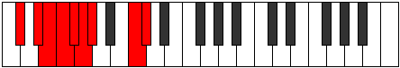

# Mode Bydyllic

## Links

- [Documentation](index.md)
- [Scales Index](Scales.md)
- [Modes Index](Modes.md)
- [Chords Index](Chords.md)

## Parent Scale

[Dolyllic](ScaleDolyllic.md)

## Number

[2301](https://ianring.com/musictheory/scales/2301)

## Perfection

- 5 Perfect notes
- 3 Perfect notes

## Perfection Profile

[true false false true true false true true]

## Permutations

| Tonic | Notes | Signature | Illustration | Audio |
|-------|-------|-----------|--------------|-------|
| [C](ModeCNaturalBydyllic.md) | C, **D**, **D#**, E, F, **F#**, G, B, C | C |  | [midi](ModeCNaturalBydyllic.mid) [ogg](ModeCNaturalBydyllic.ogg) |
| [C#](ModeCSharpBydyllic.md) | C#, **D#**, **E**, F, F#, **G**, G#, C, C# | C |  | [midi](ModeCSharpBydyllic.mid) [ogg](ModeCSharpBydyllic.ogg) |
| [Db](ModeDFlatBydyllic.md) | Db, **Eb**, **E**, F, Gb, **G**, Ab, C, Db | C |  | [midi](ModeDFlatBydyllic.mid) [ogg](ModeDFlatBydyllic.ogg) |
| [D](ModeDNaturalBydyllic.md) | D, **E**, **F**, F#, G, **G#**, A, C#, D | C |  | [midi](ModeDNaturalBydyllic.mid) [ogg](ModeDNaturalBydyllic.ogg) |
| [D#](ModeDSharpBydyllic.md) | D#, **F**, **F#**, G, G#, **A**, A#, D, D# | C |  | [midi](ModeDSharpBydyllic.mid) [ogg](ModeDSharpBydyllic.ogg) |
| [Eb](ModeEFlatBydyllic.md) | Eb, **F**, **Gb**, G, Ab, **A**, Bb, D, Eb | C |  | [midi](ModeEFlatBydyllic.mid) [ogg](ModeEFlatBydyllic.ogg) |
| [E](ModeENaturalBydyllic.md) | E, **F#**, **G**, G#, A, **A#**, B, D#, E | C |  | [midi](ModeENaturalBydyllic.mid) [ogg](ModeENaturalBydyllic.ogg) |
| [F](ModeFNaturalBydyllic.md) | F, **G**, **G#**, A, A#, **B**, C, E, F | C |  | [midi](ModeFNaturalBydyllic.mid) [ogg](ModeFNaturalBydyllic.ogg) |
| [F#](ModeFSharpBydyllic.md) | F#, **G#**, **A**, A#, B, **C**, C#, F, F# | C |  | [midi](ModeFSharpBydyllic.mid) [ogg](ModeFSharpBydyllic.ogg) |
| [Gb](ModeGFlatBydyllic.md) | Gb, **Ab**, **A**, Bb, B, **C**, Db, F, Gb | C |  | [midi](ModeGFlatBydyllic.mid) [ogg](ModeGFlatBydyllic.ogg) |
| [G](ModeGNaturalBydyllic.md) | G, **A**, **A#**, B, C, **C#**, D, F#, G | C |  | [midi](ModeGNaturalBydyllic.mid) [ogg](ModeGNaturalBydyllic.ogg) |
| [G#](ModeGSharpBydyllic.md) | G#, **A#**, **B**, C, C#, **D**, D#, G, G# | C |  | [midi](ModeGSharpBydyllic.mid) [ogg](ModeGSharpBydyllic.ogg) |
| [Ab](ModeAFlatBydyllic.md) | Ab, **Bb**, **B**, C, Db, **D**, Eb, G, Ab | C |  | [midi](ModeAFlatBydyllic.mid) [ogg](ModeAFlatBydyllic.ogg) |
| [A](ModeANaturalBydyllic.md) | A, **B**, **C**, C#, D, **D#**, E, G#, A | C |  | [midi](ModeANaturalBydyllic.mid) [ogg](ModeANaturalBydyllic.ogg) |
| [A#](ModeASharpBydyllic.md) | A#, **C**, **C#**, D, D#, **E**, F, A, A# | C |  | [midi](ModeASharpBydyllic.mid) [ogg](ModeASharpBydyllic.ogg) |
| [Bb](ModeBFlatBydyllic.md) | Bb, **C**, **Db**, D, Eb, **E**, F, A, Bb | C |  | [midi](ModeBFlatBydyllic.mid) [ogg](ModeBFlatBydyllic.ogg) |
| [B](ModeBNaturalBydyllic.md) | B, **C#**, **D**, D#, E, **F**, F#, A#, B | C |  | [midi](ModeBNaturalBydyllic.mid) [ogg](ModeBNaturalBydyllic.ogg) |
