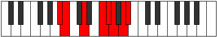

# Mode Bygian

## Links

- [Documentation](index.md)
- [Scales Index](Scales.md)
- [Modes Index](Modes.md)
- [Chords Index](Chords.md)

## Parent Scale

[Stalian](ScaleStalian.md)

## Number

[2963](https://ianring.com/musictheory/scales/2963)

## Perfection

- 4 Perfect notes
- 3 Perfect notes

## Perfection Profile

[true true true false false true false]

## Permutations

| Tonic | Notes | Signature | Illustration | Audio |
|-------|-------|-----------|--------------|-------|
| [C](ModeCNaturalBygian.md) | C, Db, E, **F##**, **G#**, A, **B**, C | C |  | [midi](ModeCNaturalBygian.mid) [ogg](ModeCNaturalBygian.ogg) |
| [C#](ModeCSharpBygian.md) | C#, D, E#, **F###**, **G##**, A#, **B#**, C# | C |  | [midi](ModeCSharpBygian.mid) [ogg](ModeCSharpBygian.ogg) |
| [Db](ModeDFlatBygian.md) | Db, Ebb, F, **G#**, **A**, Bb, **C**, Db | C |  | [midi](ModeDFlatBygian.mid) [ogg](ModeDFlatBygian.ogg) |
| [D](ModeDNaturalBygian.md) | D, Eb, F#, **G##**, **A#**, B, **C#**, D | C |  | [midi](ModeDNaturalBygian.mid) [ogg](ModeDNaturalBygian.ogg) |
| [D#](ModeDSharpBygian.md) | D#, E, F##, **G###**, **A##**, B#, **C##**, D# | C |  | [midi](ModeDSharpBygian.mid) [ogg](ModeDSharpBygian.ogg) |
| [Eb](ModeEFlatBygian.md) | Eb, Fb, G, **A#**, **B**, C, **D**, Eb | C |  | [midi](ModeEFlatBygian.mid) [ogg](ModeEFlatBygian.ogg) |
| [E](ModeENaturalBygian.md) | E, F, G#, **A##**, **B#**, C#, **D#**, E | C |  | [midi](ModeENaturalBygian.mid) [ogg](ModeENaturalBygian.ogg) |
| [F](ModeFNaturalBygian.md) | F, Gb, A, **B#**, **C#**, D, **E**, F | C |  | [midi](ModeFNaturalBygian.mid) [ogg](ModeFNaturalBygian.ogg) |
| [F#](ModeFSharpBygian.md) | F#, G, A#, **B##**, **C##**, D#, **E#**, F# | C |  | [midi](ModeFSharpBygian.mid) [ogg](ModeFSharpBygian.ogg) |
| [Gb](ModeGFlatBygian.md) | Gb, Abb, Bb, **C#**, **D**, Eb, **F**, Gb | C |  | [midi](ModeGFlatBygian.mid) [ogg](ModeGFlatBygian.ogg) |
| [G](ModeGNaturalBygian.md) | G, Ab, B, **C##**, **D#**, E, **F#**, G | C |  | [midi](ModeGNaturalBygian.mid) [ogg](ModeGNaturalBygian.ogg) |
| [G#](ModeGSharpBygian.md) | G#, A, B#, **C###**, **D##**, E#, **F##**, G# | C |  | [midi](ModeGSharpBygian.mid) [ogg](ModeGSharpBygian.ogg) |
| [Ab](ModeAFlatBygian.md) | Ab, Bbb, C, **D#**, **E**, F, **G**, Ab | C |  | [midi](ModeAFlatBygian.mid) [ogg](ModeAFlatBygian.ogg) |
| [A](ModeANaturalBygian.md) | A, Bb, C#, **D##**, **E#**, F#, **G#**, A | C |  | [midi](ModeANaturalBygian.mid) [ogg](ModeANaturalBygian.ogg) |
| [A#](ModeASharpBygian.md) | A#, B, C##, **D###**, **E##**, F##, **G##**, A# | C |  | [midi](ModeASharpBygian.mid) [ogg](ModeASharpBygian.ogg) |
| [Bb](ModeBFlatBygian.md) | Bb, Cb, D, **E#**, **F#**, G, **A**, Bb | C |  | [midi](ModeBFlatBygian.mid) [ogg](ModeBFlatBygian.ogg) |
| [B](ModeBNaturalBygian.md) | B, C, D#, **E##**, **F##**, G#, **A#**, B | C |  | [midi](ModeBNaturalBygian.mid) [ogg](ModeBNaturalBygian.ogg) |
