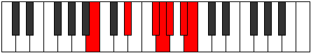

# Mode Bygimic

## Links

- [Documentation](README.md)
- [Scales Index](Scales.md)
- [Modes Index](Modes.md)
- [Chords Index](Chords.md)

## Parent Scale

[Bygimic](ScaleBygimic.md)

## Number

[2961](https://ianring.com/musictheory/scales/2961)

## Luminosity

6

## Transposition

4, 3, 1, 1, 2, 1

## Chord Pattern

II

## Perfection

- 3 Perfect notes
- 3 Perfect notes

## Perfection Profile

true, true, false, false, true, false

## Permutations

| Tonic | Notes | Signature | Illustration | Audio |
|-------|-------|-----------|--------------|-------|
| [C](ModeCNaturalBygimic.md) | C, D##, **E###**, **F###**, G##, **A##**, C | C |  | [midi](https://github.com/edipermadi/music/blob/main/docs/ModeCNaturalBygimic.mid?raw=true) |
| [C#](ModeCSharpBygimic.md) | C#, D###, **F###**, **G##**, A#, **B#**, C# | C |  | [midi](https://github.com/edipermadi/music/blob/main/docs/ModeCSharpBygimic.mid?raw=true) |
| [Db](ModeDFlatBygimic.md) | Db, E#, **F###**, **G##**, A#, **B#**, Db | C |  | [midi](https://github.com/edipermadi/music/blob/main/docs/ModeDFlatBygimic.mid?raw=true) |
| [D](ModeDNaturalBygimic.md) | D, E##, **Cbbb**, **Cbb**, Dbbb, **Ebbb**, D | C |  | [midi](https://github.com/edipermadi/music/blob/main/docs/ModeDNaturalBygimic.mid?raw=true) |
| [D#](ModeDSharpBygimic.md) | D#, E###, **Cbb**, **Dbbb**, Dbb, **Ebb**, D# | C |  | [midi](https://github.com/edipermadi/music/blob/main/docs/ModeDSharpBygimic.mid?raw=true) |
| [Eb](ModeEFlatBygimic.md) | Eb, F##, **G###**, **A##**, B#, **C##**, Eb | C |  | [midi](https://github.com/edipermadi/music/blob/main/docs/ModeEFlatBygimic.mid?raw=true) |
| [E](ModeENaturalBygimic.md) | E, F###, **Cb**, **Dbb**, Ebbb, **Fbb**, E | C |  | [midi](https://github.com/edipermadi/music/blob/main/docs/ModeENaturalBygimic.mid?raw=true) |
| [F](ModeFNaturalBygimic.md) | F, G##, **A###**, **B##**, C##, **D##**, F | C |  | [midi](https://github.com/edipermadi/music/blob/main/docs/ModeFNaturalBygimic.mid?raw=true) |
| [F#](ModeFSharpBygimic.md) | F#, G###, **Db**, **Ebb**, Fbb, **Gbb**, F# | C |  | [midi](https://github.com/edipermadi/music/blob/main/docs/ModeFSharpBygimic.mid?raw=true) |
| [Gb](ModeGFlatBygimic.md) | Gb, A#, **B##**, **C##**, D#, **E#**, Gb | C |  | [midi](https://github.com/edipermadi/music/blob/main/docs/ModeGFlatBygimic.mid?raw=true) |
| [G](ModeGNaturalBygimic.md) | G, A##, **B###**, **C###**, D##, **E##**, G | C |  | [midi](https://github.com/edipermadi/music/blob/main/docs/ModeGNaturalBygimic.mid?raw=true) |
| [G#](ModeGSharpBygimic.md) | G#, A###, **C###**, **D##**, E#, **F##**, G# | C |  | [midi](https://github.com/edipermadi/music/blob/main/docs/ModeGSharpBygimic.mid?raw=true) |
| [Ab](ModeAFlatBygimic.md) | Ab, B#, **C###**, **D##**, E#, **F##**, Ab | C |  | [midi](https://github.com/edipermadi/music/blob/main/docs/ModeAFlatBygimic.mid?raw=true) |
| [A](ModeANaturalBygimic.md) | A, B##, **D##**, **E#**, F#, **G#**, A | C |  | [midi](https://github.com/edipermadi/music/blob/main/docs/ModeANaturalBygimic.mid?raw=true) |
| [A#](ModeASharpBygimic.md) | A#, B###, **D###**, **E##**, F##, **G##**, A# | C |  | [midi](https://github.com/edipermadi/music/blob/main/docs/ModeASharpBygimic.mid?raw=true) |
| [Bb](ModeBFlatBygimic.md) | Bb, C##, **D###**, **E##**, F##, **G##**, Bb | C |  | [midi](https://github.com/edipermadi/music/blob/main/docs/ModeBFlatBygimic.mid?raw=true) |
| [B](ModeBNaturalBygimic.md) | B, C###, **E##**, **F##**, G#, **A#**, B | C |  | [midi](https://github.com/edipermadi/music/blob/main/docs/ModeBNaturalBygimic.mid?raw=true) |
