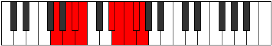

# Mode Bygyllic

## Links

- [Documentation](index.md)
- [Scales Index](Scales.md)
- [Modes Index](Modes.md)
- [Chords Index](Chords.md)

## Parent Scale

[Aeoladyllic](ScaleAeoladyllic.md)

## Number

[3869](https://ianring.com/musictheory/scales/3869)

## Perfection

- 5 Perfect notes
- 3 Perfect notes

## Perfection Profile

[false true true true true true false false]

## Permutations

| Tonic | Notes | Signature | Illustration | Audio |
|-------|-------|-----------|--------------|-------|
| [C](ModeCNaturalBygyllic.md) | **C**, D, D#, E, G#, A, **A#**, **B**, **C** | C |  | [midi](ModeCNaturalBygyllic.mid) [ogg](ModeCNaturalBygyllic.ogg) |
| [C#](ModeCSharpBygyllic.md) | **C#**, D#, E, F, A, A#, **B**, **C**, **C#** | C |  | [midi](ModeCSharpBygyllic.mid) [ogg](ModeCSharpBygyllic.ogg) |
| [Db](ModeDFlatBygyllic.md) | **Db**, Eb, E, F, A, Bb, **B**, **C**, **Db** | C |  | [midi](ModeDFlatBygyllic.mid) [ogg](ModeDFlatBygyllic.ogg) |
| [D](ModeDNaturalBygyllic.md) | **D**, E, F, F#, A#, B, **C**, **C#**, **D** | C |  | [midi](ModeDNaturalBygyllic.mid) [ogg](ModeDNaturalBygyllic.ogg) |
| [D#](ModeDSharpBygyllic.md) | **D#**, F, F#, G, B, C, **C#**, **D**, **D#** | C |  | [midi](ModeDSharpBygyllic.mid) [ogg](ModeDSharpBygyllic.ogg) |
| [Eb](ModeEFlatBygyllic.md) | **Eb**, F, Gb, G, B, C, **Db**, **D**, **Eb** | C |  | [midi](ModeEFlatBygyllic.mid) [ogg](ModeEFlatBygyllic.ogg) |
| [E](ModeENaturalBygyllic.md) | **E**, F#, G, G#, C, C#, **D**, **D#**, **E** | C |  | [midi](ModeENaturalBygyllic.mid) [ogg](ModeENaturalBygyllic.ogg) |
| [F](ModeFNaturalBygyllic.md) | **F**, G, G#, A, C#, D, **D#**, **E**, **F** | C |  | [midi](ModeFNaturalBygyllic.mid) [ogg](ModeFNaturalBygyllic.ogg) |
| [F#](ModeFSharpBygyllic.md) | **F#**, G#, A, A#, D, D#, **E**, **F**, **F#** | C |  | [midi](ModeFSharpBygyllic.mid) [ogg](ModeFSharpBygyllic.ogg) |
| [Gb](ModeGFlatBygyllic.md) | **Gb**, Ab, A, Bb, D, Eb, **E**, **F**, **Gb** | C |  | [midi](ModeGFlatBygyllic.mid) [ogg](ModeGFlatBygyllic.ogg) |
| [G](ModeGNaturalBygyllic.md) | **G**, A, A#, B, D#, E, **F**, **F#**, **G** | C |  | [midi](ModeGNaturalBygyllic.mid) [ogg](ModeGNaturalBygyllic.ogg) |
| [G#](ModeGSharpBygyllic.md) | **G#**, A#, B, C, E, F, **F#**, **G**, **G#** | C |  | [midi](ModeGSharpBygyllic.mid) [ogg](ModeGSharpBygyllic.ogg) |
| [Ab](ModeAFlatBygyllic.md) | **Ab**, Bb, B, C, E, F, **Gb**, **G**, **Ab** | C |  | [midi](ModeAFlatBygyllic.mid) [ogg](ModeAFlatBygyllic.ogg) |
| [A](ModeANaturalBygyllic.md) | **A**, B, C, C#, F, F#, **G**, **G#**, **A** | C |  | [midi](ModeANaturalBygyllic.mid) [ogg](ModeANaturalBygyllic.ogg) |
| [A#](ModeASharpBygyllic.md) | **A#**, C, C#, D, F#, G, **G#**, **A**, **A#** | C |  | [midi](ModeASharpBygyllic.mid) [ogg](ModeASharpBygyllic.ogg) |
| [Bb](ModeBFlatBygyllic.md) | **Bb**, C, Db, D, Gb, G, **Ab**, **A**, **Bb** | C |  | [midi](ModeBFlatBygyllic.mid) [ogg](ModeBFlatBygyllic.ogg) |
| [B](ModeBNaturalBygyllic.md) | **B**, C#, D, D#, G, G#, **A**, **A#**, **B** | C |  | [midi](ModeBNaturalBygyllic.mid) [ogg](ModeBNaturalBygyllic.ogg) |
