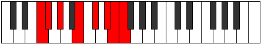

# Mode Bylian

## Links

- [Documentation](index.md)
- [Scales Index](Scales.md)
- [Modes Index](Modes.md)
- [Chords Index](Chords.md)

## Parent Scale

[Soptian](ScaleSoptian.md)

## Number

[3403](https://ianring.com/musictheory/scales/3403)

## Perfection

- 5 Perfect notes
- 2 Perfect notes

## Perfection Profile

[false true true true true false true]

## Permutations

| Tonic | Notes | Signature | Illustration | Audio |
|-------|-------|-----------|--------------|-------|
| [C](ModeCNaturalBylian.md) | **C**, Db, Eb, F#, G#, **A#**, B, **C** | C |  | [midi](ModeCNaturalBylian.mid) [ogg](ModeCNaturalBylian.ogg) |
| [C#](ModeCSharpBylian.md) | **C#**, D, E, F##, G##, **A##**, B#, **C#** | C |  | [midi](ModeCSharpBylian.mid) [ogg](ModeCSharpBylian.ogg) |
| [Db](ModeDFlatBylian.md) | **Db**, Ebb, Fb, G, A, **B**, C, **Db** | C |  | [midi](ModeDFlatBylian.mid) [ogg](ModeDFlatBylian.ogg) |
| [D](ModeDNaturalBylian.md) | **D**, Eb, F, G#, A#, **B#**, C#, **D** | C |  | [midi](ModeDNaturalBylian.mid) [ogg](ModeDNaturalBylian.ogg) |
| [D#](ModeDSharpBylian.md) | **D#**, E, F#, G##, A##, **B##**, C##, **D#** | C |  | [midi](ModeDSharpBylian.mid) [ogg](ModeDSharpBylian.ogg) |
| [Eb](ModeEFlatBylian.md) | **Eb**, Fb, Gb, A, B, **C#**, D, **Eb** | C |  | [midi](ModeEFlatBylian.mid) [ogg](ModeEFlatBylian.ogg) |
| [E](ModeENaturalBylian.md) | **E**, F, G, A#, B#, **C##**, D#, **E** | C |  | [midi](ModeENaturalBylian.mid) [ogg](ModeENaturalBylian.ogg) |
| [F](ModeFNaturalBylian.md) | **F**, Gb, Ab, B, C#, **D#**, E, **F** | C |  | [midi](ModeFNaturalBylian.mid) [ogg](ModeFNaturalBylian.ogg) |
| [F#](ModeFSharpBylian.md) | **F#**, G, A, B#, C##, **D##**, E#, **F#** | C |  | [midi](ModeFSharpBylian.mid) [ogg](ModeFSharpBylian.ogg) |
| [Gb](ModeGFlatBylian.md) | **Gb**, Abb, Bbb, C, D, **E**, F, **Gb** | C |  | [midi](ModeGFlatBylian.mid) [ogg](ModeGFlatBylian.ogg) |
| [G](ModeGNaturalBylian.md) | **G**, Ab, Bb, C#, D#, **E#**, F#, **G** | C |  | [midi](ModeGNaturalBylian.mid) [ogg](ModeGNaturalBylian.ogg) |
| [G#](ModeGSharpBylian.md) | **G#**, A, B, C##, D##, **E##**, F##, **G#** | C |  | [midi](ModeGSharpBylian.mid) [ogg](ModeGSharpBylian.ogg) |
| [Ab](ModeAFlatBylian.md) | **Ab**, Bbb, Cb, D, E, **F#**, G, **Ab** | C |  | [midi](ModeAFlatBylian.mid) [ogg](ModeAFlatBylian.ogg) |
| [A](ModeANaturalBylian.md) | **A**, Bb, C, D#, E#, **F##**, G#, **A** | C |  | [midi](ModeANaturalBylian.mid) [ogg](ModeANaturalBylian.ogg) |
| [A#](ModeASharpBylian.md) | **A#**, B, C#, D##, E##, **F###**, G##, **A#** | C |  | [midi](ModeASharpBylian.mid) [ogg](ModeASharpBylian.ogg) |
| [Bb](ModeBFlatBylian.md) | **Bb**, Cb, Db, E, F#, **G#**, A, **Bb** | C |  | [midi](ModeBFlatBylian.mid) [ogg](ModeBFlatBylian.ogg) |
| [B](ModeBNaturalBylian.md) | **B**, C, D, E#, F##, **G##**, A#, **B** | C |  | [midi](ModeBNaturalBylian.mid) [ogg](ModeBNaturalBylian.ogg) |
