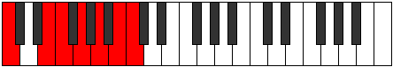
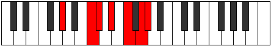

# Mode Bylimic

## Links

- [Documentation](index.md)
- [Scales Index](Scales.md)
- [Modes Index](Modes.md)
- [Chords Index](Chords.md)

## Parent Scale

[Bylimic](ScaleBylimic.md)

## Number

[2737](https://ianring.com/musictheory/scales/2737)

## Perfection

- 4 Perfect notes
- 2 Perfect notes

## Perfection Profile

[true true true false true false]

## Permutations

| Tonic | Notes | Signature | Illustration | Audio |
|-------|-------|-----------|--------------|-------|
| [C](ModeCNaturalBylimic.md) | C, D##, E#, **F##**, G##, **A##**, C | C |  | [midi](ModeCNaturalBylimic.mid) [ogg](ModeCNaturalBylimic.ogg) |
| [C#](ModeCSharpBylimic.md) | C#, D###, E##, **F###**, G###, **A###**, C# | C |  | [midi](ModeCSharpBylimic.mid) [ogg](ModeCSharpBylimic.ogg) |
| [Db](ModeDFlatBylimic.md) | Db, E#, F#, **G#**, A#, **B#**, Db | C |  | [midi](ModeDFlatBylimic.mid) [ogg](ModeDFlatBylimic.ogg) |
| [D](ModeDNaturalBylimic.md) | D, E##, F##, **G##**, A##, **B##**, D | C |  | [midi](ModeDNaturalBylimic.mid) [ogg](ModeDNaturalBylimic.ogg) |
| [D#](ModeDSharpBylimic.md) | D#, E###, F###, **G###**, A###, **B###**, D# | C |  | [midi](ModeDSharpBylimic.mid) [ogg](ModeDSharpBylimic.ogg) |
| [Eb](ModeEFlatBylimic.md) | Eb, F##, G#, **A#**, B#, **C##**, Eb | C |  | [midi](ModeEFlatBylimic.mid) [ogg](ModeEFlatBylimic.ogg) |
| [E](ModeENaturalBylimic.md) | E, F###, G##, **A##**, B##, **C###**, E | C |  | [midi](ModeENaturalBylimic.mid) [ogg](ModeENaturalBylimic.ogg) |
| [F](ModeFNaturalBylimic.md) | F, G##, A#, **B#**, C##, **D##**, F | C |  | [midi](ModeFNaturalBylimic.mid) [ogg](ModeFNaturalBylimic.ogg) |
| [F#](ModeFSharpBylimic.md) | F#, G###, A##, **B##**, C###, **D###**, F# | C |  | [midi](ModeFSharpBylimic.mid) [ogg](ModeFSharpBylimic.ogg) |
| [Gb](ModeGFlatBylimic.md) | Gb, A#, B, **C#**, D#, **E#**, Gb | C |  | [midi](ModeGFlatBylimic.mid) [ogg](ModeGFlatBylimic.ogg) |
| [G](ModeGNaturalBylimic.md) | G, A##, B#, **C##**, D##, **E##**, G | C |  | [midi](ModeGNaturalBylimic.mid) [ogg](ModeGNaturalBylimic.ogg) |
| [G#](ModeGSharpBylimic.md) | G#, A###, B##, **C###**, D###, **E###**, G# | C |  | [midi](ModeGSharpBylimic.mid) [ogg](ModeGSharpBylimic.ogg) |
| [Ab](ModeAFlatBylimic.md) | Ab, B#, C#, **D#**, E#, **F##**, Ab | C |  | [midi](ModeAFlatBylimic.mid) [ogg](ModeAFlatBylimic.ogg) |
| [A](ModeANaturalBylimic.md) | A, B##, C##, **D##**, E##, **F###**, A | C |  | [midi](ModeANaturalBylimic.mid) [ogg](ModeANaturalBylimic.ogg) |
| [A#](ModeASharpBylimic.md) | A#, B###, C###, **D###**, E###, **Cbbb**, A# | C |  | [midi](ModeASharpBylimic.mid) [ogg](ModeASharpBylimic.ogg) |
| [Bb](ModeBFlatBylimic.md) | Bb, C##, D#, **E#**, F##, **G##**, Bb | C |  | [midi](ModeBFlatBylimic.mid) [ogg](ModeBFlatBylimic.ogg) |
| [B](ModeBNaturalBylimic.md) | B, C###, D##, **E##**, F###, **G###**, B | C |  | [midi](ModeBNaturalBylimic.mid) [ogg](ModeBNaturalBylimic.ogg) |
