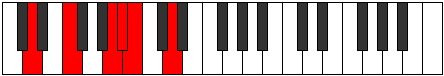

# Mode Bylitonic

## Links

- [Documentation](index.md)
- [Scales Index](Scales.md)
- [Modes Index](Modes.md)
- [Chords Index](Chords.md)

## Parent Scale

[Ionyptitonic](ScaleIonyptitonic.md)

## Number

[905](https://ianring.com/musictheory/scales/905)

## Perfection

- 2 Perfect notes
- 3 Perfect notes

## Perfection Profile

[true false false true false]

## Permutations

| Tonic | Notes | Signature | Illustration | Audio |
|-------|-------|-----------|--------------|-------|
| [C](ModeCNaturalBylitonic.md) | C, **D#**, **G**, G#, **A**, C | C |  | [midi](ModeCNaturalBylitonic.mid) [ogg](ModeCNaturalBylitonic.ogg) |
| [C#](ModeCSharpBylitonic.md) | C#, **E**, **G#**, A, **A#**, C# | C |  | [midi](ModeCSharpBylitonic.mid) [ogg](ModeCSharpBylitonic.ogg) |
| [Db](ModeDFlatBylitonic.md) | Db, **E**, **Ab**, A, **Bb**, Db | C |  | [midi](ModeDFlatBylitonic.mid) [ogg](ModeDFlatBylitonic.ogg) |
| [D](ModeDNaturalBylitonic.md) | D, **F**, **A**, A#, **B**, D | C |  | [midi](ModeDNaturalBylitonic.mid) [ogg](ModeDNaturalBylitonic.ogg) |
| [D#](ModeDSharpBylitonic.md) | D#, **F#**, **A#**, B, **C**, D# | C |  | [midi](ModeDSharpBylitonic.mid) [ogg](ModeDSharpBylitonic.ogg) |
| [Eb](ModeEFlatBylitonic.md) | Eb, **Gb**, **Bb**, B, **C**, Eb | C |  | [midi](ModeEFlatBylitonic.mid) [ogg](ModeEFlatBylitonic.ogg) |
| [E](ModeENaturalBylitonic.md) | E, **G**, **B**, C, **C#**, E | C |  | [midi](ModeENaturalBylitonic.mid) [ogg](ModeENaturalBylitonic.ogg) |
| [F](ModeFNaturalBylitonic.md) | F, **G#**, **C**, C#, **D**, F | C |  | [midi](ModeFNaturalBylitonic.mid) [ogg](ModeFNaturalBylitonic.ogg) |
| [F#](ModeFSharpBylitonic.md) | F#, **A**, **C#**, D, **D#**, F# | C |  | [midi](ModeFSharpBylitonic.mid) [ogg](ModeFSharpBylitonic.ogg) |
| [Gb](ModeGFlatBylitonic.md) | Gb, **A**, **Db**, D, **Eb**, Gb | C |  | [midi](ModeGFlatBylitonic.mid) [ogg](ModeGFlatBylitonic.ogg) |
| [G](ModeGNaturalBylitonic.md) | G, **A#**, **D**, D#, **E**, G | C |  | [midi](ModeGNaturalBylitonic.mid) [ogg](ModeGNaturalBylitonic.ogg) |
| [G#](ModeGSharpBylitonic.md) | G#, **B**, **D#**, E, **F**, G# | C |  | [midi](ModeGSharpBylitonic.mid) [ogg](ModeGSharpBylitonic.ogg) |
| [Ab](ModeAFlatBylitonic.md) | Ab, **B**, **Eb**, E, **F**, Ab | C |  | [midi](ModeAFlatBylitonic.mid) [ogg](ModeAFlatBylitonic.ogg) |
| [A](ModeANaturalBylitonic.md) | A, **C**, **E**, F, **F#**, A | C |  | [midi](ModeANaturalBylitonic.mid) [ogg](ModeANaturalBylitonic.ogg) |
| [A#](ModeASharpBylitonic.md) | A#, **C#**, **F**, F#, **G**, A# | C |  | [midi](ModeASharpBylitonic.mid) [ogg](ModeASharpBylitonic.ogg) |
| [Bb](ModeBFlatBylitonic.md) | Bb, **Db**, **F**, Gb, **G**, Bb | C |  | [midi](ModeBFlatBylitonic.mid) [ogg](ModeBFlatBylitonic.ogg) |
| [B](ModeBNaturalBylitonic.md) | B, **D**, **F#**, G, **G#**, B | C |  | [midi](ModeBNaturalBylitonic.mid) [ogg](ModeBNaturalBylitonic.ogg) |
