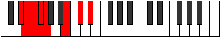

# Mode Bynian

## Links

- [Documentation](index.md)
- [Scales Index](Scales.md)
- [Modes Index](Modes.md)
- [Chords Index](Chords.md)

## Parent Scale

[Pythian](ScalePythian.md)

## Number

[1311](https://ianring.com/musictheory/scales/1311)

## Interval Pattern

1, 1, 1, 1, 4, 2, 2

## Chord Pattern

I⁺, ii, V⁺, VI, VI⁺, vii⁰

## Perfection

- 3 Perfect notes
- 4 Perfect notes

## Perfection Profile

[false true false true false true false]

## Permutations

| Tonic | Notes | Signature | Illustration | Audio |
|-------|-------|-----------|--------------|-------|
| [C](ModeCNaturalBynian.md) | **C**, Db, **Ebb**, Fbb, **Gbbb**, Ab, **Bb**, **C** | C |  | [midi](https://github.com/edipermadi/music/blob/main/docs/ModeCNaturalBynian.mid?raw=true) |
| [C#](ModeCSharpBynian.md) | **C#**, D, **Eb**, Fb, **Gbb**, A, **B**, **C#** | C |  | [midi](https://github.com/edipermadi/music/blob/main/docs/ModeCSharpBynian.mid?raw=true) |
| [Db](ModeDFlatBynian.md) | **Db**, Ebb, **Fbb**, Gbbb, **D###**, Cbbb, **Dbbb**, **Db** | C |  | [midi](https://github.com/edipermadi/music/blob/main/docs/ModeDFlatBynian.mid?raw=true) |
| [D](ModeDNaturalBynian.md) | **D**, Eb, **Fb**, Gbb, **Abbb**, Bb, **C**, **D** | C |  | [midi](https://github.com/edipermadi/music/blob/main/docs/ModeDNaturalBynian.mid?raw=true) |
| [D#](ModeDSharpBynian.md) | **D#**, E, **F**, Gb, **Abb**, B, **C#**, **D#** | C |  | [midi](https://github.com/edipermadi/music/blob/main/docs/ModeDSharpBynian.mid?raw=true) |
| [Eb](ModeEFlatBynian.md) | **Eb**, Fb, **Gbb**, Abbb, **E###**, Cb, **Db**, **Eb** | C |  | [midi](https://github.com/edipermadi/music/blob/main/docs/ModeEFlatBynian.mid?raw=true) |
| [E](ModeENaturalBynian.md) | **E**, F, **Gb**, Abb, **Bbbb**, C, **D**, **E** | C |  | [midi](https://github.com/edipermadi/music/blob/main/docs/ModeENaturalBynian.mid?raw=true) |
| [F](ModeFNaturalBynian.md) | **F**, Gb, **Abb**, Bbbb, **Cbbb**, Db, **Eb**, **F** | C |  | [midi](https://github.com/edipermadi/music/blob/main/docs/ModeFNaturalBynian.mid?raw=true) |
| [F#](ModeFSharpBynian.md) | **F#**, G, **Ab**, Bbb, **Cbb**, D, **E**, **F#** | C |  | [midi](https://github.com/edipermadi/music/blob/main/docs/ModeFSharpBynian.mid?raw=true) |
| [Gb](ModeGFlatBynian.md) | **Gb**, Abb, **Bbbb**, Cbbb, **Cbb**, D, **E**, **Gb** | C |  | [midi](https://github.com/edipermadi/music/blob/main/docs/ModeGFlatBynian.mid?raw=true) |
| [G](ModeGNaturalBynian.md) | **G**, Ab, **Bbb**, Cbb, **Dbbb**, Eb, **F**, **G** | C |  | [midi](https://github.com/edipermadi/music/blob/main/docs/ModeGNaturalBynian.mid?raw=true) |
| [G#](ModeGSharpBynian.md) | **G#**, A, **Bb**, Cb, **Dbb**, E, **F#**, **G#** | C |  | [midi](https://github.com/edipermadi/music/blob/main/docs/ModeGSharpBynian.mid?raw=true) |
| [Ab](ModeAFlatBynian.md) | **Ab**, Bbb, **Cbb**, Dbbb, **Dbb**, E, **F#**, **Ab** | C |  | [midi](https://github.com/edipermadi/music/blob/main/docs/ModeAFlatBynian.mid?raw=true) |
| [A](ModeANaturalBynian.md) | **A**, Bb, **Cb**, Dbb, **Ebbb**, F, **G**, **A** | C |  | [midi](https://github.com/edipermadi/music/blob/main/docs/ModeANaturalBynian.mid?raw=true) |
| [A#](ModeASharpBynian.md) | **A#**, B, **C**, Db, **Ebb**, F#, **G#**, **A#** | C |  | [midi](https://github.com/edipermadi/music/blob/main/docs/ModeASharpBynian.mid?raw=true) |
| [Bb](ModeBFlatBynian.md) | **Bb**, Cb, **Dbb**, Ebbb, **Fbbb**, Gb, **Ab**, **Bb** | C |  | [midi](https://github.com/edipermadi/music/blob/main/docs/ModeBFlatBynian.mid?raw=true) |
| [B](ModeBNaturalBynian.md) | **B**, C, **Db**, Ebb, **Fbb**, G, **A**, **B** | C |  | [midi](https://github.com/edipermadi/music/blob/main/docs/ModeBNaturalBynian.mid?raw=true) |
