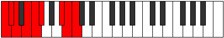

# Mode Bynyllic

## Links

- [Documentation](index.md)
- [Scales Index](Scales.md)
- [Modes Index](Modes.md)
- [Chords Index](Chords.md)

## Parent Scale

[Aeoladyllic](ScaleAeoladyllic.md)

## Number

[3191](https://ianring.com/musictheory/scales/3191)

## Perfection

- 5 Perfect notes
- 3 Perfect notes

## Perfection Profile

[false false false true true true true true]

## Permutations

| Tonic | Notes | Signature | Illustration | Audio |
|-------|-------|-----------|--------------|-------|
| [C](ModeCNaturalBynyllic.md) | **C**, **C#**, **D**, E, F, F#, A#, B, **C** | C |  | [midi](https://github.com/edipermadi/music/blob/main/docs/ModeCNaturalBynyllic.mid?raw=true) |
| [C#](ModeCSharpBynyllic.md) | **C#**, **D**, **D#**, F, F#, G, B, C, **C#** | C |  | [midi](https://github.com/edipermadi/music/blob/main/docs/ModeCSharpBynyllic.mid?raw=true) |
| [Db](ModeDFlatBynyllic.md) | **Db**, **D**, **Eb**, F, Gb, G, B, C, **Db** | C |  | [midi](https://github.com/edipermadi/music/blob/main/docs/ModeDFlatBynyllic.mid?raw=true) |
| [D](ModeDNaturalBynyllic.md) | **D**, **D#**, **E**, F#, G, G#, C, C#, **D** | C |  | [midi](https://github.com/edipermadi/music/blob/main/docs/ModeDNaturalBynyllic.mid?raw=true) |
| [D#](ModeDSharpBynyllic.md) | **D#**, **E**, **F**, G, G#, A, C#, D, **D#** | C |  | [midi](https://github.com/edipermadi/music/blob/main/docs/ModeDSharpBynyllic.mid?raw=true) |
| [Eb](ModeEFlatBynyllic.md) | **Eb**, **E**, **F**, G, Ab, A, Db, D, **Eb** | C |  | [midi](https://github.com/edipermadi/music/blob/main/docs/ModeEFlatBynyllic.mid?raw=true) |
| [E](ModeENaturalBynyllic.md) | **E**, **F**, **F#**, G#, A, A#, D, D#, **E** | C |  | [midi](https://github.com/edipermadi/music/blob/main/docs/ModeENaturalBynyllic.mid?raw=true) |
| [F](ModeFNaturalBynyllic.md) | **F**, **F#**, **G**, A, A#, B, D#, E, **F** | C |  | [midi](https://github.com/edipermadi/music/blob/main/docs/ModeFNaturalBynyllic.mid?raw=true) |
| [F#](ModeFSharpBynyllic.md) | **F#**, **G**, **G#**, A#, B, C, E, F, **F#** | C |  | [midi](https://github.com/edipermadi/music/blob/main/docs/ModeFSharpBynyllic.mid?raw=true) |
| [Gb](ModeGFlatBynyllic.md) | **Gb**, **G**, **Ab**, Bb, B, C, E, F, **Gb** | C |  | [midi](https://github.com/edipermadi/music/blob/main/docs/ModeGFlatBynyllic.mid?raw=true) |
| [G](ModeGNaturalBynyllic.md) | **G**, **G#**, **A**, B, C, C#, F, F#, **G** | C |  | [midi](https://github.com/edipermadi/music/blob/main/docs/ModeGNaturalBynyllic.mid?raw=true) |
| [G#](ModeGSharpBynyllic.md) | **G#**, **A**, **A#**, C, C#, D, F#, G, **G#** | C |  | [midi](https://github.com/edipermadi/music/blob/main/docs/ModeGSharpBynyllic.mid?raw=true) |
| [Ab](ModeAFlatBynyllic.md) | **Ab**, **A**, **Bb**, C, Db, D, Gb, G, **Ab** | C |  | [midi](https://github.com/edipermadi/music/blob/main/docs/ModeAFlatBynyllic.mid?raw=true) |
| [A](ModeANaturalBynyllic.md) | **A**, **A#**, **B**, C#, D, D#, G, G#, **A** | C |  | [midi](https://github.com/edipermadi/music/blob/main/docs/ModeANaturalBynyllic.mid?raw=true) |
| [A#](ModeASharpBynyllic.md) | **A#**, **B**, **C**, D, D#, E, G#, A, **A#** | C |  | [midi](https://github.com/edipermadi/music/blob/main/docs/ModeASharpBynyllic.mid?raw=true) |
| [Bb](ModeBFlatBynyllic.md) | **Bb**, **B**, **C**, D, Eb, E, Ab, A, **Bb** | C |  | [midi](https://github.com/edipermadi/music/blob/main/docs/ModeBFlatBynyllic.mid?raw=true) |
| [B](ModeBNaturalBynyllic.md) | **B**, **C**, **C#**, D#, E, F, A, A#, **B** | C |  | [midi](https://github.com/edipermadi/music/blob/main/docs/ModeBNaturalBynyllic.mid?raw=true) |
