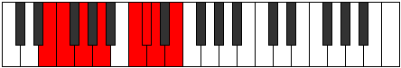
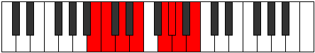

# Mode Byptian

## Links

- [Documentation](index.md)
- [Scales Index](Scales.md)
- [Modes Index](Modes.md)
- [Chords Index](Chords.md)

## Parent Scale

[Aerathian](ScaleAerathian.md)

## Number

[1835](https://ianring.com/musictheory/scales/1835)

## Perfection

- 5 Perfect notes
- 2 Perfect notes

## Perfection Profile

[false true true true true false true]

## Permutations

| Tonic | Notes | Signature | Illustration | Audio |
|-------|-------|-----------|--------------|-------|
| [C](ModeCNaturalByptian.md) | **C**, Db, Eb, F, G#, **A**, Bb, **C** | C |  | [midi](ModeCNaturalByptian.mid) [ogg](ModeCNaturalByptian.ogg) |
| [C#](ModeCSharpByptian.md) | **C#**, D, E, F#, G##, **A#**, B, **C#** | C |  | [midi](ModeCSharpByptian.mid) [ogg](ModeCSharpByptian.ogg) |
| [Db](ModeDFlatByptian.md) | **Db**, Ebb, Fb, Gb, A, **Bb**, Cb, **Db** | C |  | [midi](ModeDFlatByptian.mid) [ogg](ModeDFlatByptian.ogg) |
| [D](ModeDNaturalByptian.md) | **D**, Eb, F, G, A#, **B**, C, **D** | C |  | [midi](ModeDNaturalByptian.mid) [ogg](ModeDNaturalByptian.ogg) |
| [D#](ModeDSharpByptian.md) | **D#**, E, F#, G#, A##, **B#**, C#, **D#** | C |  | [midi](ModeDSharpByptian.mid) [ogg](ModeDSharpByptian.ogg) |
| [Eb](ModeEFlatByptian.md) | **Eb**, Fb, Gb, Ab, B, **C**, Db, **Eb** | C |  | [midi](ModeEFlatByptian.mid) [ogg](ModeEFlatByptian.ogg) |
| [E](ModeENaturalByptian.md) | **E**, F, G, A, B#, **C#**, D, **E** | C |  | [midi](ModeENaturalByptian.mid) [ogg](ModeENaturalByptian.ogg) |
| [F](ModeFNaturalByptian.md) | **F**, Gb, Ab, Bb, C#, **D**, Eb, **F** | C |  | [midi](ModeFNaturalByptian.mid) [ogg](ModeFNaturalByptian.ogg) |
| [F#](ModeFSharpByptian.md) | **F#**, G, A, B, C##, **D#**, E, **F#** | C |  | [midi](ModeFSharpByptian.mid) [ogg](ModeFSharpByptian.ogg) |
| [Gb](ModeGFlatByptian.md) | **Gb**, Abb, Bbb, Cb, D, **Eb**, Fb, **Gb** | C |  | [midi](ModeGFlatByptian.mid) [ogg](ModeGFlatByptian.ogg) |
| [G](ModeGNaturalByptian.md) | **G**, Ab, Bb, C, D#, **E**, F, **G** | C |  | [midi](ModeGNaturalByptian.mid) [ogg](ModeGNaturalByptian.ogg) |
| [G#](ModeGSharpByptian.md) | **G#**, A, B, C#, D##, **E#**, F#, **G#** | C |  | [midi](ModeGSharpByptian.mid) [ogg](ModeGSharpByptian.ogg) |
| [Ab](ModeAFlatByptian.md) | **Ab**, Bbb, Cb, Db, E, **F**, Gb, **Ab** | C |  | [midi](ModeAFlatByptian.mid) [ogg](ModeAFlatByptian.ogg) |
| [A](ModeANaturalByptian.md) | **A**, Bb, C, D, E#, **F#**, G, **A** | C |  | [midi](ModeANaturalByptian.mid) [ogg](ModeANaturalByptian.ogg) |
| [A#](ModeASharpByptian.md) | **A#**, B, C#, D#, E##, **F##**, G#, **A#** | C |  | [midi](ModeASharpByptian.mid) [ogg](ModeASharpByptian.ogg) |
| [Bb](ModeBFlatByptian.md) | **Bb**, Cb, Db, Eb, F#, **G**, Ab, **Bb** | C |  | [midi](ModeBFlatByptian.mid) [ogg](ModeBFlatByptian.ogg) |
| [B](ModeBNaturalByptian.md) | **B**, C, D, E, F##, **G#**, A, **B** | C |  | [midi](ModeBNaturalByptian.mid) [ogg](ModeBNaturalByptian.ogg) |
