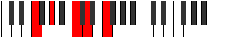
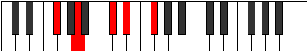

# Mode Byptic

## Links

- [Documentation](index.md)
- [Scales Index](Scales.md)
- [Modes Index](Modes.md)
- [Chords Index](Chords.md)

## Parent Scale

[Saric](ScaleSaric.md)

## Number

[649](https://ianring.com/musictheory/scales/649)

## Perfection

- 1 Perfect notes
- 3 Perfect notes

## Perfection Profile

[true false false false]

## Permutations

| Tonic | Notes | Signature | Illustration | Audio |
|-------|-------|-----------|--------------|-------|
| [C](ModeCNaturalByptic.md) | C, **D#**, **G**, **A**, C | C |  | [midi](ModeCNaturalByptic.mid) [ogg](ModeCNaturalByptic.ogg) |
| [C#](ModeCSharpByptic.md) | C#, **E**, **G#**, **A#**, C# | C |  | [midi](ModeCSharpByptic.mid) [ogg](ModeCSharpByptic.ogg) |
| [Db](ModeDFlatByptic.md) | Db, **E**, **Ab**, **Bb**, Db | C |  | [midi](ModeDFlatByptic.mid) [ogg](ModeDFlatByptic.ogg) |
| [D](ModeDNaturalByptic.md) | D, **F**, **A**, **B**, D | C |  | [midi](ModeDNaturalByptic.mid) [ogg](ModeDNaturalByptic.ogg) |
| [D#](ModeDSharpByptic.md) | D#, **F#**, **A#**, **C**, D# | C |  | [midi](ModeDSharpByptic.mid) [ogg](ModeDSharpByptic.ogg) |
| [Eb](ModeEFlatByptic.md) | Eb, **Gb**, **Bb**, **C**, Eb | C |  | [midi](ModeEFlatByptic.mid) [ogg](ModeEFlatByptic.ogg) |
| [E](ModeENaturalByptic.md) | E, **G**, **B**, **C#**, E | C |  | [midi](ModeENaturalByptic.mid) [ogg](ModeENaturalByptic.ogg) |
| [F](ModeFNaturalByptic.md) | F, **G#**, **C**, **D**, F | C |  | [midi](ModeFNaturalByptic.mid) [ogg](ModeFNaturalByptic.ogg) |
| [F#](ModeFSharpByptic.md) | F#, **A**, **C#**, **D#**, F# | C |  | [midi](ModeFSharpByptic.mid) [ogg](ModeFSharpByptic.ogg) |
| [Gb](ModeGFlatByptic.md) | Gb, **A**, **Db**, **Eb**, Gb | C |  | [midi](ModeGFlatByptic.mid) [ogg](ModeGFlatByptic.ogg) |
| [G](ModeGNaturalByptic.md) | G, **A#**, **D**, **E**, G | C |  | [midi](ModeGNaturalByptic.mid) [ogg](ModeGNaturalByptic.ogg) |
| [G#](ModeGSharpByptic.md) | G#, **B**, **D#**, **F**, G# | C |  | [midi](ModeGSharpByptic.mid) [ogg](ModeGSharpByptic.ogg) |
| [Ab](ModeAFlatByptic.md) | Ab, **B**, **Eb**, **F**, Ab | C |  | [midi](ModeAFlatByptic.mid) [ogg](ModeAFlatByptic.ogg) |
| [A](ModeANaturalByptic.md) | A, **C**, **E**, **F#**, A | C |  | [midi](ModeANaturalByptic.mid) [ogg](ModeANaturalByptic.ogg) |
| [A#](ModeASharpByptic.md) | A#, **C#**, **F**, **G**, A# | C |  | [midi](ModeASharpByptic.mid) [ogg](ModeASharpByptic.ogg) |
| [Bb](ModeBFlatByptic.md) | Bb, **Db**, **F**, **G**, Bb | C |  | [midi](ModeBFlatByptic.mid) [ogg](ModeBFlatByptic.ogg) |
| [B](ModeBNaturalByptic.md) | B, **D**, **F#**, **G#**, B | C |  | [midi](ModeBNaturalByptic.mid) [ogg](ModeBNaturalByptic.ogg) |
