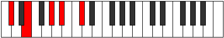
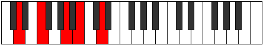
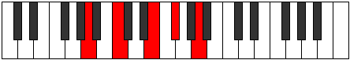

# Mode Byptic

## Links

- [Documentation](README.md)
- [Scales Index](Scales.md)
- [Modes Index](Modes.md)
- [Chords Index](Chords.md)

## Parent Scale

[Saric](ScaleSaric.md)

## Number

[649](https://ianring.com/musictheory/scales/649)

## Transposition

3, 4, 2, 3

## Chord Pattern

## Perfection

- 1 Perfect notes
- 3 Perfect notes

## Perfection Profile

[true false false false]

## Permutations

| Tonic | Notes | Signature | Illustration | Audio |
|-------|-------|-----------|--------------|-------|
| [C](ModeCNaturalByptic.md) | C, **D#**, **G**, **A**, C | C |  | [midi](https://github.com/edipermadi/music/blob/main/docs/ModeCNaturalByptic.mid?raw=true) |
| [C#](ModeCSharpByptic.md) | C#, **E**, **G#**, **A#**, C# | C |  | [midi](https://github.com/edipermadi/music/blob/main/docs/ModeCSharpByptic.mid?raw=true) |
| [Db](ModeDFlatByptic.md) | Db, **E**, **Ab**, **Bb**, Db | C |  | [midi](https://github.com/edipermadi/music/blob/main/docs/ModeDFlatByptic.mid?raw=true) |
| [D](ModeDNaturalByptic.md) | D, **F**, **A**, **B**, D | C |  | [midi](https://github.com/edipermadi/music/blob/main/docs/ModeDNaturalByptic.mid?raw=true) |
| [D#](ModeDSharpByptic.md) | D#, **F#**, **A#**, **C**, D# | C |  | [midi](https://github.com/edipermadi/music/blob/main/docs/ModeDSharpByptic.mid?raw=true) |
| [Eb](ModeEFlatByptic.md) | Eb, **Gb**, **Bb**, **C**, Eb | C |  | [midi](https://github.com/edipermadi/music/blob/main/docs/ModeEFlatByptic.mid?raw=true) |
| [E](ModeENaturalByptic.md) | E, **G**, **B**, **C#**, E | C |  | [midi](https://github.com/edipermadi/music/blob/main/docs/ModeENaturalByptic.mid?raw=true) |
| [F](ModeFNaturalByptic.md) | F, **G#**, **C**, **D**, F | C |  | [midi](https://github.com/edipermadi/music/blob/main/docs/ModeFNaturalByptic.mid?raw=true) |
| [F#](ModeFSharpByptic.md) | F#, **A**, **C#**, **D#**, F# | C |  | [midi](https://github.com/edipermadi/music/blob/main/docs/ModeFSharpByptic.mid?raw=true) |
| [Gb](ModeGFlatByptic.md) | Gb, **A**, **Db**, **Eb**, Gb | C |  | [midi](https://github.com/edipermadi/music/blob/main/docs/ModeGFlatByptic.mid?raw=true) |
| [G](ModeGNaturalByptic.md) | G, **A#**, **D**, **E**, G | C |  | [midi](https://github.com/edipermadi/music/blob/main/docs/ModeGNaturalByptic.mid?raw=true) |
| [G#](ModeGSharpByptic.md) | G#, **B**, **D#**, **F**, G# | C |  | [midi](https://github.com/edipermadi/music/blob/main/docs/ModeGSharpByptic.mid?raw=true) |
| [Ab](ModeAFlatByptic.md) | Ab, **B**, **Eb**, **F**, Ab | C |  | [midi](https://github.com/edipermadi/music/blob/main/docs/ModeAFlatByptic.mid?raw=true) |
| [A](ModeANaturalByptic.md) | A, **C**, **E**, **F#**, A | C |  | [midi](https://github.com/edipermadi/music/blob/main/docs/ModeANaturalByptic.mid?raw=true) |
| [A#](ModeASharpByptic.md) | A#, **C#**, **F**, **G**, A# | C |  | [midi](https://github.com/edipermadi/music/blob/main/docs/ModeASharpByptic.mid?raw=true) |
| [Bb](ModeBFlatByptic.md) | Bb, **Db**, **F**, **G**, Bb | C |  | [midi](https://github.com/edipermadi/music/blob/main/docs/ModeBFlatByptic.mid?raw=true) |
| [B](ModeBNaturalByptic.md) | B, **D**, **F#**, **G#**, B | C |  | [midi](https://github.com/edipermadi/music/blob/main/docs/ModeBNaturalByptic.mid?raw=true) |
