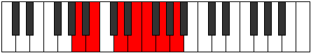

# Mode Byptimic

## Links

- [Documentation](index.md)
- [Scales Index](Scales.md)
- [Modes Index](Modes.md)
- [Chords Index](Chords.md)

## Parent Scale

[Phracrimic](ScalePhracrimic.md)

## Number

[1445](https://ianring.com/musictheory/scales/1445)

## Perfection

- 4 Perfect notes
- 2 Perfect notes

## Perfection Profile

[true false true true false true]

## Permutations

| Tonic | Notes | Signature | Illustration | Audio |
|-------|-------|-----------|--------------|-------|
| [C](ModeCNaturalByptimic.md) | C, **D**, E#, F##, **G#**, A#, C | C |  | [midi](ModeCNaturalByptimic.mid) [ogg](ModeCNaturalByptimic.ogg) |
| [C#](ModeCSharpByptimic.md) | C#, **D#**, E##, F###, **G##**, A##, C# | C |  | [midi](ModeCSharpByptimic.mid) [ogg](ModeCSharpByptimic.ogg) |
| [Db](ModeDFlatByptimic.md) | Db, **Eb**, F#, G#, **A**, B, Db | C |  | [midi](ModeDFlatByptimic.mid) [ogg](ModeDFlatByptimic.ogg) |
| [D](ModeDNaturalByptimic.md) | D, **E**, F##, G##, **A#**, B#, D | C |  | [midi](ModeDNaturalByptimic.mid) [ogg](ModeDNaturalByptimic.ogg) |
| [D#](ModeDSharpByptimic.md) | D#, **E#**, F###, G###, **A##**, B##, D# | C |  | [midi](ModeDSharpByptimic.mid) [ogg](ModeDSharpByptimic.ogg) |
| [Eb](ModeEFlatByptimic.md) | Eb, **F**, G#, A#, **B**, C#, Eb | C |  | [midi](ModeEFlatByptimic.mid) [ogg](ModeEFlatByptimic.ogg) |
| [E](ModeENaturalByptimic.md) | E, **F#**, G##, A##, **B#**, C##, E | C |  | [midi](ModeENaturalByptimic.mid) [ogg](ModeENaturalByptimic.ogg) |
| [F](ModeFNaturalByptimic.md) | F, **G**, A#, B#, **C#**, D#, F | C |  | [midi](ModeFNaturalByptimic.mid) [ogg](ModeFNaturalByptimic.ogg) |
| [F#](ModeFSharpByptimic.md) | F#, **G#**, A##, B##, **C##**, D##, F# | C |  | [midi](ModeFSharpByptimic.mid) [ogg](ModeFSharpByptimic.ogg) |
| [Gb](ModeGFlatByptimic.md) | Gb, **Ab**, B, C#, **D**, E, Gb | C |  | [midi](ModeGFlatByptimic.mid) [ogg](ModeGFlatByptimic.ogg) |
| [G](ModeGNaturalByptimic.md) | G, **A**, B#, C##, **D#**, E#, G | C |  | [midi](ModeGNaturalByptimic.mid) [ogg](ModeGNaturalByptimic.ogg) |
| [G#](ModeGSharpByptimic.md) | G#, **A#**, B##, C###, **D##**, E##, G# | C |  | [midi](ModeGSharpByptimic.mid) [ogg](ModeGSharpByptimic.ogg) |
| [Ab](ModeAFlatByptimic.md) | Ab, **Bb**, C#, D#, **E**, F#, Ab | C |  | [midi](ModeAFlatByptimic.mid) [ogg](ModeAFlatByptimic.ogg) |
| [A](ModeANaturalByptimic.md) | A, **B**, C##, D##, **E#**, F##, A | C |  | [midi](ModeANaturalByptimic.mid) [ogg](ModeANaturalByptimic.ogg) |
| [A#](ModeASharpByptimic.md) | A#, **B#**, C###, D###, **E##**, F###, A# | C |  | [midi](ModeASharpByptimic.mid) [ogg](ModeASharpByptimic.ogg) |
| [Bb](ModeBFlatByptimic.md) | Bb, **C**, D#, E#, **F#**, G#, Bb | C |  | [midi](ModeBFlatByptimic.mid) [ogg](ModeBFlatByptimic.ogg) |
| [B](ModeBNaturalByptimic.md) | B, **C#**, D##, E##, **F##**, G##, B | C |  | [midi](ModeBNaturalByptimic.mid) [ogg](ModeBNaturalByptimic.ogg) |
