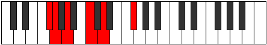

# Mode Byptitonic

## Links

- [Documentation](index.md)
- [Scales Index](Scales.md)
- [Modes Index](Modes.md)
- [Chords Index](Chords.md)

## Parent Scale

[Aeracritonic](ScaleAeracritonic.md)

## Number

[331](https://ianring.com/musictheory/scales/331)

## Perfection

- 3 Perfect notes
- 2 Perfect notes

## Perfection Profile

[false true false true true]

## Permutations

| Tonic | Notes | Signature | Illustration | Audio |
|-------|-------|-----------|--------------|-------|
| [C](ModeCNaturalByptitonic.md) | **C**, C#, **D#**, F#, G#, **C** | C |  | [midi](https://github.com/edipermadi/music/blob/main/docs/ModeCNaturalByptitonic.mid?raw=true) |
| [C#](ModeCSharpByptitonic.md) | **C#**, D, **E**, G, A, **C#** | C |  | [midi](https://github.com/edipermadi/music/blob/main/docs/ModeCSharpByptitonic.mid?raw=true) |
| [Db](ModeDFlatByptitonic.md) | **Db**, D, **E**, G, A, **Db** | C |  | [midi](https://github.com/edipermadi/music/blob/main/docs/ModeDFlatByptitonic.mid?raw=true) |
| [D](ModeDNaturalByptitonic.md) | **D**, D#, **F**, G#, A#, **D** | C |  | [midi](https://github.com/edipermadi/music/blob/main/docs/ModeDNaturalByptitonic.mid?raw=true) |
| [D#](ModeDSharpByptitonic.md) | **D#**, E, **F#**, A, B, **D#** | C |  | [midi](https://github.com/edipermadi/music/blob/main/docs/ModeDSharpByptitonic.mid?raw=true) |
| [Eb](ModeEFlatByptitonic.md) | **Eb**, E, **Gb**, A, B, **Eb** | C |  | [midi](https://github.com/edipermadi/music/blob/main/docs/ModeEFlatByptitonic.mid?raw=true) |
| [E](ModeENaturalByptitonic.md) | **E**, F, **G**, A#, C, **E** | C |  | [midi](https://github.com/edipermadi/music/blob/main/docs/ModeENaturalByptitonic.mid?raw=true) |
| [F](ModeFNaturalByptitonic.md) | **F**, F#, **G#**, B, C#, **F** | C |  | [midi](https://github.com/edipermadi/music/blob/main/docs/ModeFNaturalByptitonic.mid?raw=true) |
| [F#](ModeFSharpByptitonic.md) | **F#**, G, **A**, C, D, **F#** | C |  | [midi](https://github.com/edipermadi/music/blob/main/docs/ModeFSharpByptitonic.mid?raw=true) |
| [Gb](ModeGFlatByptitonic.md) | **Gb**, G, **A**, C, D, **Gb** | C |  | [midi](https://github.com/edipermadi/music/blob/main/docs/ModeGFlatByptitonic.mid?raw=true) |
| [G](ModeGNaturalByptitonic.md) | **G**, G#, **A#**, C#, D#, **G** | C |  | [midi](https://github.com/edipermadi/music/blob/main/docs/ModeGNaturalByptitonic.mid?raw=true) |
| [G#](ModeGSharpByptitonic.md) | **G#**, A, **B**, D, E, **G#** | C |  | [midi](https://github.com/edipermadi/music/blob/main/docs/ModeGSharpByptitonic.mid?raw=true) |
| [Ab](ModeAFlatByptitonic.md) | **Ab**, A, **B**, D, E, **Ab** | C |  | [midi](https://github.com/edipermadi/music/blob/main/docs/ModeAFlatByptitonic.mid?raw=true) |
| [A](ModeANaturalByptitonic.md) | **A**, A#, **C**, D#, F, **A** | C |  | [midi](https://github.com/edipermadi/music/blob/main/docs/ModeANaturalByptitonic.mid?raw=true) |
| [A#](ModeASharpByptitonic.md) | **A#**, B, **C#**, E, F#, **A#** | C |  | [midi](https://github.com/edipermadi/music/blob/main/docs/ModeASharpByptitonic.mid?raw=true) |
| [Bb](ModeBFlatByptitonic.md) | **Bb**, B, **Db**, E, Gb, **Bb** | C |  | [midi](https://github.com/edipermadi/music/blob/main/docs/ModeBFlatByptitonic.mid?raw=true) |
| [B](ModeBNaturalByptitonic.md) | **B**, C, **D**, F, G, **B** | C |  | [midi](https://github.com/edipermadi/music/blob/main/docs/ModeBNaturalByptitonic.mid?raw=true) |
