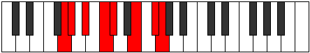

# Mode Byrian

## Links

- [Documentation](index.md)
- [Scales Index](Scales.md)
- [Modes Index](Modes.md)
- [Chords Index](Chords.md)

## Parent Scale

[Eporian](ScaleEporian.md)

## Number

[2667](https://ianring.com/musictheory/scales/2667)

## Perfection

- 3 Perfect notes
- 4 Perfect notes

## Interval Pattern

1, 2, 2, 1, 3, 2, 1

## Perfection Profile

[false false false true true false true]

## Permutations

| Tonic | Notes | Signature | Illustration | Audio |
|-------|-------|-----------|--------------|-------|
| [C](ModeCNaturalByrian.md) | **C**, **Db**, **Eb**, F, Gb, **A**, B, **C** | C |  | [midi](https://github.com/edipermadi/music/blob/main/docs/ModeCNaturalByrian.mid?raw=true) |
| [C#](ModeCSharpByrian.md) | **C#**, **D**, **E**, F#, G, **A#**, B#, **C#** | C |  | [midi](https://github.com/edipermadi/music/blob/main/docs/ModeCSharpByrian.mid?raw=true) |
| [Db](ModeDFlatByrian.md) | **Db**, **Ebb**, **Fb**, Gb, Abb, **Bb**, C, **Db** | C |  | [midi](https://github.com/edipermadi/music/blob/main/docs/ModeDFlatByrian.mid?raw=true) |
| [D](ModeDNaturalByrian.md) | **D**, **Eb**, **F**, G, Ab, **B**, C#, **D** | C |  | [midi](https://github.com/edipermadi/music/blob/main/docs/ModeDNaturalByrian.mid?raw=true) |
| [D#](ModeDSharpByrian.md) | **D#**, **E**, **F#**, G#, A, **B#**, C##, **D#** | C |  | [midi](https://github.com/edipermadi/music/blob/main/docs/ModeDSharpByrian.mid?raw=true) |
| [Eb](ModeEFlatByrian.md) | **Eb**, **Fb**, **Gb**, Ab, Bbb, **C**, D, **Eb** | C |  | [midi](https://github.com/edipermadi/music/blob/main/docs/ModeEFlatByrian.mid?raw=true) |
| [E](ModeENaturalByrian.md) | **E**, **F**, **G**, A, Bb, **C#**, D#, **E** | C |  | [midi](https://github.com/edipermadi/music/blob/main/docs/ModeENaturalByrian.mid?raw=true) |
| [F](ModeFNaturalByrian.md) | **F**, **Gb**, **Ab**, Bb, Cb, **D**, E, **F** | C |  | [midi](https://github.com/edipermadi/music/blob/main/docs/ModeFNaturalByrian.mid?raw=true) |
| [F#](ModeFSharpByrian.md) | **F#**, **G**, **A**, B, C, **D#**, E#, **F#** | C |  | [midi](https://github.com/edipermadi/music/blob/main/docs/ModeFSharpByrian.mid?raw=true) |
| [Gb](ModeGFlatByrian.md) | **Gb**, **Abb**, **Bbb**, Cb, Dbb, **Eb**, F, **Gb** | C |  | [midi](https://github.com/edipermadi/music/blob/main/docs/ModeGFlatByrian.mid?raw=true) |
| [G](ModeGNaturalByrian.md) | **G**, **Ab**, **Bb**, C, Db, **E**, F#, **G** | C |  | [midi](https://github.com/edipermadi/music/blob/main/docs/ModeGNaturalByrian.mid?raw=true) |
| [G#](ModeGSharpByrian.md) | **G#**, **A**, **B**, C#, D, **E#**, F##, **G#** | C |  | [midi](https://github.com/edipermadi/music/blob/main/docs/ModeGSharpByrian.mid?raw=true) |
| [Ab](ModeAFlatByrian.md) | **Ab**, **Bbb**, **Cb**, Db, Ebb, **F**, G, **Ab** | C |  | [midi](https://github.com/edipermadi/music/blob/main/docs/ModeAFlatByrian.mid?raw=true) |
| [A](ModeANaturalByrian.md) | **A**, **Bb**, **C**, D, Eb, **F#**, G#, **A** | C |  | [midi](https://github.com/edipermadi/music/blob/main/docs/ModeANaturalByrian.mid?raw=true) |
| [A#](ModeASharpByrian.md) | **A#**, **B**, **C#**, D#, E, **F##**, G##, **A#** | C |  | [midi](https://github.com/edipermadi/music/blob/main/docs/ModeASharpByrian.mid?raw=true) |
| [Bb](ModeBFlatByrian.md) | **Bb**, **Cb**, **Db**, Eb, Fb, **G**, A, **Bb** | C |  | [midi](https://github.com/edipermadi/music/blob/main/docs/ModeBFlatByrian.mid?raw=true) |
| [B](ModeBNaturalByrian.md) | **B**, **C**, **D**, E, F, **G#**, A#, **B** | C |  | [midi](https://github.com/edipermadi/music/blob/main/docs/ModeBNaturalByrian.mid?raw=true) |
