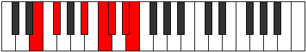

# Mode Byrimic

## Links

- [Documentation](index.md)
- [Scales Index](Scales.md)
- [Modes Index](Modes.md)
- [Chords Index](Chords.md)

## Parent Scale

[Manimic](ScaleManimic.md)

## Number

[2885](https://ianring.com/musictheory/scales/2885)

## Perfection

- 2 Perfect notes
- 4 Perfect notes

## Perfection Profile

[false true false false false true]

## Permutations

| Tonic | Notes | Signature | Illustration | Audio |
|-------|-------|-----------|--------------|-------|
| [C](ModeCNaturalByrimic.md) | **C**, D, **E##**, **F###**, **G##**, A##, **C** | C |  | [midi](ModeCNaturalByrimic.mid) [ogg](ModeCNaturalByrimic.ogg) |
| [C#](ModeCSharpByrimic.md) | **C#**, D#, **E###**, **Cbbb**, **Cbb**, Dbb, **C#** | C |  | [midi](ModeCSharpByrimic.mid) [ogg](ModeCSharpByrimic.ogg) |
| [Db](ModeDFlatByrimic.md) | **Db**, Eb, **F##**, **G##**, **A#**, B#, **Db** | C |  | [midi](ModeDFlatByrimic.mid) [ogg](ModeDFlatByrimic.ogg) |
| [D](ModeDNaturalByrimic.md) | **D**, E, **F###**, **G###**, **A##**, B##, **D** | C |  | [midi](ModeDNaturalByrimic.mid) [ogg](ModeDNaturalByrimic.ogg) |
| [D#](ModeDSharpByrimic.md) | **D#**, E#, **Cbbb**, **Dbbb**, **Dbb**, Ebb, **D#** | C |  | [midi](ModeDSharpByrimic.mid) [ogg](ModeDSharpByrimic.ogg) |
| [Eb](ModeEFlatByrimic.md) | **Eb**, F, **G##**, **A##**, **B#**, C##, **Eb** | C |  | [midi](ModeEFlatByrimic.mid) [ogg](ModeEFlatByrimic.ogg) |
| [E](ModeENaturalByrimic.md) | **E**, F#, **G###**, **A###**, **B##**, C###, **E** | C |  | [midi](ModeENaturalByrimic.mid) [ogg](ModeENaturalByrimic.ogg) |
| [F](ModeFNaturalByrimic.md) | **F**, G, **A##**, **B##**, **C##**, D##, **F** | C |  | [midi](ModeFNaturalByrimic.mid) [ogg](ModeFNaturalByrimic.ogg) |
| [F#](ModeFSharpByrimic.md) | **F#**, G#, **A###**, **B###**, **C###**, D###, **F#** | C |  | [midi](ModeFSharpByrimic.mid) [ogg](ModeFSharpByrimic.ogg) |
| [Gb](ModeGFlatByrimic.md) | **Gb**, Ab, **B#**, **C##**, **D#**, E#, **Gb** | C |  | [midi](ModeGFlatByrimic.mid) [ogg](ModeGFlatByrimic.ogg) |
| [G](ModeGNaturalByrimic.md) | **G**, A, **B##**, **C###**, **D##**, E##, **G** | C |  | [midi](ModeGNaturalByrimic.mid) [ogg](ModeGNaturalByrimic.ogg) |
| [G#](ModeGSharpByrimic.md) | **G#**, A#, **B###**, **D##**, **E#**, F##, **G#** | C |  | [midi](ModeGSharpByrimic.mid) [ogg](ModeGSharpByrimic.ogg) |
| [Ab](ModeAFlatByrimic.md) | **Ab**, Bb, **C##**, **D##**, **E#**, F##, **Ab** | C |  | [midi](ModeAFlatByrimic.mid) [ogg](ModeAFlatByrimic.ogg) |
| [A](ModeANaturalByrimic.md) | **A**, B, **C###**, **D###**, **E##**, F###, **A** | C |  | [midi](ModeANaturalByrimic.mid) [ogg](ModeANaturalByrimic.ogg) |
| [A#](ModeASharpByrimic.md) | **A#**, B#, **D##**, **E##**, **F##**, G##, **A#** | C |  | [midi](ModeASharpByrimic.mid) [ogg](ModeASharpByrimic.ogg) |
| [Bb](ModeBFlatByrimic.md) | **Bb**, C, **D##**, **E##**, **F##**, G##, **Bb** | C |  | [midi](ModeBFlatByrimic.mid) [ogg](ModeBFlatByrimic.ogg) |
| [B](ModeBNaturalByrimic.md) | **B**, C#, **D###**, **E###**, **F###**, G###, **B** | C |  | [midi](ModeBNaturalByrimic.mid) [ogg](ModeBNaturalByrimic.ogg) |
