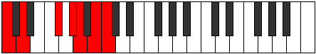
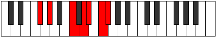

# Mode Byrimic

## Links

- [Documentation](index.md)
- [Scales Index](Scales.md)
- [Modes Index](Modes.md)
- [Chords Index](Chords.md)

## Parent Scale

[Manimic](ScaleManimic.md)

## Number

[2885](https://ianring.com/musictheory/scales/2885)

## Interval Pattern

2, 4, 2, 1, 2, 1

## Chord Pattern

II, iii⁰, iv⁰, vi

## Perfection

- 2 Perfect notes
- 4 Perfect notes

## Perfection Profile

[false true false false false true]

## Permutations

| Tonic | Notes | Signature | Illustration | Audio |
|-------|-------|-----------|--------------|-------|
| [C](ModeCNaturalByrimic.md) | **C**, D, **E##**, **F###**, **G##**, A##, **C** | C |  | [midi](https://github.com/edipermadi/music/blob/main/docs/ModeCNaturalByrimic.mid?raw=true) |
| [C#](ModeCSharpByrimic.md) | **C#**, D#, **E###**, **Cbbb**, **Cbb**, Dbb, **C#** | C |  | [midi](https://github.com/edipermadi/music/blob/main/docs/ModeCSharpByrimic.mid?raw=true) |
| [Db](ModeDFlatByrimic.md) | **Db**, Eb, **F##**, **G##**, **A#**, B#, **Db** | C |  | [midi](https://github.com/edipermadi/music/blob/main/docs/ModeDFlatByrimic.mid?raw=true) |
| [D](ModeDNaturalByrimic.md) | **D**, E, **F###**, **G###**, **A##**, B##, **D** | C |  | [midi](https://github.com/edipermadi/music/blob/main/docs/ModeDNaturalByrimic.mid?raw=true) |
| [D#](ModeDSharpByrimic.md) | **D#**, E#, **Cbbb**, **Dbbb**, **Dbb**, Ebb, **D#** | C |  | [midi](https://github.com/edipermadi/music/blob/main/docs/ModeDSharpByrimic.mid?raw=true) |
| [Eb](ModeEFlatByrimic.md) | **Eb**, F, **G##**, **A##**, **B#**, C##, **Eb** | C |  | [midi](https://github.com/edipermadi/music/blob/main/docs/ModeEFlatByrimic.mid?raw=true) |
| [E](ModeENaturalByrimic.md) | **E**, F#, **G###**, **A###**, **B##**, C###, **E** | C |  | [midi](https://github.com/edipermadi/music/blob/main/docs/ModeENaturalByrimic.mid?raw=true) |
| [F](ModeFNaturalByrimic.md) | **F**, G, **A##**, **B##**, **C##**, D##, **F** | C |  | [midi](https://github.com/edipermadi/music/blob/main/docs/ModeFNaturalByrimic.mid?raw=true) |
| [F#](ModeFSharpByrimic.md) | **F#**, G#, **A###**, **B###**, **C###**, D###, **F#** | C |  | [midi](https://github.com/edipermadi/music/blob/main/docs/ModeFSharpByrimic.mid?raw=true) |
| [Gb](ModeGFlatByrimic.md) | **Gb**, Ab, **B#**, **C##**, **D#**, E#, **Gb** | C |  | [midi](https://github.com/edipermadi/music/blob/main/docs/ModeGFlatByrimic.mid?raw=true) |
| [G](ModeGNaturalByrimic.md) | **G**, A, **B##**, **C###**, **D##**, E##, **G** | C |  | [midi](https://github.com/edipermadi/music/blob/main/docs/ModeGNaturalByrimic.mid?raw=true) |
| [G#](ModeGSharpByrimic.md) | **G#**, A#, **B###**, **D##**, **E#**, F##, **G#** | C |  | [midi](https://github.com/edipermadi/music/blob/main/docs/ModeGSharpByrimic.mid?raw=true) |
| [Ab](ModeAFlatByrimic.md) | **Ab**, Bb, **C##**, **D##**, **E#**, F##, **Ab** | C |  | [midi](https://github.com/edipermadi/music/blob/main/docs/ModeAFlatByrimic.mid?raw=true) |
| [A](ModeANaturalByrimic.md) | **A**, B, **C###**, **D###**, **E##**, F###, **A** | C |  | [midi](https://github.com/edipermadi/music/blob/main/docs/ModeANaturalByrimic.mid?raw=true) |
| [A#](ModeASharpByrimic.md) | **A#**, B#, **D##**, **E##**, **F##**, G##, **A#** | C |  | [midi](https://github.com/edipermadi/music/blob/main/docs/ModeASharpByrimic.mid?raw=true) |
| [Bb](ModeBFlatByrimic.md) | **Bb**, C, **D##**, **E##**, **F##**, G##, **Bb** | C |  | [midi](https://github.com/edipermadi/music/blob/main/docs/ModeBFlatByrimic.mid?raw=true) |
| [B](ModeBNaturalByrimic.md) | **B**, C#, **D###**, **E###**, **F###**, G###, **B** | C |  | [midi](https://github.com/edipermadi/music/blob/main/docs/ModeBNaturalByrimic.mid?raw=true) |
