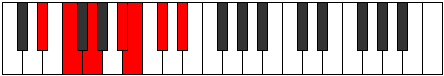

# Mode Bythimic

## Links

- [Documentation](index.md)
- [Scales Index](Scales.md)
- [Modes Index](Modes.md)
- [Chords Index](Chords.md)

## Parent Scale

[Boptimic](ScaleBoptimic.md)

## Number

[1429](https://ianring.com/musictheory/scales/1429)

## Perfection

- 2 Perfect notes
- 4 Perfect notes

## Perfection Profile

[true false false true false false]

## Permutations

| Tonic | Notes | Signature | Illustration | Audio |
|-------|-------|-----------|--------------|-------|
| [C](ModeCNaturalBythimic.md) | C, **D**, **E**, F##, **G#**, **A#**, C | C |  | [midi](ModeCNaturalBythimic.mid) [ogg](ModeCNaturalBythimic.ogg) |
| [C#](ModeCSharpBythimic.md) | C#, **D#**, **E#**, F###, **G##**, **A##**, C# | C |  | [midi](ModeCSharpBythimic.mid) [ogg](ModeCSharpBythimic.ogg) |
| [Db](ModeDFlatBythimic.md) | Db, **Eb**, **F**, G#, **A**, **B**, Db | C |  | [midi](ModeDFlatBythimic.mid) [ogg](ModeDFlatBythimic.ogg) |
| [D](ModeDNaturalBythimic.md) | D, **E**, **F#**, G##, **A#**, **B#**, D | C |  | [midi](ModeDNaturalBythimic.mid) [ogg](ModeDNaturalBythimic.ogg) |
| [D#](ModeDSharpBythimic.md) | D#, **E#**, **F##**, G###, **A##**, **B##**, D# | C |  | [midi](ModeDSharpBythimic.mid) [ogg](ModeDSharpBythimic.ogg) |
| [Eb](ModeEFlatBythimic.md) | Eb, **F**, **G**, A#, **B**, **C#**, Eb | C |  | [midi](ModeEFlatBythimic.mid) [ogg](ModeEFlatBythimic.ogg) |
| [E](ModeENaturalBythimic.md) | E, **F#**, **G#**, A##, **B#**, **C##**, E | C |  | [midi](ModeENaturalBythimic.mid) [ogg](ModeENaturalBythimic.ogg) |
| [F](ModeFNaturalBythimic.md) | F, **G**, **A**, B#, **C#**, **D#**, F | C |  | [midi](ModeFNaturalBythimic.mid) [ogg](ModeFNaturalBythimic.ogg) |
| [F#](ModeFSharpBythimic.md) | F#, **G#**, **A#**, B##, **C##**, **D##**, F# | C |  | [midi](ModeFSharpBythimic.mid) [ogg](ModeFSharpBythimic.ogg) |
| [Gb](ModeGFlatBythimic.md) | Gb, **Ab**, **Bb**, C#, **D**, **E**, Gb | C |  | [midi](ModeGFlatBythimic.mid) [ogg](ModeGFlatBythimic.ogg) |
| [G](ModeGNaturalBythimic.md) | G, **A**, **B**, C##, **D#**, **E#**, G | C |  | [midi](ModeGNaturalBythimic.mid) [ogg](ModeGNaturalBythimic.ogg) |
| [G#](ModeGSharpBythimic.md) | G#, **A#**, **B#**, C###, **D##**, **E##**, G# | C |  | [midi](ModeGSharpBythimic.mid) [ogg](ModeGSharpBythimic.ogg) |
| [Ab](ModeAFlatBythimic.md) | Ab, **Bb**, **C**, D#, **E**, **F#**, Ab | C |  | [midi](ModeAFlatBythimic.mid) [ogg](ModeAFlatBythimic.ogg) |
| [A](ModeANaturalBythimic.md) | A, **B**, **C#**, D##, **E#**, **F##**, A | C |  | [midi](ModeANaturalBythimic.mid) [ogg](ModeANaturalBythimic.ogg) |
| [A#](ModeASharpBythimic.md) | A#, **B#**, **C##**, D###, **E##**, **F###**, A# | C |  | [midi](ModeASharpBythimic.mid) [ogg](ModeASharpBythimic.ogg) |
| [Bb](ModeBFlatBythimic.md) | Bb, **C**, **D**, E#, **F#**, **G#**, Bb | C |  | [midi](ModeBFlatBythimic.mid) [ogg](ModeBFlatBythimic.ogg) |
| [B](ModeBNaturalBythimic.md) | B, **C#**, **D#**, E##, **F##**, **G##**, B | C |  | [midi](ModeBNaturalBythimic.mid) [ogg](ModeBNaturalBythimic.ogg) |
