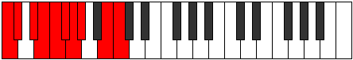

# Mode Bythygic

## Links

- [Documentation](index.md)
- [Scales Index](Scales.md)
- [Modes Index](Modes.md)
- [Chords Index](Chords.md)

## Parent Scale

[Kalygic](ScaleKalygic.md)

## Number

[2555](https://ianring.com/musictheory/scales/2555)

## Perfection

- 7 Perfect notes
- 2 Perfect notes

## Perfection Profile

[true true false true true true false true true]

## Permutations

| Tonic | Notes | Signature | Illustration | Audio |
|-------|-------|-----------|--------------|-------|
| [C](ModeCNaturalBythygic.md) | C, C#, **D#**, E, F, F#, **G**, G#, B, C | C |  | [midi](ModeCNaturalBythygic.mid) [ogg](ModeCNaturalBythygic.ogg) |
| [C#](ModeCSharpBythygic.md) | C#, D, **E**, F, F#, G, **G#**, A, C, C# | C |  | [midi](ModeCSharpBythygic.mid) [ogg](ModeCSharpBythygic.ogg) |
| [Db](ModeDFlatBythygic.md) | Db, D, **E**, F, Gb, G, **Ab**, A, C, Db | C |  | [midi](ModeDFlatBythygic.mid) [ogg](ModeDFlatBythygic.ogg) |
| [D](ModeDNaturalBythygic.md) | D, D#, **F**, F#, G, G#, **A**, A#, C#, D | C |  | [midi](ModeDNaturalBythygic.mid) [ogg](ModeDNaturalBythygic.ogg) |
| [D#](ModeDSharpBythygic.md) | D#, E, **F#**, G, G#, A, **A#**, B, D, D# | C |  | [midi](ModeDSharpBythygic.mid) [ogg](ModeDSharpBythygic.ogg) |
| [Eb](ModeEFlatBythygic.md) | Eb, E, **Gb**, G, Ab, A, **Bb**, B, D, Eb | C |  | [midi](ModeEFlatBythygic.mid) [ogg](ModeEFlatBythygic.ogg) |
| [E](ModeENaturalBythygic.md) | E, F, **G**, G#, A, A#, **B**, C, D#, E | C |  | [midi](ModeENaturalBythygic.mid) [ogg](ModeENaturalBythygic.ogg) |
| [F](ModeFNaturalBythygic.md) | F, F#, **G#**, A, A#, B, **C**, C#, E, F | C |  | [midi](ModeFNaturalBythygic.mid) [ogg](ModeFNaturalBythygic.ogg) |
| [F#](ModeFSharpBythygic.md) | F#, G, **A**, A#, B, C, **C#**, D, F, F# | C |  | [midi](ModeFSharpBythygic.mid) [ogg](ModeFSharpBythygic.ogg) |
| [Gb](ModeGFlatBythygic.md) | Gb, G, **A**, Bb, B, C, **Db**, D, F, Gb | C |  | [midi](ModeGFlatBythygic.mid) [ogg](ModeGFlatBythygic.ogg) |
| [G](ModeGNaturalBythygic.md) | G, G#, **A#**, B, C, C#, **D**, D#, F#, G | C |  | [midi](ModeGNaturalBythygic.mid) [ogg](ModeGNaturalBythygic.ogg) |
| [G#](ModeGSharpBythygic.md) | G#, A, **B**, C, C#, D, **D#**, E, G, G# | C |  | [midi](ModeGSharpBythygic.mid) [ogg](ModeGSharpBythygic.ogg) |
| [Ab](ModeAFlatBythygic.md) | Ab, A, **B**, C, Db, D, **Eb**, E, G, Ab | C |  | [midi](ModeAFlatBythygic.mid) [ogg](ModeAFlatBythygic.ogg) |
| [A](ModeANaturalBythygic.md) | A, A#, **C**, C#, D, D#, **E**, F, G#, A | C |  | [midi](ModeANaturalBythygic.mid) [ogg](ModeANaturalBythygic.ogg) |
| [A#](ModeASharpBythygic.md) | A#, B, **C#**, D, D#, E, **F**, F#, A, A# | C |  | [midi](ModeASharpBythygic.mid) [ogg](ModeASharpBythygic.ogg) |
| [Bb](ModeBFlatBythygic.md) | Bb, B, **Db**, D, Eb, E, **F**, Gb, A, Bb | C |  | [midi](ModeBFlatBythygic.mid) [ogg](ModeBFlatBythygic.ogg) |
| [B](ModeBNaturalBythygic.md) | B, C, **D**, D#, E, F, **F#**, G, A#, B | C |  | [midi](ModeBNaturalBythygic.mid) [ogg](ModeBNaturalBythygic.ogg) |
