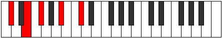
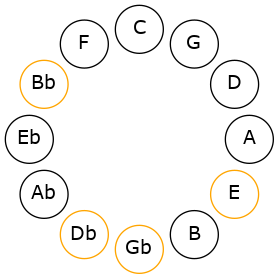
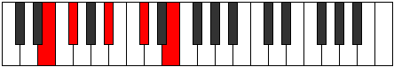
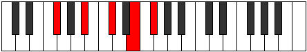
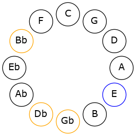
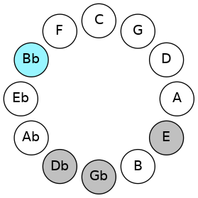

# Mode CSharpPhradic

## Links

- [Documentation](README.md)
- [Scales Index](Scales.md)
- [Modes Index](Modes.md)
- [Chords Index](Chords.md)

## Scale

[Daric](ScaleDaric.md)

## Mode

[CSharpPhradic](ModeCSharpPhradic.md)

## Tonic

C#

## Signature

[CNaturalMajor]

## Interval Pattern

3, 2, 4, 3

## Chord Pattern

## Perfection

 - 1 Perfect Notes

 - 3 Imperfect Notes

## Notes

- C# (Imperfect)
- E (Imperfect)
- F#
- A# (Imperfect)
- C# (Imperfect)

## Illustration

## Diagram

## Relative Modes

| Number | Mode | Tonic | Notes | Illustration |
|--------|------|-------|-------|--------------|
| [553](https://ianring.com/musictheory/scales/553) | [Phradic](ModePhradic.md) | C# | C#, E, F#, A#, C# |  |
| [581](https://ianring.com/musictheory/scales/581) | [Bolic](ModeBolic.md) | E | E, F#, A#, C#, E |  |
| [1169](https://ianring.com/musictheory/scales/1169) | [Daric](ModeDaric.md) | F# | F#, A#, C#, E, F# |  |
| [329](https://ianring.com/musictheory/scales/329) | [Lonic](ModeLonic.md) | A# | A#, C#, E, F#, A# |  |
## Relative Brightness

| Number | Mode | Tonic | Notes | Illustration |
|--------|------|-------|-------|--------------|
| [553](https://ianring.com/musictheory/scales/553) | [Phradic](ModePhradic.md) | C# | C#, E, F#, A#, C# |  |
| [581](https://ianring.com/musictheory/scales/581) | [Bolic](ModeBolic.md) | E | E, F#, A#, C#, E |  |
| [1169](https://ianring.com/musictheory/scales/1169) | [Daric](ModeDaric.md) | F# | F#, A#, C#, E, F# |  |
| [329](https://ianring.com/musictheory/scales/329) | [Lonic](ModeLonic.md) | A# | A#, C#, E, F#, A# |  |

## Chords

### C#

| Number | Root | Name | Notes | Illustration | Audio |
|--------|------|------|-------|--------------|-------|
| 82 | C# | [C#mbb5](ChordCSharpMinorDoubleFlatFifth.md) | C#, E, F# |  | [midi](ChordCSharpMinorDoubleFlatFifthRootPosition.mid) |
| 1090 | C# | [C#sus4##5](ChordCSharpSuspendedFourthDoubleSharpFifth.md) | C#, F#, A# |  | [midi](ChordCSharpSuspendedFourthDoubleSharpFifthRootPosition.mid) |

### E

| Number | Root | Name | Notes | Illustration | Audio |
|--------|------|------|-------|--------------|-------|
| 1104 | E | [E](ChordENaturalDiminishedFlatThird.md) | E, Gb, Bb |  | [midi](ChordENaturalDiminishedFlatThirdRootPosition.mid) |
| 1104 | E | [Esus2b5](ChordENaturalSuspendedSecondFlatFifth.md) | E, F#, Bb |  | [midi](ChordENaturalSuspendedSecondFlatFifthRootPosition.mid) |
| 1106 | E | [EM6sus2b5](ChordENaturalMajorSixthSuspendedSecondFlatFifth.md) | E, F#, Bb, C# |  | [midi](ChordENaturalMajorSixthSuspendedSecondFlatFifthRootPosition.mid) |

### F#

| Number | Root | Name | Notes | Illustration | Audio |
|--------|------|------|-------|--------------|-------|
| 66 | F# | [F#5](ChordFSharpPowerChord.md) | F#, C# |  | [midi](ChordFSharpPowerChordRootPosition.mid) |
| 1090 | F# | [F#M](ChordFSharpMajor.md) | F#, A#, C# |  | [midi](ChordFSharpMajorRootPosition.mid) |
| 1106 | F# | [F#7](ChordFSharpDominantSeventh.md) | F#, A#, C#, E |  | [midi](ChordFSharpDominantSeventhRootPosition.mid) |

### A#

| Number | Root | Name | Notes | Illustration | Audio |
|--------|------|------|-------|--------------|-------|
| 1042 | A# | [A#o](ChordASharpDiminished.md) | A#, C#, E |  | [midi](ChordASharpDiminishedRootPosition.mid) |
| 1090 | A# | [A#m#5](ChordASharpMinorSharpFifth.md) | A#, C#, F# |  | [midi](ChordASharpMinorSharpFifthRootPosition.mid) |

